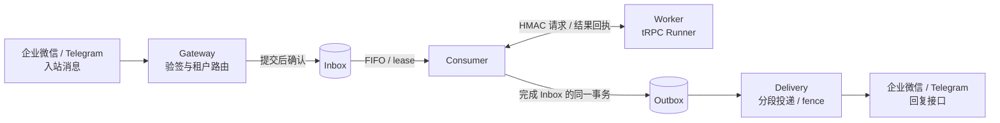

# Enterprise Multi-Tenant Agent Platform

[](https://github.com/ltyfulan9/trpc-agent-service/actions/workflows/verify.yml)

基于 tRPC-Agent-Go 的企业多租户 Agent 平台，将企业微信与 Telegram 接入、版本发布、共享数据面、治理审批和运行观测接入同一条可恢复消息链路。

[题目要求](https://github.com/liuzengh/trpc-agent-service/blob/main/README.md) · [王子龙方案入口](docs/solution-design-wangzilong.md)

## 核心设计

| 设计机制 | 实现方式与阅读入口 |
|---|---|
| 租户级数据面组合 | Session/Memory 独立选择引擎与 profile，例如租户 A 使用 Redis Session + PostgreSQL Memory，租户 B 使用相反组合；profile 指定共享或专属部署位置。见[配置与 SDK 调用链](docs/MULTI_BACKEND_DESIGN.md) |
| 可恢复的数据迁移协议 | 创建时捕获增量，源端写入前持久化 intent，以 journal 追平并验证目标；配置 CAS 切换后，在回滚窗口继续写入源端。见[在线迁移](docs/ONLINE_MIGRATION.md) |
| 跨节点执行一致性 | 请求绑定不可变版本，副本共享 Session/Memory；FIFO、lease/fence 和结果记录约束故障接管，Consumer 事务完成 Inbox/Outbox。见[架构设计](docs/ARCHITECTURE.md)与[验收入口](docs/ACCEPTANCE_EVIDENCE.md) |

平台按 PostgreSQL、Redis、Qdrant、S3-compatible 四类存储分工。profile 表达实例、命名空间与授权配置；各类状态的权威所有者和恢复协议保持明确。

业务集成测试将两种交叉后端组合贯穿企业微信加密回调、持久队列、Runner、Memory Tool 与回复投递，并验证 token 刷新和活动请求取消。真实 PostgreSQL/Redis 承载状态，模型与 IM 使用本地协议服务；执行命令及目标账号验收见[验证指南](docs/VERIFICATION.md#4-后端集成与部署检查)。

## 阅读导航

| 关注内容 | 文档 |
|---|---|
| 项目概览与演示顺序 | [评审指南](docs/JUDGE_QUICKSTART.md) |
| 完整方案与框架复用边界 | [项目方案](docs/COMPETITION_SUBMISSION.md) |
| 模块边界与设计取舍 | [架构设计](docs/ARCHITECTURE.md)、[设计决策](docs/ARCHITECTURE_REVIEW.md) |
| 数据所有权与一致性 | [数据模型](docs/DATA_MODEL.md)、[数据同步与幂等设计](docs/DATA_SYNC_IDEMPOTENCY.md) |
| 租户选择与后端组合 | [多后端适配方案](docs/MULTI_BACKEND_DESIGN.md) |
| 在线数据迁移与恢复 | [迁移运行指南](docs/ONLINE_MIGRATION.md) |
| 安全、故障和运行指标 | [安全设计](docs/SECURITY_REVIEW.md)、[风险登记册](docs/RISK_REGISTER.md)、[SLO](docs/SLO.md) |
| 运行及验证 | [交付指南](ENTERPRISE_PLATFORM_HANDOFF.md)、[验证方法](docs/VERIFICATION.md)、[验收矩阵](docs/ACCEPTANCE_EVIDENCE.md) |

## 功能与架构

| 能力 | 执行方式 |
|---|---|
| IM 接入 | 企业微信签名/AES/CorpID 及 AppID/AgentID 校验、Telegram webhook secret；统一消息身份和回复路由 |
| 可靠消息 | PostgreSQL Inbox/Outbox、幂等键与 payload hash、同 Session FIFO、lease/fence、重试、DLQ 和审计重放 |
| 多租户 | 配置/RBAC、存储键、工具权限、SecretRef 和观测标签按租户作用域隔离 |
| 版本发布 | Agent App → immutable Version → stable/canary Deployment；Session 稳定分桶和请求重试版本绑定 |
| Agent 运行 | LLM、Chain、Graph、Parallel、Cycle；节点提示词、工具白名单、调用预算和拓扑校验 |
| Session / Memory | 每租户独立配置 Redis/PostgreSQL 组合与部署 profile；完整调用租约、跨节点恢复的会话和长期记忆 |
| Summary | 独立任务、Session 代次隔离、事件边界冻结与后续目标刷新、固定版本生成、fenced checkpoint、下一轮 Runner overlay |
| Knowledge / Artifact | Qdrant tenant/app 检索；受控知识导入支持有界分片、幂等替换和迁移装饰器；PostgreSQL 元数据与 S3/MinIO 对象、版本、SHA-256 和 tombstone |
| 数据迁移 | Session/Knowledge/Artifact 生产写入捕获、持久化 journal、同步镜像、全量规范记录比对、配置 CAS 切换与回滚；独立 `cmd/data-migrate` 命令 |
| 容量基线 | `cmd/queue-bench` 使用隔离 PostgreSQL 对普通/公平领取、热点会话和 1/4/8/16 Consumer 输出可复测吞吐与分位延迟；见[验证方法](docs/VERIFICATION.md#52-postgresql-公平队列容量基线) |
| 工具与治理 | Runner Plugin、预算 reservation、危险操作审批、递归脱敏、审计及 MCP profile 白名单 |
| 运维 | 健康与排空、Prometheus、OpenTelemetry、Compose、Kubernetes 发布门禁和默认拒绝网络策略 |



Inbox/Outbox 由 PostgreSQL 持久化；Worker 返回执行结果后，由 Consumer 提交完成事务。

Admin 管理不可变版本与部署；Worker 进程内的 Storage Adapter 选择官方 Redis/PostgreSQL Session/Memory Service，独立的数据面 Resolver 注入 Qdrant Knowledge 和 PostgreSQL 元数据 + S3/MinIO 对象的 Artifact Service。Summary 由独立 Summary Worker 消费任务并发布 checkpoint，下一轮 Runner 读取摘要。接线与存储所有权见[项目方案分图](docs/COMPETITION_SUBMISSION.md#251-session--memory-适配)。

PostgreSQL 另持有控制面、执行 guard、审计和迁移 fence。Runner 缓存按租户、配置、版本和部署标识绑定，并具有容量、TTL 和排空约束。

在线迁移覆盖 Session、Knowledge 和 Artifact；回滚窗口读目标、写源并镜像目标，`complete` 后读写目标且保留源数据。支持范围与迁移窗口要求见[运行指南](docs/ONLINE_MIGRATION.md)。

各 `cmd/*` 独立部署，共享协议和领域规则位于 `pkg/*`；运行时注册表在启动时封存。

### 租户组合与运行场景

| 业务场景 | 配置与执行方式 | 关键取舍与验收 |
|---|---|---|
| 两个业务共用 Worker | 租户 A 使用 Redis Session + PostgreSQL Memory；租户 B 使用 PostgreSQL Session + Redis Memory，各自选择授权 profile | 同一二进制根据租户配置装配官方服务；以相同逻辑 app/user/session ID 检查数据隔离，实例级容量和凭据权限独立验收 |
| 一个租户改用专用存储 | 运维新增单租户 profile，在空目标命名空间执行 Session 在线迁移，Memory、Knowledge、Artifact 的绑定保持各自独立 | 完整复制与增量捕获同时进行，源目标读回一致后执行配置 CAS；直接修改已有 profile endpoint 会破坏数据位置身份，应使用新 profile |
| Worker 在调用期间失联 | Consumer 根据 lease、执行记录和传输连接状态区分可重试失败与未知结果；DNS/连接建立失败可以重试，取得连接后的传输错误按可能已发送处理 | 拒绝旧 fence 的持久化提交；外部 Tool 未知结果单独核对，有效接管继续使用首次绑定版本和共享 Session |
| 迁移目标暂时失败 | 保留 intent/journal，后续操作先恢复未完成投影；回滚窗口读目标、写源并镜像目标 | 源端可能已经提交，错误返回不等于无写入；回滚需要验证源端并恢复意图，完成迁移后反向搬迁应创建新任务 |

完整配置样例、后端的一致性/延迟/成本取舍、单租户专用 profile 和目标环境验证步骤见[多后端适配方案](docs/MULTI_BACKEND_DESIGN.md)。部署验收记录实际吞吐、模型效果、IM 收发与对应的配置及源码身份。

### 消息与故障处理

1. Gateway 验证消息、映射租户身份、执行限流，将规范化消息和回复路由提交到 Inbox 后返回确认。
2. Consumer 按持久化 Session 序号领取任务；owner、fence 和有效期共同约束状态提交。
3. Worker 解析首次绑定的 AgentVersion，装配共享数据面和治理插件，执行 Runner 并持久化结果。
4. Consumer 在同一事务中完成 Inbox、创建 Outbox，并按回执登记 Summary 任务。
5. Delivery 在调用 IM 前提交 `DISPATCH_STARTED`，按分段 cursor 推进投递。

重复 ID 同内容复用记录，内容冲突被拒绝。前序消息处于等待核对或死信时，同 Session 后续消息暂停，其他 Session 继续执行。模型/工具/IM 调用结果未知时进入 `WAITING_RECONCILIATION`，由操作者核对后审计恢复。投递采用 at-least-once；外部工具应使用业务幂等键。

## 本地运行

工具链：tRPC-Agent-Go v1.11.2；模块最低 Go 1.25.14，完整验证与容器构建使用 Go 1.26.7。Compose 栈需要运行中的 Docker Linux engine。

### 状态机演示

```powershell
go run -buildvcs=false ./cmd/demo
.\scripts\benchmark_local.ps1 -Count 5
```

演示使用 MemoryStore，展示 lease 接管、陈旧提交拒绝、Inbox/Outbox 状态转换和未知投递结果核对。基准输出该内存实现的 ns/op、B/op、allocs/op。详细步骤见[故障演示](docs/JUDGE_QUICKSTART.md#2-两分钟故障演示)和[本地基准](docs/VERIFICATION.md#5-演示与基准)。

### 完整服务栈

在源码根目录执行：

```powershell
.\scripts\run_c_local_stack.ps1 -ProjectName agent-platform-review -Build
```

脚本通过进程环境注入本地验证配置，启动隔离 Compose 项目。默认端口为 Gateway `18080`、Admin `18081`、Prometheus `19095`、Grafana `13000`，均绑定 loopback。迁移任务在应用启动前执行；镜像构建建议保留至少 8 GB 磁盘空间。

```powershell
.\scripts\run_c_local_stack.ps1 -ProjectName agent-platform-review -Down
```

停止命令保留命名卷。直接使用 Compose 时，从 `deploy/.env.example` 配置本地环境，并为数据库、内部认证、审计和 Admin 设置独立随机密钥。

### Agent 配置与管理

Admin 同源提供 `/console/` 管理控制台，支持租户选择、独立后端组合、版本发布、灰度部署和请求执行视图。运行 `scripts/run_console_lab.ps1 -Build -SeedExamples` 可建立两个交叉后端配置示例；操作与读取接口见[管理控制台](docs/OPERATIONS_CONSOLE.md)。

管理 API 使用服务端 Principal 进行角色和租户授权。`ADMIN_API_TOKEN` 用于 bootstrap 管理，日常操作通过 `ADMIN_PRINCIPALS_JSON` 分配 `tenant_admin`、`release_manager`、`auditor` 及 tenant allowlist。

| 操作 | API |
|---|---|
| 创建租户 | `POST /api/v1/tenants` |
| 创建 Agent 应用 | `POST /api/v1/agent-apps` |
| 创建版本快照 | `POST /api/v1/agent-versions` |
| 发布版本 | `POST /api/v1/agent-versions/{version_id}/publish` |
| stable/canary 部署 | `POST /api/v1/deployments` |
| 查询工具审批 | `GET /api/v1/tool-approvals?tenantId={tenant_id}` |
| 授权审批 | `POST /api/v1/tool-approvals/{challenge_id}/grant?tenantId={tenant_id}` |

Worker 要求 Agent App 存在 active stable deployment。版本快照保存无密钥配置、模型目录信息和 runtime capability fingerprint；同一请求重试继续使用首次绑定版本。`canaryBps` 范围为 1–9999；不传 canary 时执行 stable 切换。

当前模型工厂支持 OpenAI，模型由 operator-approved catalog 准入。租户通过 operator-owned profile 和 SecretRef 选择数据面及凭据。Admin 响应对密钥脱敏；模型、通道和 MCP 密钥按进程职责注入。

运营侧可向 Worker 与 Summary Worker 注入 `TRPC_OPENAI_BASE_URL`，接入通过公网 HTTPS 提供服务的 OpenAI-compatible API；模型密钥仍通过租户 SecretRef 解析。端点使用固定目标、DNS 校验和 TLS 验证，租户不能覆盖；配置和网络边界见[模型端点](pkg/modelendpoint/README.md)。

企业微信沙箱配置依次使用 `scripts/wecom_sandbox_tunnel.ps1`、`scripts/wecom_sandbox_setup.ps1`、`scripts/wecom_sandbox_bootstrap.ps1`，参数和控制台步骤见 [接入与部署验收](docs/EXTERNAL_ACCEPTANCE_RUNBOOK.md)。

## 支持范围与部署条件

- PostgreSQL 是共享协调依赖；执行 fencing 使用连接级 advisory lock，数据库连接使用直连或 PgBouncer session pooling。
- Consumer→Worker 生产连接使用验证证书的 HTTPS，或具有身份认证的 service mesh；HMAC 负责请求完整性和 nonce 防重放。
- `STORAGE_BACKEND_PROFILES` 与 `DATA_PLANE_PROFILES` 保存公开配置，SecretRef 绑定租户、用途、provider 和 model，实际秘密仅授予消费它的进程。
- 工具同时受版本与租户白名单约束；危险工具按 tenant/actor/session/tool/args/invocation 一次性审批。
- 预算以 token 计量（`maxCostPerDay=0`），按 UTC 日账本原子预留；已 dispatch 但 usage 未知的调用保留预算占用。金额预算尚未接入，准入拒绝 `maxCostPerDay > 0` 的配置。
- 公平调度使用 `FAIR_QUEUE_ENABLED`、权重、`max_inflight` 与 `max_queued`。外部 Store 需提供公平领取、原子准入及 Outbox dispatch fence 能力。
- `/metrics` 使用 bearer 认证；tenant、agent 和 model 标签由有界 allowlist 管理。
- 重放要求 actor/reason 和可恢复状态。Outbox resume 保留已确认 cursor，restart 从第 0 段发送；操作前核对外部投递结果。

Kubernetes 的镜像 digest、Secret、网络策略、传输和迁移门禁见 [部署指南](deploy/kubernetes/README.md)。真实 IM、目标集群、外部密钥服务和 HA/容量验证统一记录在 [验收矩阵](docs/ACCEPTANCE_EVIDENCE.md)。

在线迁移要求所有写入副本使用相同不可变 profile。活跃迁移串行化该租户数据域的操作，全量记录校验与切换扫描可能暂时阻塞请求；同步镜像增加目标延迟和故障依赖，需据此预留维护窗口。Session 迁移支持 session-owned State/Event/Track，要求关闭 TTL，并拒绝 App/User shared state、SDK native summary 及达到安全上限的 inventory/history。Memory 后端可独立选择，在线 Memory 迁移尚未实现。逐域条件与恢复步骤见[多后端方案](docs/MULTI_BACKEND_DESIGN.md)与[迁移指南](docs/ONLINE_MIGRATION.md)。

## 验证与交付

| 题目要求 | 实现与核验入口 |
|---|---|
| 多租户节点部署、治理和故障恢复 | [架构设计](docs/ARCHITECTURE.md)、[独立部署单元](docs/COMPETITION_SUBMISSION.md#24-独立部署单元与组合根)、[设计决策](docs/ARCHITECTURE_REVIEW.md) |
| Tenant、Agent、Binding、Session、Event、Memory、Summary、Audit 关系 | [数据模型与物理 ER](docs/DATA_MODEL.md) |
| 两种 IM，包含微信或企业微信 | 企业微信与 Telegram 文本 Adapter；[完整消息时序](docs/COMPETITION_SUBMISSION.md#5-核心消息时序) |
| 至少三类存储及同步策略 | PostgreSQL、Redis、Qdrant、S3-compatible；[配置、选型与迁移](docs/MULTI_BACKEND_DESIGN.md) |
| trace_id/request_id 贯穿全链路 | Inbox/Outbox 持久化 traceparent，内部签名绑定并跨进程恢复；[观测与审计](docs/SECURITY_REVIEW.md#6-可观测与审计) |
| 至少八项生产风险和缓解 | [方案风险清单](docs/COMPETITION_SUBMISSION.md)、[29 项风险登记](docs/RISK_REGISTER.md) |
| tRPC-Agent-Go 复用与平台新增 | [逐项接口与职责划分](docs/COMPETITION_SUBMISSION.md#11-trpc-agent-go-复用与平台新增) |

```powershell
go test -buildvcs=false -count=1 -p 1 ./...
go vet -p 1 ./...
go test -buildvcs=false -race -count=1 -p 1 ./...
```

完整门禁在 Git Bash 或 Linux 环境执行：

```bash
bash ./scripts/static_verify.sh
bash ./scripts/validate.sh
```

完整门禁包含构建、测试、race、容器和真实后端集成，运行条件见[验证方法](docs/VERIFICATION.md)。交付包包含源码、测试、文档、验证记录和文件校验清单，内容索引见[交付内容索引](PACKAGE_MANIFEST.md)。
