# tRPC-Agent-Go 多租户节点化 Agent 平台（决赛强化版 V14）

本目录以较小、边界清楚的实现为基线，吸收另一版本中有效的治理 Plugin、控制面和运维设计，并重建了可靠消息主链路。它是一个可继续工程化的候选实现，不以文件数量或文档长度声称“生产就绪”。

> 安全基线：当前模块最低要求 Go 1.25.14，生产 CI 与容器构建固定到官方 Go 1.26.7。此前 Go 1.21 验证记录已归档，不再构成当前兼容承诺。源码验证、真实基础设施验收和外部 Provider 验收必须严格区分；请在目标环境运行 `./scripts/validate.sh`，详见 [验证报告](docs/VERIFICATION.md)。

评委建议阅读顺序：先看 [评委快速摘要 V14](docs/JUDGE_QUICKSTART_V14.md)，再看 [决赛架构设计 V14](docs/COMPETITION_SUBMISSION_V14.md)、[验收证据矩阵 V14](docs/ACCEPTANCE_EVIDENCE_V14.md)、[核心数据模型](docs/DATA_MODEL.md)、[风险登记册 V14](docs/RISK_REGISTER_V14.md)、[安全审计 V14](docs/SECURITY_REVIEW_V14.md) 和 [最终交接](TRPC_AGENT_ENTERPRISE_HANDOFF_V14_FINAL.md)。每项能力明确区分本机实测、源码已闭环但待目标环境验收和外部依赖未验收，避免用单测或模拟器冒充生产证据。

## 1. 运行架构

```mermaid
flowchart LR
    IM[企业微信 / Telegram] --> GW[Gateway\n验签、限流、规范化]
    GW --> IN[(PostgreSQL\n可靠队列 / 控制面 / 执行栅栏 / 审计)]
    IN --> C[Consumer Pool]
    C -->|HMAC + nonce| W[Stateless Worker Pool]
    W --> CP[(Agent App / Version / Deployment)]
    W --> S[租户 Session / Memory Backend]
    W --> G[Runner Plugin / Governance]
    C -->|同一事务| OUT[(PostgreSQL Outbox)]
    OUT --> D[Delivery Pool]
    D --> IM
    GW & C & W & D --> OTEL[OTel Collector]
    GW & C & W & D --> PROM[Prometheus]
    A[Admin API] --> CP
    A --> T[(Tenant Config)]
```



生产消息路径只有一条：

```text
IM webhook
  → Gateway 验签/解密
  → INSERT Inbox 成功后返回 200
  → Consumer 使用 session_sequence 前序门禁 + SKIP LOCKED + lease_version 领取
  → HMAC 请求 Worker
  → Runner + 共享 Session/Memory + Governance Plugin
  → 持久化幂等结果
  → 同事务完成 Inbox 并创建 Outbox
  → Delivery 领取、重试、死信并发送 IM
```

Gateway 生产入口不再直接调用 Worker，也不在返回 200 后启动不可追踪 goroutine。Worker 无需 sticky session；租户选择的共享 SessionService 与 MemoryService 均注入 tRPC Runner，`appName`、session ID、消息幂等键均包含租户/通道账户作用域。同一 tenant/app/user/session 的完整 Runner 调用持有可续约 Redis lease，避免只锁 AppendEvent 却让模型/工具并发交错。

长期记忆使用框架原生有界 preload；`memory_add`、`memory_update`、`memory_search`、`memory_load`、`memory_delete`、`memory_clear` 仅在 Agent 版本和租户 whitelist 都显式允许时，从该租户的真实 MemoryService 动态接入，调用仍受治理插件与审计约束。

## 2. 已落地的关键能力

- 可靠消息：PostgreSQL Inbox/Outbox、唯一幂等键、payload hash 冲突检测、同一 `(tenant, agent app, session)` 的持久化 FIFO、永久/重试/429 错误分类、provider Retry-After、分段投递游标、DLQ、审计重放；Claim 热路径不再扫全表，Consumer/Delivery 的独立有界 reaper 以 `SKIP LOCKED` 处理最终 lease/审批超时。Delivery 在 Provider 调用前写入 fenced `DISPATCH_STARTED`；该状态过期后只进入 `WAITING_RECONCILIATION`，不会自动重复发送可能已成功的片段。
- Outbox 成功提交也受 fence 约束：`AdvanceOutbox` 与 `MarkDelivered` 在 PostgreSQL/MemoryStore 中只接受 `DISPATCH_STARTED`，任何绕过 Provider 前 fence 的直接调用都会被拒绝，避免自定义调用者把未发送内容标记为已交付。
- 并发安全：每个 session 流单调 `session_sequence`、前序未完成阻塞、跨 session 独立领取、`FOR UPDATE SKIP LOCKED`、到期租约接管、单调 `lease_version`，所有提交均校验 owner + fence + expiry。
- 路由隔离：Gateway 在可信入口固化 tenant/channel/account/conversation/reply target；`CompleteInbox` 只接受回复内容，不允许 Worker 提交或覆盖投递路由。
- 多租户：唯一租户配置源、加密保存模型/IM 凭据、Channel Account 与 Agent App 显式绑定；租户只能引用 operator-owned Session/Memory profile，不能提交 DSN/URL。Channel.Config 仅接受当前适配器消费的 `account_id`、`corp_id`、`encoding_aes_key`，未知键 fail-closed，避免把未加密的 `api_key`/`access_token` 写入租户 JSON。
- Agent 控制面：Agent App、无密钥版本快照、发布、stable/canary 灰度、基于 session 的稳定万分桶、原子切换和回滚；同一幂等请求固定到首次解析的版本，重试不会跨版本。Worker 以 tenant config/version/deployment 五元组缓存不可变 Runner，缓存有容量、空闲 TTL、并发合并和安全排空，不再逐请求重建模型客户端。
- Runtime 类型：`llm`、`chain`、`graph`、`parallel`、`cycle` 均已内置并接到真实上游 Agent factory；四种组合 Runtime 的拓扑执行和 Worker composition 已有回归。节点独立提示词、工具白名单、调用限额、Graph DAG/可达性和 Cycle 有限迭代均受校验，并执行总调用预算。Admin 发布时把 registry fingerprint 写入 immutable version snapshot，Worker 在构造/执行前校验同一指纹；历史 LLM 指纹有明确隔离的兼容路径。自定义 runtime 必须通过 `RegisterWithCapability` 提供稳定的实现/构建版本标识，避免同名 factory 漂移；未知 runtime 仍 fail-closed，绝不静默降级成 LLMAgent。
- 治理：Runner `BeforeTool`/`AfterTool` Plugin 是唯一的工具执行拦截层；显式工具白名单、输入内容策略、逐工具授权/结果审计、工具及最终模型输出递归脱敏、预算检查均在该生命周期入口执行。危险工具走持久化 challenge → operator grant → 一次性消费闭环；消费按 tenant/actor/session-owner/session/tool/args/invocation 精确绑定。
- IM：Telegram secret header；企业微信 URL 验证、SHA1 回调签名、AES-CBC 解密、接收方 corp ID 校验、消息分段。
- 内部安全：Consumer→Worker 请求使用 HMAC-SHA256，签名绑定 method/path/body；随机 nonce 由 Redis 跨副本一次性消费。Admin bearer 解析为不可伪造 Principal，按角色、HTTP 操作和 tenant allowlist 授权，审计 actor 只取认证主体。Ingress/Egress 强制使用 scoped tenant reader，缺少该能力直接拒绝，不把完整租户凭据带入 Gateway/Delivery。
- 执行结果安全：版本化 Worker 请求把执行预算放在签名 body 中；成功响应若缺少预算证明、响应体损坏或协议版本不明，Consumer 会把 Inbox 停在 `WAITING_RECONCILIATION`，不自动重跑可能已经产生副作用的模型/Tool 调用。Runner 之后的未知错误及执行租约失效返回 423，并与 `retry_safe=false` 的持久化尝试一致。
- Worker 网络结果安全：预算感知 HTTP Client 通过 `httptrace` 记录请求是否越过写入边界；写入前连接失败才允许重试，写入后断连一律视为执行结果未知并进入 reconciliation。该判断不依赖网络错误文本，也不提供 exactly-once；provider/egress 仍需业务幂等键。
- 可观测：Prometheus 指标、全局自动队列 depth/oldest-age 快照与告警、PostgreSQL 审计记录、W3C traceparent 跨 Inbox/Worker/Outbox 传播、OTLP 批量导出；公网 webhook 从可信 root span 开始，服务间 traceparent 纳入 HMAC，审计用户标识使用租户级 HMAC 假名或固定脱敏标记。
- 运维：带 advisory lock/checksum 的版本化迁移器、健康/排空、Compose、默认拒绝 NetworkPolicy、Prometheus 告警规则、可审计 DLQ replay 和控制面变更审计；后台 reconciler 把超时 RUNNING execution 有界地标为 ABANDONED，不覆盖终态。

生产连接约束：PostgreSQL 是运行时协调与 fence 权威，并非仅是控制面数据库；即使租户把 Session/Memory 选为 Redis，可靠队列、执行 guard、审计和跨后端 fencing 仍依赖 PostgreSQL。Session/Memory fencing 使用连接级 PostgreSQL advisory lock，`DATABASE_URL` 必须直连 PostgreSQL 或使用 PgBouncer **session pooling**。PgBouncer transaction/statement pooling 会破坏锁、续租和解锁使用同一物理连接的前提，必须在部署验收时拒绝。
- Summary 闭环：`pkg/summary` 提供租户/session/filter 去重、事件序号目标合并、PostgreSQL lease/续租/有限重试及 fenced CAS；`pkg/summaryruntime` 按固定 Agent 版本从权威 tRPC Session backend 重读不可变事件前缀，通过 tRPC-Agent-Go Summarizer 生成并结算预算；migration 042 持久化 `cutoff_at`/`last_event_id`，Worker 把精确 checkpoint overlay 到克隆 Session 的 `Session.Summaries`，同时启用 `WithAddSessionSummary(true)` 和与平台全会话 checkpoint 一致的 `BranchFilterModeAll`。真实 Redis/PostgreSQL 集成中的捕获模型断言下一次 Runner 请求包含摘要与 cutoff 后消息，且已覆盖原始历史不再发送。独立 `cmd/summary-worker` 提供有限并发、超时、健康、指标、信号排空和失败持久化。
- Knowledge/Artifact 真实数据面：租户只选择 operator-owned `qdrant`/`s3` profile。Worker-only `pkg/runtimeplane` 解析 SecretRef 并注入框架原生 `knowledge.Knowledge` 与 `artifact.Service`；`knowledge_search` 由平台托管工具/LLMAgent Knowledge 接线，Qdrant 物理 ID 和保留元数据同时绑定 tenant+app；Artifact 采用 PostgreSQL 不可变版本元数据 + MinIO/S3 对象正文、SHA-256 读校验、tombstone 与精确版本投影。非 Worker 进程只拿无秘密 profile 元数据。

自定义可靠消息 Store 的升级约束：`Store` 接口本身保持兼容，但生产 `Delivery` 启动时强制要求同一个实现提供 `reliable.OutboxDispatchFence`。该能力在 Provider 调用前持久化 `DISPATCH_STARTED`；没有它无法区分“尚未发出、租约过期可接管”和“调用结果未知、必须核对”的两个故障窗口，因此不会静默回退到旧的自动重发语义。现有 PostgreSQL 和 MemoryStore 已实现该接口；外部 Store 必须先实现并测试 `MarkDispatchStarted`，再接入 Delivery。

## 3. tRPC-Agent-Go 与平台层边界

| 领域 | 直接复用 tRPC-Agent-Go | 本仓库新增 |
|---|---|---|
| Agent 执行 | `llmagent`、`runner.Runner`、Event 流 | 租户/版本解析与 Worker 编排 |
| Session / Memory | 官方 InMemory、Redis、PostgreSQL service | 租户后端选择、作用域、租约保护 |
| Tool 治理 | Runner Plugin lifecycle | 租户策略、脱敏、预算与审计 |
| IM | Channel 抽象思路 | 企业微信、Telegram Adapter 与租户绑定 |
| 服务化 | Go HTTP/Runner 能力 | Gateway、Consumer、Delivery、Admin |
| 观测 | OpenTelemetry API | OTLP provider、异步链路传播、平台指标 |

## 4. 快速启动

```bash
cd deploy
cp .env.example .env
# 将 .env 中 MASTER_KEY、SERVICE_AUTH_SECRET、AUDIT_IDENTITY_HMAC_KEY、ADMIN_API_TOKEN、数据库密码等换成独立随机值
docker compose up --build -d
docker compose ps
```

源码归档没有 Git 元数据时，Go 默认的 VCS stamping 会让裸 `go build ./...` 失败。统一验证入口已经固定关闭该行为：

```bash
make build       # 等价于 go build -buildvcs=false ./...
make verify      # Go 门禁、镜像构建和真实后端集成验证
```

Windows 没有 GNU Make 时，使用等价的 `scripts\validate.sh`（Git Bash/WSL）或下方的
`scripts\run_c_local_stack.ps1`；两者都从脚本自身路径定位源码，不依赖当前盘符。

迁移由 `migrate` 容器先执行。开发栈的宿主端口只绑定 `127.0.0.1`：Gateway `8080`、Admin `8081`、Prometheus `9095`、Grafana `3000`；Worker、Consumer 和 Delivery 仅在 Compose 网络内可达。

源码归档故意不包含 `.env` 或任何真实凭据。因而在一个刚解压的归档目录直接执行 `docker compose`，看到 `set POSTGRES_PASSWORD in .env` 是预期的 fail-closed 行为，不是代码缺失，也不依赖 E 盘。Windows 本地验证可从任意当前目录运行下面的路径无关脚本；它从 `$PSScriptRoot` 定位本源码，并只在当前进程中设置一次性验证值：

```powershell
Set-Location <解压后的 V14 源码根目录>
.\scripts\run_c_local_stack.ps1 -ProjectName trpc-v14-c-local-final -Build
```

脚本默认使用隔离宿主端口（Gateway `18080`、Admin `18081`、Prometheus `19095`、Grafana `13000`），不会读取或写入 E 盘。显式使用同一个 `-ProjectName` 可重启既有验证栈；创建新项目应选择新名称和空闲端口。验证结束后执行 `.\scripts\run_c_local_stack.ps1 -ProjectName trpc-v14-c-local-final -Down`；该命令默认保留命名卷。真实部署应使用受 ACL 保护的 `.env` 和正式 Secret Manager，不得使用验证值。七个应用镜像逐个构建，构建前至少保留 8 GB。

`STORAGE_BACKEND_PROFILES` 只保存 profile ID、后端类型与 secret 环境变量名；Gateway、Admin、Consumer、Delivery 仅校验这份非密钥目录，只有实际构造 Session/Memory 的 Worker 注入真实连接串或生产 Secret Manager resolver。生产 profile 和平台 `DATABASE_URL` 都要求 Redis TLS (`rediss`) 或 PostgreSQL `sslmode=verify-full`；`DATABASE_ALLOW_INSECURE=true` 与 profile 的 `allowInsecure:true` 仅用于隔离的本地开发网络，Kubernetes/生产环境不得设置。

密钥加载支持 operator-owned `SecretRef` 组合根：`MASTER_KEY_RING_REF` 或 `MASTER_KEY_REF` 可以指向受限的 `env://TRPC_SECRET_*` 引用；`LoadKeyRingFromEnv` 会拒绝 inline 与未授权前缀，并将解析失败归一化为不含引用名或密钥值的稳定错误。该能力只提供安全的 resolver 边界，不冒充外部 KMS/Vault；生产应把 `SecretResolver` 实现接到实际的 KMS/Vault workload identity，并为每个服务配置最小读取范围。旧的 `MASTER_KEY_RING`/`MASTER_KEY` 仍可用于兼容迁移。

Consumer 到 Worker 的传输也有独立门禁：默认 `WORKER_TRANSPORT_MODE=production`，只接受 `https://`，并在启动时拒绝明文端点；HMAC 只提供完整性和防重放，不能替代加密。Compose 明确设置 `WORKER_TRANSPORT_MODE=development` 以适配本机隔离网络（开发模式仅接受 loopback 或单标签本地服务名）。Kubernetes 若由 service mesh 在应用外提供 mTLS，可在完成严格 peer-auth/身份授权验收后使用 `WORKER_TRANSPORT_MODE=mesh` 并显式设置 `WORKER_MESH_MTLS_ASSERTED=true`；该标记只是运维前置条件，不代表 Go Worker 已实现 TLS/mTLS。当前 Worker 仍使用普通 HTTP server，生产应通过已验证的 HTTPS terminator 或 service mesh 提供机密性。

`/metrics` 默认 fail-closed：生产必须为每个进程配置 `METRICS_AUTH_TOKEN`，Prometheus 使用同一 bearer token 抓取；只有绑定到本机开发网络的 Compose 栈才使用 `METRICS_ALLOW_UNAUTHENTICATED=true`。该开关不得带入公网或生产 Kubernetes 部署。

Prometheus 的动态标签默认聚合为 `__other__`（缺失值为 `__unknown__`），避免租户或版本名称轮换造成高基数。生产如确有明细看板需求，给所有 HTTP 进程一致注入小规模 `METRICS_TENANT_ALLOWLIST`（最多 100 个租户）；`agent_name` 和 `model` 还必须分别通过 `METRICS_AGENT_ALLOWLIST`、`METRICS_MODEL_ALLOWLIST` 中的 `tenant/name` 精确对授权（每类最多 200 对），不能仅凭 tenant allowlist 直接进入标签。其余明细进入日志或成本仓库。

### 创建租户

```bash
curl -X POST http://localhost:8081/api/v1/tenants \
  -H "Authorization: Bearer $ADMIN_API_TOKEN" \
  -H 'Content-Type: application/json' \
  -d '{
    "name":"acme",
    "config":{
      "agents":[{"name":"support","type":"llm","defaultModel":"gpt-4o-mini","maxLLMCalls":1}],
      "models":[{"provider":"openai","modelName":"gpt-4o-mini","apiKey":"REPLACE","maxTokens":2048}],
      "toolPolicy":{"mode":"whitelist","allowed":[]},
      "channels":[{
        "type":"telegram","agentApp":"support",
        "token":"REPLACE_WITH_VALID_BOT_TOKEN","secret":"REPLACE_WITH_URL_SAFE_WEBHOOK_SECRET",
        "accessPolicy":{"allowDirectMessages":true,"allowedUsers":["REPLACE_WITH_PROVIDER_USER_ID"]}
      }],
      "storage":{
        "sessionBackend":"postgres","sessionProfile":"local-postgres",
        "memoryBackend":"postgres","memoryProfile":"local-postgres"
      },
      "governance":{"auditLevel":"detailed"},
      "budget":{"maxTokensPerDay":1280000,"maxTokensPerRequest":128000}
    }
  }'
```

返回的 `webhookKey` 是非密钥路由标识；`token`、`secret`、`encodingAESKey` 和模型 API Key 均被遮盖，不能通过 Admin API 读回。PUT 中只有能匹配既有资源的 `***REDACTED***` 才会保留旧密钥；新资源或 identity 改变后的占位符会返回 400，显式新值才执行轮换。`sessionProfile`/`memoryProfile` 是非密钥引用，可由租户选择的平台 allowlist 决定；连接串永不进入租户 JSON。

### 创建与发布 Agent 版本

`ADMIN_API_TOKEN` 只映射到应急/bootstrap `platform_admin`。日常操作者应通过 `ADMIN_PRINCIPALS_JSON` 配置独立 token、`tenant_admin` / `release_manager` / `auditor` 角色和 tenant allowlist。路由权限与 tenant scope 在读取租户数据前校验，审计 actor 只来自认证 Principal；伪造 `X-Admin-Actor` 不会改变审计身份。Tenant/Agent 变更与 `control_plane_audit` 在同一数据库事务提交。生产应进一步把凭证发行替换为 OIDC/IAP，但不能再回退到可信请求头。

```text
POST /api/v1/agent-apps
POST /api/v1/agent-versions
POST /api/v1/agent-versions/{version_id}/publish
POST /api/v1/deployments
GET  /api/v1/tool-approvals?tenantId={tenant_id}
GET  /api/v1/tool-approvals/{challenge_id}?tenantId={tenant_id}
POST /api/v1/tool-approvals/{challenge_id}/grant?tenantId={tenant_id}
```

版本快照禁止包含 API Key；Worker 在执行时从加密租户配置注入同 provider/model 的凭据。`POST /deployments` 不传 canary 即为稳定版本切换/回滚；传 canary 时 `canaryBps` 为 1–9999。

生产 Worker 强制要求 `AgentApp` 存在 active stable deployment。不会退回可变的 `Tenant.Agents[0]`，也不会在版本切换后的 Inbox 重试中重新抽签。默认工具目录注册无副作用的 `current_time`；此外支持 operator-owned `MCP_PROFILES`：Admin 只校验 `mcp_<profile>_<remote>` 的公开声明，Worker 按 AgentVersion 实际使用的 profile 延迟连接官方 tRPC-Agent-Go MCP ToolSet，并以 `env://TRPC_SECRET_*` 在执行进程内解析 Header。租户 JSON 不能提交 MCP URL、Header 或凭据，只能引用已发布的精确工具名；`stdio`、HTTP 明文（非显式隔离开发）、URL userinfo/query/fragment、危险 Header、未知字段和未列入 profile 的远端工具均 fail-closed。

### 审计重放

```bash
DATABASE_URL='...' go run ./cmd/replay inbox 123 operator-a 'incident-2026-08-24'
DATABASE_URL='...' go run ./cmd/replay outbox 456 operator-a 'provider recovered'
DATABASE_URL='...' go run ./cmd/replay outbox 456 operator-a 'approved full resend' --restart
```

只有 `DEAD_LETTERED` 或 `WAITING_RECONCILIATION` 消息可以重放，且 actor/reason 必填并写入 `message_replay_audit`。后者表示租户暂停或外部结果不确定，必须先完成运营核对；重放不会绕过租户 active 检查。Inbox 重放始终是语义 restart；同 session 中的阻塞前序会暂停后续消息，直到该消息经审计重放并成功完成。Outbox 默认是 resume，保留已确认的 `delivery_cursor`；只有显式 `--restart` 才从第 0 段重发，可能重复用户已经收到的片段，必须由操作者承担并审计该风险。

## 5. 验证

```bash
./scripts/static_verify.sh  # 只检查结构，不能证明编译
./scripts/validate.sh       # 安全 Go 门、build/vet/unit/race、镜像、真实 PostgreSQL+Redis integration
```

真实基础设施集成与故障测试应在 CI 中启动 PostgreSQL/Redis 后执行。没有命令输出和退出码，不得声称测试通过。本次 2026-09-05 C 盘复核的命令、端口、容器后状态和路径诊断见 [V14 验收证据](docs/ACCEPTANCE_EVIDENCE_V14.md) 与 [验证报告](docs/VERIFICATION.md)；此前三节点 K3d、Linkerd、Vault dev-mode、真实 PostgreSQL/Redis、发布/回滚和 2,200 条容量证据见 [本地生产化验证报告](docs/LOCAL_PRODUCTION_VALIDATION_20260830.md)；目标账号的低次数执行顺序见 [外部验收 Runbook](docs/EXTERNAL_ACCEPTANCE_RUNBOOK.md)。

Windows 企微沙箱依次使用 `scripts/wecom_sandbox_tunnel.ps1`、`scripts/wecom_sandbox_setup.ps1`、`scripts/wecom_sandbox_bootstrap.ps1`。它会用独立 Compose project/端口保留现有 V13，凭据只写入 gitignore 的 `deploy/.env.wecom.local` 并以 SecretRef 注入；Bash 环境另提供模板一致、经 `bash -n` 与 ShellCheck 验证的 `scripts/wecom_sandbox_setup.sh`。这些脚本把 URL verify 前置条件自动化，但真实控制台保存和成员消息仍必须由企业管理员完成并留证。

## 6. 当前边界

- 可选的租户公平 Inbox 调度由 migration 035、`tenant_queue_schedule` 和
  `FAIR_QUEUE_ENABLED=true` 开启；PostgreSQL/Memory 使用加权
  virtual-runtime 调度，并在同一 claim 临界区检查 `max_inflight`；Gateway 对
  内置 Postgres/Memory Store 在同一入队事务内执行 `max_queued` 拒绝。启用前
  必须完成迁移和策略审计；Consumer 对未实现 `FairInboxClaimer` 的外部 Store、
  Gateway 对不具备原子 QueueAdmission 的 fair 部署都会 fail-closed。未启用
  fair 模式时，旧 Store 仍保留兼容路径。migration 035 会一次性为历史租户
  回填默认 weight=1 schedule；新租户由带 admission 的入队事务按单行
  `ON CONFLICT DO NOTHING` 补齐；migration 036 为 admission count 增加
  tenant/status partial index，fair claim 热路径不会扫描整个 Inbox。生产 Kubernetes
  模板已显式使用 `FAIR_QUEUE_ENABLED=true`、`CONCURRENCY=4`；这是本地 2 Pod ×
  4 workers 容量场景验证过的保守起点，不能未经目标环境压测直接提高。

- 当前模型工厂只实现 OpenAI provider；其他 provider 是可扩展接口，不是假装完成的 Adapter。
- 当前不接受自定义模型 Endpoint；在接入带 DNS 重解析防护、私网/metadata IP 阻断和出网 allowlist 的 transport 前，控制面会 fail-closed，避免把普通 HTTP client 冒充 SSRF 防护。
- Worker 附件目前只把 URL 传给模型 provider，不在本进程下载；入口会拒绝 userinfo、fragment、localhost 和字面量私网/环回/链路本地/组播 IP。该校验不是完整 SSRF 防护：任何未来下载型 Adapter 都必须增加 DNS 解析固定、重定向逐跳检查、响应大小/超时限制和 operator-owned 出网 allowlist，并通过真实网络验收后才能开放。
- 当前内置工具是 `current_time`，并已接入 operator-owned HTTP(S) MCP profile；真实 MCP 业务系统仍必须逐 profile 配置域名/出网 allowlist、最小权限 Header、服务端幂等和目标环境 SLA。租户自定义 `stdio` MCP、任意 MCP URL、Skill 与具体业务 Tool 不会自动开放。
- Admin 和生产 Worker 拒绝 InMemory Session/Memory，避免多副本下状态分裂；InMemory 只保留给单元测试或显式本地 composition。
- 危险工具审批使用 PostgreSQL `tool_approvals`；`GET /api/v1/tool-approvals/{challenge_id}?tenantId=...` 只返回无秘密的 scope，`POST /api/v1/tool-approvals/{challenge_id}/grant?tenantId=...` 需要带 tenant scope 的 Admin principal，响应也不会返回 raw approval token。Worker 的 428 必须携带有效过期时间；Consumer 将 Inbox 原子转为 `WAITING_APPROVAL`，按受限 Retry-After 轮询但不消耗普通 attempt，挑战过期后转入可审计 DLQ。grant 后下一次同 invocation 重试在数据库中原子消费已授予状态。HTTP admission 使用 `ApprovalResumeStateInspector` 一次性读取 challenge 与 grant 状态；未授权轮询不会创建 execution record，已授权轮询携带仅内部可见的 challenge fence，若并发 Worker 已消费 grant 则 fail-closed 到 reconciliation，不会重跑模型。旧的自定义 Store 若未实现审批等待能力会 fail-closed 到 reconciliation，而不是静默耗尽重试。
- Session/Memory 已改为 operator-owned backend profile。控制面拒绝租户提供 `dsn`、`url` 或未知调优项；Worker 启动时一次性解析并校验 profile，第三方构造失败只返回无凭据的稳定错误类。生产仍应以 Vault/KMS resolver 替换环境变量 lookup，并给每个 profile 配置最小权限数据库角色/Redis ACL。
- Channel.Config 不是通用秘密字典：当前安装的 Telegram/WeCom 适配器只允许 `account_id`、`corp_id`、`encoding_aes_key`。新增适配器必须先增加类型化字段或经过审计的加密/SecretRef 路径，不能放宽为任意 key/value；Gateway/Delivery 自定义 TenantService 也必须实现对应 scoped reader，否则 fail-closed。
- 企业微信 Adapter覆盖应用回调的加密文本主路径；微信客服/公众号、媒体下载、撤回语义仍需单独 Adapter 与契约测试。
- 投递语义为 at-least-once；分段回复每成功一段都会持久化 cursor，已知后段失败不会从头重发。Provider 调用前的 `DISPATCH_STARTED` fence 将“尚未发出即可接管”和“结果未知必须核对”分开；Provider 成功但 cursor/REPLIED 提交失败时，行会停在该状态，必须完成外部核对并通过审计 replay 才能继续，因此不能宣称 exactly-once。
- invocation result cache 避免已持久化结果再次执行模型；它不能替代支付、发券、删除等外部 Tool 的业务幂等键。危险工具在没有 durable ApprovalStore 时仍 fail-closed，不会假装已批准。
- token 预算使用 UTC 日账本和 Redis Lua 原子 reservation；`used + pending + requested` 不得超过每日额度。Worker 在模型调用前预留，调用前将授权一次性标记为 dispatched，并禁用 OpenAI SDK 隐式重试；同 response ID 的流式累计 usage 只取最大值，不同 response ID 求和。只有从未 dispatched 的过期 reservation 可回收；已 dispatched 且结果未知的 reservation 转为 uncertain 并持续占用当日日账本，不能因 Worker 崩溃自动释放。usage 缺失/无稳定 ID、已启动后失败时按整笔 reservation 保守计费，落账失败不得返回成功。硬预算只接受 operator 固定的精确模型 ID、catalog revision、context window 和最大输出限制，且 reservation 必须覆盖 `context window × MaxLLMCalls`。provider 报告值超过 reservation 时仍先完整记账再 fail-closed。未接 operator price catalog 前，控制面直接拒绝 `maxCostPerDay`，不会把永远记录 0 美元冒充成本治理。
- 后端迁移已实现租户/领域隔离的有界状态机、checkpoint、heartbeat/fence context、shadow/cutover operator hook 与 projection ledger（见 `pkg/datamigration`、`pkg/dataprojection`）。Session 纵切从官方 Redis `session.Service` 导出规范化 Session-owned State/Event/Track，经版本化 journal 和 fence 投影到官方 PostgreSQL `session.Service`，完成增量 catch-up、shadow validation 与租户 `config_version` CAS cutover；Knowledge/Artifact 分别投影到 Qdrant 与精确 MinIO/S3 版本。所有 projector 覆盖幂等重放、版本冲突、tombstone、目标失败不标成功及最终 fence 校验。平台 Summary checkpoint 独立存于 PostgreSQL，不冒充任意第三方私有 summary schema；正式大数据量迁移与多副本故障注入仍须在目标环境执行。
- Summary 的生成、持久化、Runner 消费和独立进程均已接线；本地使用真实 PostgreSQL/Redis 与本地假 OpenAI-compatible 模型验证，不消耗外部 LLM 次数。目标模型 Provider 的额度、限流和响应差异仍属于外部验收。
- 迁移 018 把 execution 改为 append-only fenced attempts。它与旧 Worker 的写入协议不兼容；升级前必须停止 Consumer intake、排空并停止旧 Worker，再执行迁移并启动新 Worker/Consumer。不得把这一步描述成无停机滚动升级。
- 迁移 019 为每个 tenant/app/session 增加 execution admission guard；迁移 020 增加显式 reconciliation-wait 状态；迁移 021 让过期 reconciler 在迁移遗留的多个 stale attempt 场景下逐行、安全地排空。旧 `ExecutionRecorder.Start` 保留仅为源码兼容但会 fail-closed，所有新执行必须经过 `StartWithRequest` 获得 token 和 generation。
- Compose 是开发/集成栈；其外部镜像已按 tag + Docker Hub digest 固定，七个 Go 服务/作业以 non-root、只读根文件系统、`cap_drop: ALL`、`no-new-privileges` 和有界 `/tmp` 运行。Kubernetes 清单另含 seccomp、PDB、拓扑分散、默认拒绝 NetworkPolicy 和迁移先行脚本。网络策略假设同 namespace 的 PostgreSQL/Redis；托管私网后端必须替换为精确 CIDR，不能直接套用。生产仍应使用 KMS/Vault、mTLS、签名的应用镜像 digest/SBOM 和真实 Trace/Alertmanager 后端。

更多内容： [V14 决赛方案](docs/COMPETITION_SUBMISSION_V14.md) · [V14 验收证据](docs/ACCEPTANCE_EVIDENCE_V14.md) · [架构与一致性](docs/ARCHITECTURE.md) · [数据模型](docs/DATA_MODEL.md) · [SLO 与告警](docs/SLO.md) · [V14 风险](docs/RISK_REGISTER_V14.md) · [V14 安全审计](docs/SECURITY_REVIEW_V14.md) · [本地生产化证据](docs/LOCAL_PRODUCTION_VALIDATION_20260830.md) · [外部低次数验收](docs/EXTERNAL_ACCEPTANCE_RUNBOOK.md) · [演示步骤](docs/DEMO.md)
