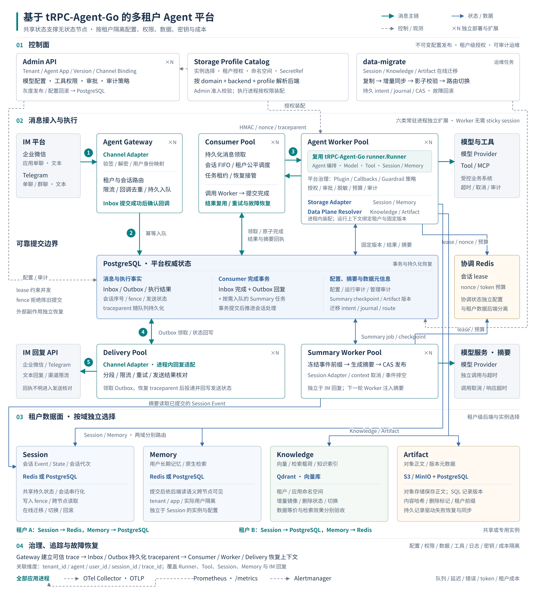
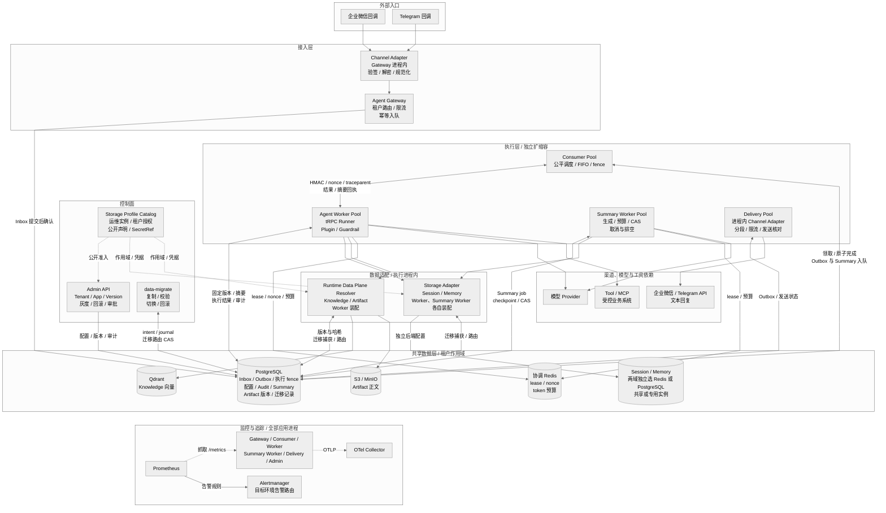

# 架构设计

## 1. 目标与边界

平台面向多个业务共用 Agent 执行节点、数据按租户独立管理的企业场景。设计首先保证已经确认的消息可以恢复、同一会话保持因果顺序、租户身份贯穿每次数据访问、失败执行者不能覆盖有效结果，并使配置、版本、工具授权与恢复操作可以追溯。模型能力由 tRPC-Agent-Go 提供，平台围绕执行过程补齐可靠消息、控制面、共享数据面和治理协议。

租户能够分别选择 Redis 或 PostgreSQL 保存 Session 与 Memory，再配置 Qdrant Knowledge 和 S3/MinIO Artifact。后端类型决定接口实现，运维管理的 profile 决定实例、命名空间和授权范围。不同租户可以共用实例，也可以绑定专用实例；同一套 Worker 根据配置装配实际服务。共享后端承担数据权威，进程内缓存只保存可以重建的客户端和执行配置。

平台接入企业微信应用单聊文本与 Telegram 私聊、群聊文本，运行 LLM、Chain、Graph、Parallel 和 Cycle。生产准入检查实际安装的运行时能力、模型目录和数据后端，禁止静默替换执行实现。代码验证、真实后端集成与目标环境验收各自保留证据；正式账号、网络身份、容量、容灾和业务效果按部署环境验收。

## 2. 系统架构图

查看完整组件依赖图与 Mermaid 源码

Gateway 处理通道认证、租户路由与入口限制，在数据库提交 Inbox 后确认回调。Consumer 竞争持久化消息的处理权，调用 Worker，再把业务完成状态、回复和摘要任务一并提交。Worker 解析固定版本、读取共享上下文、执行模型与工具，并保存结果。Delivery 独立处理分段、限流、重试和未知发送结果，使慢模型与慢通道具有不同的扩容及故障边界。

Admin 管理租户、Agent 应用、不可变版本和发布路由；业务请求从共享控制面读取配置，不需要逐次经过 Admin。Summary Worker 独立生成摘要，避免摘要模型延迟阻塞正常回复。Storage Adapter 与 Runtime Data Plane Resolver 都位于执行进程内，前者选择 Session/Memory 官方服务，后者装配 Knowledge/Artifact。它们不是额外的网络代理层。

各二进制只负责配置、依赖装配、协议接线、健康状态和资源关闭。共享领域模块持有状态机、身份检查、存储适配与治理契约。这样可以独立发布进程，又能直接通过模块接口验证不变量；代价是跨进程协议必须同时约束状态、版本和失败分类，不能依靠调用栈隐含事务关系。

## 3. 可靠执行与一致性

数据库事务负责可以在同一存储内完成的原子操作。Inbox 使用租户、通道类型、通道账号和外部消息标识构成唯一身份，并检查内容哈希。重复消息复用最初提交的路由与会话序号；同身份异内容拒绝。回复由已领取的权威 Inbox 派生，Worker 返回类型只允许业务正文、格式和 trace，阻止执行结果重新指定租户或回复目标。

同一租户、Agent 应用和会话的消息采用持久化顺序。只有全部前序完成，后续消息才可领取；等待核对或死信会暂停该会话，其他会话继续推进。这个选择用局部可用性换取因果一致性，避免工具动作、用户意图和上下文发生倒置。热点会话不能通过增加 Worker 副本无限加速，需要在业务层拆分独立会话或降低单次处理耗时。

领取、续租、完成和失败更新共同校验状态、持有者、单调 fence 与数据库时间。Redis 会话租约覆盖记忆读取、模型、工具和事件消费，丢失租约会取消执行；PostgreSQL fence 拒绝陈旧持有者的持久化提交。二者分别控制执行并发与提交身份。共享存储可被两个副本访问，并不意味着它们可以同时修改同一会话。

Worker 在返回成功前保存执行结果，重试优先读取已提交结果，避免再次调用模型。外部工具和 IM 与本地数据库之间没有共同事务，因此系统仍采用至少一次语义。连接建立前的失败可以重试；取得连接后的传输错误按可能已经发送处理。模型或工具越过执行边界、IM 已发送但回执丢失时，记录进入人工核对流程，外部业务幂等键负责限制目标系统的重复副作用。

队列维护采用有界过期扫描与独立索引，避免空轮询反复更新全表。公平调度通过持久化虚拟时钟和租户权重选择会话队头，入队配额与在途配额在事务内检查。公平性增加调度行竞争，因此应同时测量热门租户、配额更新、续租和多副本领取的锁等待。它约束资源分配，不替代会话顺序和执行 fence。

## 4. 租户与配置隔离

租户身份先由已认证入口确定，再贯穿配置读取、版本解析、会话命名空间、数据查询、工具调用和审计。单聊以发送者形成会话主体，群聊以群形成共享会话主体；实际发言者仍独立保留。Session 使用群内共享所有者，Memory 按实际用户作用域访问，避免一个成员的个人记忆被同群其他成员读取。跨租户、跨应用和跨通道账号均具有独立身份。

数据库复合键、查询条件和后端物理键共同约束数据访问；适配器还检查返回对象身份，防止仅在调用入口过滤而在后端返回阶段串数据。profile 是运维批准的连接引用，租户不能直接提供数据库地址、任意模型端点或 MCP 请求头。新增专用后端先完成账号、网络、命名空间与容量配置，再授权租户绑定。

Admin 将认证材料解析为服务端 Principal，按角色和租户范围授权，审计操作者也来自该身份。配置更新使用版本条件写入，发布后 AgentVersion 不可变。运行时注册表在启动后封存，版本快照记录能力指纹；Admin 与 Worker 安装能力不一致时拒绝发布或执行。缓存按租户、配置、应用、版本和部署标识区分，引用计数、容量与空闲期限共同控制生命周期。

密钥按租户、用途、提供方和模型绑定，响应固定遮盖，遮盖值回写保持原密钥。Gateway/Delivery 仅解析所选通道所需凭据，Worker/Summary Worker 获得各自模型与数据面秘密。内部签名绑定方法、路径、正文、时间与 nonce，重放记录由 Redis 原子消费；网络隔离、传输认证和应用身份验证分别验收，任何一层通过都不能替代其他层。

## 5. 数据所有权与上下文

Session Event 是会话转录，State 保存会话内状态，Memory 是工具明确写入的长期记忆，Summary 是从已提交事件派生的上下文压缩结果。平台不把每条用户输入自动保存成 Memory，也不把摘要当成原始事件的替代权威。Runner 读取后端提交的数据，进程退出后新副本仍能恢复；查询语义与持久化保证由所选后端及其部署配置决定。

摘要遵循已提交 Event/State、持久化任务、冻结事件边界、重新读取事件前缀、生成、校验 fence、发布 checkpoint、下一轮注入的顺序。事件截止位置与最后事件标识精确说明覆盖范围，延迟结果不能用生成时间代替边界。任务固定 Agent 版本，摘要模型也执行预算预留和结算；任务失败与回复结果分离，用户回复不等待摘要模型完成。

同一会话身份在删除或到期后可能重新创建，因此 Session State 保存平台管理的代次 UUID，摘要任务和 checkpoint 都包含该代次。迁移原会话保留 UUID，创建新会话使用新 UUID；旧代次晚到摘要无法进入新会话。生成过程中出现的新目标登记给后续领取，当前生成继续使用冻结边界。摘要读取失败时拒绝执行，避免静默加载错误或失控的上下文。

Knowledge 以租户和应用隔离向量与检索，Artifact 把不可变版本元数据放在 PostgreSQL、正文放在对象存储。元数据和对象没有跨存储原子提交，通过稳定对象身份、哈希校验、删除标记和恢复流程收敛。检索排名质量、向量维度与模型兼容性另行验收；记录内容相等只能证明数据同步，不能证明业务查询效果相同。

## 6. 治理与资源约束

工具治理安装在 Runner 实际调用路径中，同时检查租户白名单和不可变版本授权。危险工具先建立绑定租户、调用、操作者、会话、工具及规范参数的 challenge，经有权限主体授权后一次性消费。等待审批不消耗普通重试次数；授权被替换、重复消费或作用域不符时拒绝继续。审批令牌不进入会话、模型输入或普通回复。

内容策略在记忆检索和模型调用前执行，工具结果与最终文本递归脱敏。审计记录身份、版本、工具、决定、耗时、错误类别和 trace，不保存原始提示词或凭据。工具执行审计不可用时阻断新调用。输入大小、嵌套深度和集合规模也需有界，防止合法协议格式耗尽内存或让脱敏过程失控。

token 预算采用日账本的原子预留，预留量覆盖模型上下文上限与最大调用次数。调用前消费一次性 dispatch 授权，禁用模型客户端隐式重试；明确未发送的预留可以释放，已发送且用量未知的调用保留占用。正常返回按可校验的提供方用量结算，缺失稳定用量证据时按完整预留扣减。金额硬预算尚未实现，不能以 token 账本宣称货币成本精确控制。

取消与超时贯穿模型、工具和后台任务。可合作工具响应 context；不能合作的工具需要可终止进程或容器边界。进程先停止接收与领取，再有界排空活跃执行，最后关闭共享客户端。必须持久化的失败记录使用独立短期限，既不能随原请求取消而丢失，也不能让服务永远无法退出。

## 7. 在线迁移与演进

在线迁移按租户和数据域保存持久化路由、意图、增量日志、游标及 fence。创建时确认源目标实际身份不同、目标命名空间为空、配置版本一致且数据兼容，并立即开启写入捕获。所有已有客户端在操作时重读路由，使缓存中的服务也服从切换结果；直接修改同名 profile 指向新实例会破坏数据位置身份，应创建新的配置引用。

迁移写入先恢复未完成记录，再登记本次意图、写源端、读取规范数据、保存有序日志、投影目标并读回验证。未知源端结果保留意图，删除使用独立版本的 tombstone，防止删除和重建被合并丢失。全量校验检查记录集合、内容、版本和删除状态；切换在排他门禁内完成配置条件更新、路由、状态和审计的原子提交。

回滚窗口读取目标，继续写源并同步镜像目标，操作者观察后选择完成或回滚；完成后读写目标，保留源数据和终态路由。同步镜像会把目标延迟与故障带入源请求，全量扫描也可能暂时阻塞该租户数据域，应预留容量与维护窗口。暂停只暂停协调推进，捕获与恢复仍承担数据安全职责。

当前支持 Session、Knowledge 和 Artifact 在线迁移，Memory 的后端可选但在线迁移尚未实现。Session 迁移要求关闭 TTL，拒绝共享应用或用户状态、原生摘要以及不完整的历史读取。连接级数据库锁要求直连或会话池，事务池不满足所有权契约。改变协议或唯一键的 schema 升级先排空并停止相关写入，再执行迁移和部署兼容服务。

## 8. 部署、观测与容量

最小栈包含控制面数据库、协调 Redis、六类常驻应用进程以及迁移任务和观测组件，Summary Worker 是摘要链路必要单元。生产采用托管高可用数据库与备份恢复、受控 Redis 稳定端点、独立 Admin 入口、最小权限密钥、默认拒绝网络策略和不可变镜像。当前 Redis 客户端使用单端点连接，拓扑发现并未交给运行时自动完成。

发布先应用网络与配置约束，再等待迁移任务明确完成，最后发布工作负载。Gateway、Worker 和 Summary Worker 模板包含基于应用容器指标的伸缩，Consumer/Delivery 的队列指标伸缩由独立生产配置提供。PDB、拓扑分散、健康探针和缩容等待共同减少发布中断，仍需验证目标集群的身份策略、指标可用性及故障接管。

容量按入口峰值、模型处理时长、并发余量与下游配额共同确定。Worker 扩容增加数据库连接、Redis 租约与预算请求、向量检索以及提供方调用，不能只按 CPU 线性推算。压测涵盖模型变慢、通道限流、数据库抖动、重试放大和热点会话，记录吞吐、延迟分位数、队列年龄、连接池等待与成本，并验证恢复后能否消化积压。

trace 随 Inbox/Outbox 持久化并由下游恢复，关联回调、执行、工具、存储和回复。队列深度、最老消息年龄、预算占用、摘要失败和迁移水位揭示积压来源；指标读取失败保留最近有效值并记录失败。遥测标签使用有界集合，用户标识按租户假名化。告警恢复后仍需检查业务结果、摘要覆盖和迁移一致性，不能仅凭健康端点判断数据恢复完成。

## 9. 设计取舍与验证

本设计把强一致集中在身份、队列、版本与提交门禁，把向量、对象和摘要等派生状态交给有证据的收敛协议。这样保留不同后端的能力与成本优势，同时要求每个跨存储边界明确重复写入、失败残留、读回验证和恢复责任。可恢复性来自可查询的持久状态及条件提交，不能由增加重试次数替代。

配置发布、执行恢复与数据迁移具有不同的回滚含义。发布回滚选择另一个不可变版本，不改变已经绑定请求的执行身份；消息恢复重置领取条件，但必须先核对可能存在的外部结果；数据迁移回滚依据持续维护的源端数据和路由完成。把三类操作分开建模，可以防止一次配置变更被误认为能够撤销已经发生的工具动作或对象写入。

缓存设计以资源所有权为中心。正在使用的客户端必须由明确的调用租约持有，释放与关闭具有固定顺序；容量耗尽时应返回可观测的错误，不能无界创建连接。配置变化生成新的缓存身份，使新请求读取新配置，旧请求完成后才回收旧资源。评估该选择时既要测量命中率，也要检查慢调用、取消、配置频繁更新和扩容同时发生时的连接峰值。

增加一种后端或运行时首先需要明确能力契约。接口能够编译不代表具备生产所需的租户隔离、持久化顺序、完整历史读取、关闭语义或迁移能力。扩展必须声明不可替换的能力身份、支持的数据范围和失败行为，经准入、工厂装配、实际框架调用及后端验证贯通后才能进入支持矩阵。运维还要准备最小凭据、索引与命名空间、网络策略、备份方式和可测量的容量上限。

验收沿真实请求路径检查结果：首次会话创建必须绑定代次；同会话并发和失联接管必须拒绝旧执行者；摘要必须实际进入下一轮模型请求并裁剪已覆盖历史；迁移目标必须读回正确版本和删除状态。模块测试覆盖局部不变量，真实后端集成检验驱动、时间精度与事务行为，目标部署再验证账号、网络、容量与容灾。

验收记录关联实际源码提交、配置身份与运行环境，保留可重复执行的命令及关键后状态。故障演练覆盖提交前、提交后与回执丢失三个位置，并确认恢复不会跳过未完成前序或覆盖新持有者。升级演练还应从已有数据出发，验证新字段与旧记录的处理策略；空库初始化成功不能代替带数据升级。评审据此判断哪些结论已被验证，以及目标环境仍需补齐哪些证据。

完整组件协议、消息时序、预算规则和部署模型见[项目方案](COMPETITION_SUBMISSION.md)；逐域提交与恢复见[数据同步与幂等](DATA_SYNC_IDEMPOTENCY.md)；模块选择理由及失败门禁见[设计决策](ARCHITECTURE_REVIEW.md)。物理关系、配置示例、操作命令和结果分别由[数据模型](DATA_MODEL.md)、[多后端适配方案](MULTI_BACKEND_DESIGN.md)、[迁移运行指南](ONLINE_MIGRATION.md)及[验收矩阵](ACCEPTANCE_EVIDENCE.md)给出。
