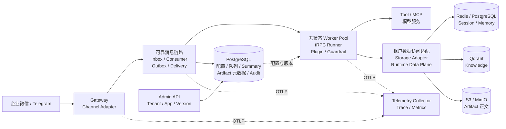
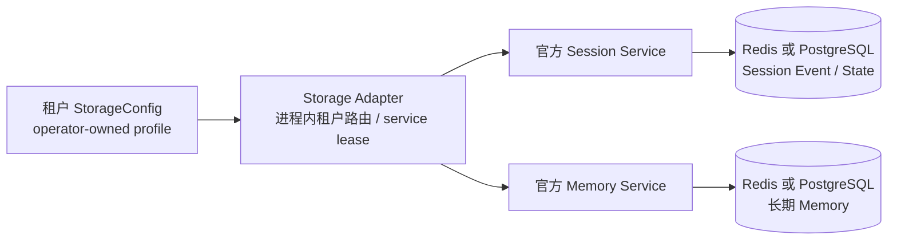
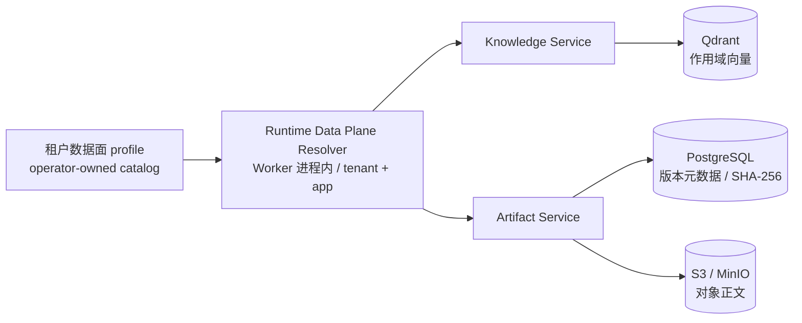
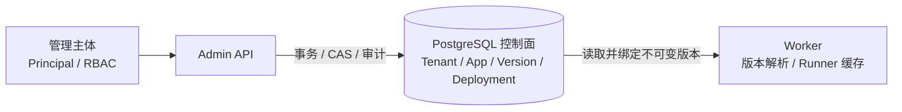
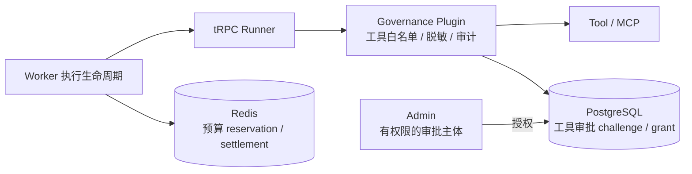
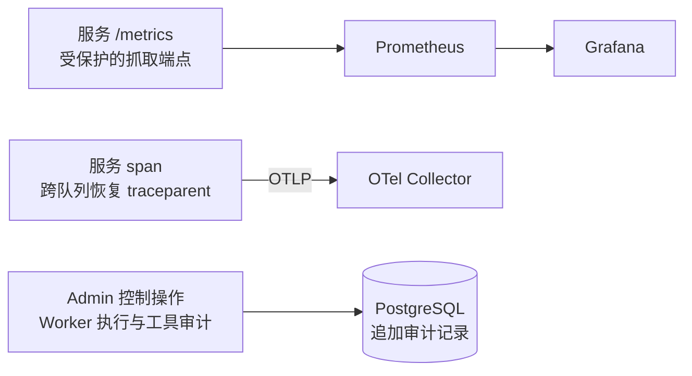
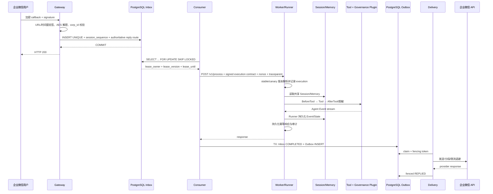
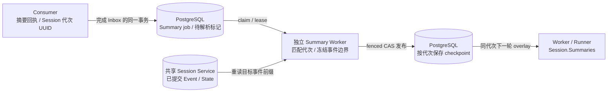

# 企业级架构与一致性设计

## 1. 设计目标与实现范围

平台基于 tRPC-Agent-Go 的 Runner、Session、Memory、Tool 和 Plugin 构建多租户控制面与可靠数据面。核心设计约束包括：已确认消息的持久性、租户作用域隔离、重复投递的幂等性、失效执行者的写入隔离、版本可追溯性，以及故障观测与恢复能力。

平台支持企业微信与 Telegram 接入、OpenAI 模型工厂、Redis/PostgreSQL Session/Memory、Qdrant Knowledge 和 S3/MinIO Artifact。InMemory 用于测试和显式单进程组合，生产 Admin/Worker 使用共享持久化后端；模型提供方和存储后端通过对应工厂与适配接口扩展。

AgentVersion 发布准入要求模型命中构建绑定的运维批准目录（operator-approved model catalog），并将目录版本与 context window 写入不可变快照。模型执行能力及预算预留依据在发布阶段完成校验，运行阶段按快照执行。

### 1.1 独立部署单元与组合根

仓库中的 `cmd/admin`、`cmd/gateway`、`cmd/consumer`、`cmd/worker`、
`cmd/summary-worker`、`cmd/delivery`、`cmd/migrate`、`cmd/data-migrate`、`cmd/replay` 和
`cmd/releaseverify` 分别编译为独立二进制和部署单元。每个入口只负责读取
配置、构造依赖、注册 HTTP/后台循环、处理信号和关闭资源；租户隔离、状态机、
fence、治理和适配器契约全部位于 `pkg/` 深模块中。入口之间不通过进程内全局
变量共享状态，也不直接调用另一个入口的实现；跨进程协作只能经过 PostgreSQL、
Redis、HTTP/HMAC 或受控 Provider 接口。这样既保持 Gateway/Consumer/Worker/
Delivery 的故障域和扩缩容边界，又让单元测试可以直接穿过 `pkg/` 接口验证不变量。

`cmd` 层承担启动、健康状态、协议适配和生命周期编排；共享业务规则由
`pkg` 领域模块提供，并由对应回归测试约束。

Admin/Worker 的 `cmd/*/main.go` 仅调用进程组合根；
`admin_bootstrap.go`/`bootstrap.go` 负责依赖装配与生命周期，`admin_http.go`/`http.go`
负责协议适配，`admin_policy.go`/`policy.go` 负责进程私有策略，`admin_config.go`/
`config.go` 负责配置解析。跨进程共享的租户、队列、执行、治理和存储不放回
`cmd`，仍由 `pkg/*` 深模块提供。

### 1.2 系统总览



总览图将可靠消息组件按职责分组；Consumer、Delivery、Gateway 和 Worker 是独立可扩缩容进程，Storage Adapter 与 Runtime Data Plane 位于 Worker 内。回复方向、事务提交与 `traceparent` 传播见第 3 节时序图；后端 profile 选择与租户组合见 [多后端适配方案](MULTI_BACKEND_DESIGN.md)。

## 2. 组件职责

- Gateway：使用非密钥 `webhookKey` 查租户，恢复并解析所选 channel 的加密凭据/SecretRef，验签/解密，限制 body/JSON 深度/内容长度；用户文本消息生成租户作用域 session，提交 Inbox 后才回复 200，通过验签的非文本回调确认并忽略。缺少 scoped tenant reader 时直接拒绝，不加载完整租户配置。
- Consumer：只领取 session 流中不存在未完成前序的 Inbox，再用 `SKIP LOCKED` 和 fence 竞争所有权；租约短于最大处理窗口时拒绝配置；调用 Worker；在同一数据库事务中把 Inbox 置为 COMPLETED 并插入唯一 Outbox。
- Inbox FIFO 分区使用 `(tenant_id, agent_app_name, session_id)`。生产 Gateway 使用 canonical session ID 生成器：单聊把外部用户主体编码进 session，群聊把会话编码进 session；`session_owner_id` 另用于 Runner Session、Summary 与审批作用域。兼容调用者提供非 canonical ID 时，同样须保持主体与 session 的稳定映射，以避免跨主体队头阻塞。改变分区键须配套迁移和 group-chat ordering 验证。
- Worker：验证 Consumer HMAC 与 nonce，解析 Channel 绑定的 Agent App，将幂等请求固定到不可变版本，连接租户 Session/Memory，运行 Runner 与治理 Plugin，持久化 execution/audit/result；没有 active stable deployment 时拒绝执行。不可变 Runner 由带容量和空闲 TTL 的并发安全缓存复用，key 包含 tenant/config/app/version/deployment；引用计数确保使用中实例不被关闭。Worker 在构造/执行前校验 immutable snapshot 中的 runtime capability fingerprint，拒绝 Admin 与 Worker 安装集不一致的执行；生产 strict Worker 与 Admin admission 对非内置 runtime 拒绝 type-only 注册，自定义 runtime 必须提供稳定 capability identity。
- Delivery：领取 Outbox，按 tenant/channel/account 恢复并解析单个 Channel 密钥，调用 Adapter；区分永久错误、普通重试和 provider Retry-After。分段消息每次只发送一段并 fenced 持久化 `delivery_cursor`，永久错误直接 DLQ，完整成功后更新 REPLIED。缺少 scoped tenant reader 时 fail-closed。
- Admin：管理 Tenant 与 Agent App/Version/Deployment。bootstrap token 和可选 scoped token 均解析为 Principal；角色权限和 tenant allowlist 在数据访问前校验，审计 actor 来自服务端身份。`pkg/adminauth` 提供 `PrincipalResolver`，允许组合根接入经验证的 OIDC/IAP/mTLS 短期主体；解析器返回的 Principal 继续接受 ID、角色与租户范围归一化校验。默认二进制使用 bootstrap bearer。响应遮盖模型、IM 和存储凭据，遮盖值 PUT 保留原密钥。
- Storage Adapter：执行进程内按租户 StorageConfig/profile 选择官方 Redis/PostgreSQL Session/Memory Service，通过 service lease 管理后端客户端生命周期；共享 Session/Memory 使执行副本无需 sticky session，Summary Worker 复用相同后端选择规则。
- Runtime Data Plane Resolver：Worker 进程内按 tenant/app 与 operator-owned profile 装配 Knowledge 和 Artifact。Knowledge Service 连接 Qdrant，Artifact Service 组合 PostgreSQL 版本元数据与 S3/MinIO 对象正文；服务在注入框架前绑定租户作用域。
- Summary Worker：独立领取 PostgreSQL Summary job，按任务固定版本和事件边界重新读取共享 Session，生成摘要并 fenced 发布 checkpoint，供下一轮 Worker 读取。
- Memory 工具从租户实际 `memory.Service.Tools()` 动态解析；只有同时进入 Agent 版本快照和租户 whitelist 的工具才暴露，并继续经过 Runner governance plugin。默认 recall 预算为 10，避免无界上下文增长；不会无条件把每条原始输入保存成长期记忆。
- Telemetry：Prometheus 指标、PostgreSQL 审计、OTLP trace。异步边界把 traceparent 写入 Inbox/Outbox，再由下游恢复。

### 2.1 Session / Memory 适配

下图是进程内的构造与后端选择关系。Storage Adapter 是 `pkg/storage` 的接口边界，不是独立网络服务。Worker 与 Summary Worker 分别装配自己的 Adapter；返回的租户作用域 Service 由调用方注入 Runner 或摘要运行时，引用释放后才允许回收空闲后端。



两类 Service 可按各自 profile 选择后端；图中存储节点表示逻辑数据所有权，不要求独立物理实例。Worker 的执行 fence、Redis Session lease 与 Adapter 客户端引用是不同层面的约束。

### 2.2 Knowledge / Artifact 适配

`pkg/runtimeplane` 在 Worker 构造阶段解析 profile，并获取绑定 tenant/app 的框架服务：Knowledge 注入需要检索的 Agent 节点，Artifact 注入 Runner。它与 Session/Memory 的 Storage Adapter 分工独立。



Knowledge 的查询 embedding 使用 profile 配置的模型服务；上图只画数据存储关系。Artifact 的元数据和对象正文是两个提交边界，读取时按版本与哈希校验。

### 2.3 控制面与执行治理

Admin 写入控制面，Worker 从共享控制面解析并固定版本；两者之间没有每次请求都要经过的 Admin RPC。



Worker 在执行生命周期中完成预算预留、dispatch 授权和结算；治理插件在 Runner 的 BeforeTool/AfterTool 与 AfterModel 回调执行工具授权、审计和输出脱敏。图中的预算、审批和工具节点表示不同职责，不是另一个统一治理服务。



### 2.4 观测与审计

每类观测信号只画一次来源，避免把所有进程的指标与 trace 连到消息主链上。`traceparent` 随 Inbox/Outbox 持久化并由下游恢复；审计与普通遥测有不同的持久化和失败语义。



## 3. 核心时序



正常完成或非超时错误时，Worker 持续消费 Runner Event channel 直到关闭，释放 producer；请求 context 超时或取消时停止等待并返回不确定结果。Tool 需响应 context，非合作工具使用可终止的进程级隔离。进程 shutdown 先关闭 intake/readiness，再等待固定 Worker Pool，最后关闭数据库与 Redis。

### 3.1 企业微信与 Telegram 的接入差异

| 项目 | 企业微信应用回调 | Telegram Bot |
|---|---|---|
| 初次验证 | GET `echostr` 验签并 AES 解密后原样返回 | 设置 webhook 时配置 secret token，无独立 echostr |
| 回调认证 | token + timestamp + nonce + encrypted payload 做 SHA1；再校验 corp ID | `X-Telegram-Bot-Api-Secret-Token` 常量时间比较 |
| 消息解密 | AES-CBC、PKCS#7、随机前缀、接收方 ID | JSON 明文，必须依赖 HTTPS |
| 入站范围 | 应用单聊文本；通过验签的非文本回调确认并忽略 | private/group/supergroup 用户文本；通过验签的非文本更新确认并忽略 |
| 幂等 ID | 必填 `MsgId`；缺失则拒绝该文本消息 | 优先全局 `update_id`，为 0 时用 `chat_id:message_id` |
| 会话 | 单聊按 `FromUserName`，叠加 tenant/channel/account 作用域 | 单聊按发送者，群聊按 chat ID，叠加 tenant/channel/bot account 作用域 |
| 回复 | 文本应用消息；access token 获取与缓存、2048 字节 UTF-8 分段 | 文本/Markdown；4096 字符分段、429/Retry-After、可 reply_to |

两类 Adapter 都只负责协议转换和投递，不拥有会话、Agent 执行或重试状态；可靠状态统一属于 Inbox/Outbox。

Worker 通用请求可携带经格式、地址和元数据校验的图片、音频、视频、文件 URL，并将引用转换为模型内容；Worker 不下载资源。两种 IM 的入站适配采用文本范围，非文本回调不生成此类附件。媒体通道扩展承担媒体标识解析、访问授权和有效期管理，实际下载侧配置出网限制、DNS 与重定向校验。

## 4. 幂等、并发和恢复语义

### 4.1 Inbox

唯一键为 `(tenant_id, channel_type, channel_account_id, external_message_id)`。Telegram 使用 bot 作用域全局 `update_id`，为 0 时用 `chat_id:message_id`；企业微信使用必填 MsgId，缺少该字段的文本消息在适配器解析阶段被拒绝。相同 key、不同 payload hash 返回 409，而不是静默丢弃。重复入队返回最初持久化的权威记录，不消耗新的 session 序号，也不会接受重试请求携带的路由覆盖。

入队事务通过 `inbox_session_sequences` 为 `(tenant_id, agent_app_name, session_id)` 分配单调 `session_sequence`。候选消息只有在该流所有更小序号都为 COMPLETED 时才可领取；RECEIVED、PROCESSING、RETRY_WAIT、WAITING_RECONCILIATION 和 DEAD_LETTERED 前序都会阻塞后续，其他 session 流仍可独立领取。死信或待核对状态因此有意暂停单个 session，而不是让后续消息越过已知失败破坏因果顺序；恢复需要租户已激活、完成外部结果核对，并带 actor/reason 的审计重放后成功完成前序。

领取在事务内完成。每次领取把 `lease_version + 1`；完成、重试和续租必须同时满足 status、owner、version、未过期四个条件。旧 Worker 即使恢复，也只能得到 `ErrStaleLease`。Claim 只负责领取，不在每次空轮询时扫描和更新全局过期行；Consumer 与 Delivery 每个进程各启动一个 `ReapExpired` 循环，启动立即执行、随后默认每分钟执行。PostgreSQL 用有界候选 CTE、专用 partial index 和 `FOR UPDATE SKIP LOCKED` 终结最终 lease/审批超时，每次最多处理 100 条 Inbox 与 100 条 Outbox（运行时上限 1000），因此多副本可以并行运行而不会等候或破坏 fence。最后一次租约过期会进入 DEAD_LETTERED，避免永久 PROCESSING；重放才递增 fence，终结状态本身已拒绝陈旧 Worker 提交。

QueueInspector 是只读运维接口：统计自动处理状态，排除终态和
`WAITING_RECONCILIATION`，并返回 Inbox/Outbox depth 与最早创建时间。每次
有界 reaper 维护后，Pipeline 将该快照发布为不含 tenant 标签的 depth/oldest-age
gauge；检查失败保留最后已知值并递增 failure counter，避免错误读数伪装成空队列。
迁移 034 为这两个查询增加自动状态的 `(created_at, id)` partial index；迁移 035
增加 operator-owned `tenant_queue_schedule`。启用 `FAIR_QUEUE_ENABLED` 后，
Consumer 使用持久化单调虚拟时钟，将新加入或空闲恢复租户的 virtual-runtime
对齐当前调度基线，再按权重选择租户 session head。迁移 044 安装时钟状态；
领取在短事务中依次锁定时钟、schedule 和消息，并重读 `max_inflight`；续租在更新前持有相同租户的 schedule 锁，防止未提交续租与新领取共同突破配额。计数只计入仍在有效 lease 内的
`PROCESSING` 行；Gateway 通过 `QueueAdmissionStore` 在同一入队事务内检查
`max_queued`，超限返回 429 且不分配 session 序号。migration 035 回填已有租户，
后续租户由 admission 入队按单行 upsert 补齐，claim 不执行全 Inbox 初始化扫描。启用前，
所有副本须完成对应迁移和能力校验。重置队列策略保留调度累计值；只有领取元数据的
短临界区串行，Worker 执行仍然并行。部署容量测试覆盖多副本公平性与锁竞争。

持久化 FIFO 是因果顺序的主约束；Worker 的 Redis lease 是纵深保护。Worker 对 `tenant/app/user/session` 的哈希键持有覆盖 memory read、model、tool 和 Event drain 的可续约 lease，丢失 lease 会取消 Runner context 并拒绝成功响应。UUID 标识 lease 所有权，PostgreSQL 单调 `lease_version` fence 保护 durable Inbox/Outbox 提交。

### 4.2 Worker 结果

Consumer 发送 `inbox:{id}` 与 payload hash。Worker 在模型完成后、HTTP 成功前写 `invocation_results`；Inbox 重试首先读取该结果，避免重复模型成本。该缓存不替代 Tool 的业务幂等：付款、发券、删库等工具仍必须接受业务 idempotency key，并在目标系统唯一约束下执行。

### 4.3 Outbox

`outbox_messages.inbox_id` 唯一，Outbox 创建与 Inbox 完成同事务。投递路由只从被租约保护的 Inbox 权威行派生；Worker 仅提交 `OutboxReply` 中的 content/content_type/trace，tenant、channel account、conversation、reply target 和重试策略由 Store 保持权威。Adapter 每次发送一个长度受限片段，Delivery 在调用 Provider 前以 owner/fence/lease 条件写入 `DISPATCH_STARTED`，再发送并 fenced 写回 `delivery_cursor` 或 `REPLIED`；`AdvanceOutbox`/`MarkDelivered` 只接受 `DISPATCH_STARTED`。永久 4xx 直接进入 DLQ，429 使用 provider delay，网络/5xx 使用指数退避。未 dispatch 的过期 `DELIVERING` 可安全接管；已写入 dispatch marker 的过期行进入 `WAITING_RECONCILIATION`，暂停自动重发。投递采用 at-least-once 语义：完成外部核对后的显式 resume 仍可能重复；Provider 支持幂等键时，使用 outbox ID+cursor 标识片段。

### 4.4 重放

`DEAD_LETTERED` 和 `WAITING_RECONCILIATION` 可在完成外部核对且租户恢复 active 后审计重放；attempt 清零、fence 递增，actor/reason/mode 进入 `message_replay_audit`。Inbox 重放恒为 restart。Outbox 默认 resume 并保留 `delivery_cursor`；可选 `OutboxRestartStore` 供显式 `--restart` 使用，将 cursor 清零并可能重发已确认片段。Admin 通过受保护的 `POST /api/v1/outbox-replays` 入口提交 `tenantId`、`outboxId` 和审计 `reason`，服务端复用可靠 Store 的租约/fence 和租户 scope 校验。基础 `Store` 与运维重放接口分离，普通 Adapter 保持最小能力。

## 5. 租户与安全边界

租户隔离覆盖以下十个边界：

1. 配置：PostgreSQL 是唯一租户源；服务缓存的是解密后深拷贝，调用者不能篡改共享缓存。
2. 路由：WebhookKey 与 IM 验签 Token 分离；ChannelAccountID 与 AgentApp 显式绑定；reply target 在验签后的 Gateway 固化，Worker 完成接口从类型上不包含租户或 IM 路由字段。
3. 数据：session appName 为 `tenantID:agentName`；session ID 含 tenant/channel/account；队列表与控制面有 tenant 外键/复合约束。
4. 工具：Runner Plugin 是唯一真实执行拦截点；不保留不在 Runner 路径上的静态 Tool/Agent wrapper，以免它与审批和审计语义漂移。旧配置也必须是显式 whitelist；租户只能引用运维注册的工具目录，版本创建时再次验证可执行性。Plugin 在执行前记录授权决定、执行后记录 tool name/结果/耗时；审计不可用时阻断新工具执行。需人工批准的工具走持久化 challenge → operator grant → 一次性消费，未授权、过期或作用域不匹配时 fail-closed。
5. 密钥：API Key、IM Token/Secret/AES Key 用 AES-GCM 加密且 Admin 响应固定遮盖；Channel.Config 仅允许已安装适配器的 `account_id`、`corp_id`、`encoding_aes_key`。租户保存 operator-owned Session/Memory profile ID，Worker 通过 SecretResolver 取连接串。内置 key-ring resolver 支持受限的 `env://TRPC_SECRET_*`；生产密钥来源、workload identity 与轮换步骤见外部验收运行手册。
6. 服务身份：Consumer 请求签名绑定 service、timestamp、nonce、method、path 和 body hash；Redis SETNX 消费 nonce，防五分钟窗口内跨节点重放。自定义模型 Endpoint 当前禁止；接入 SSRF-safe transport 与出网 allowlist 后才能开放。Worker HTTP Client 通过 `httptrace.GotConn` 保守标记请求可能已发送：DNS 或连接建立阶段的失败可重试，取得连接后的传输错误归类为结果未知并暂停到 reconciliation。`WroteRequest` 可能晚于 `Do` 返回，缺少该回调不能证明 Worker 未执行；部分写入同样不能安全自动重试。
7. 内容与日志：输入在 memory/model 前执行 block/warn/log 策略；工具输出和最终模型文本递归脱敏。审计结构没有 prompt/response/credential 字段；credential-bearing HTTP 请求的构造和 transport 错误在 Adapter 边界映射为稳定错误类，不传播原始 URL 或底层错误文本。
8. 控制面：租户配置更新使用 `config_version` CAS；Tenant CRUD、Agent 创建、版本创建/发布和部署切换均与操作者审计同事务。认证 token 映射不可变 Principal、权限和 tenant scope；`X-Admin-Actor` 完全不参与授权或审计身份。生产可由 OIDC/IAP 发行短期主体，但必须保留同样的服务端 scope 校验。
9. token 预算：控制面要求 `maxTokensPerDay` 与 `maxTokensPerRequest` 成对配置。硬预算仅接受运维不可变目录中的精确模型 ID，并将 catalog revision、context window 和最大输出限制写入版本快照；单请求 reservation 必须覆盖 `context window × MaxLLMCalls`。Redis Lua 在 UTC 日账本中原子验证 `used + pending + requested <= daily limit`。模型调用前的 dispatch 授权一次性使用，OpenAI SDK 隐式重试被禁用。未 dispatch 的过期 reservation 可以回收；已 dispatch 且结果未知的记录转为 uncertain，并持续占用当日预算。正常完成按 provider usage 结算：同 response ID 的累计流取最大值，多 response ID 求和；缺失 usage、无稳定 response ID 或执行开始后失败，均按完整 reservation 扣减 token 账本。结算采用幂等校验，冲突或存储失败时返回错误；Provider 用量超过 reservation 时先记录实际值，再拒绝成功响应。该机制约束并发授权与预算结算，Provider 已发生的用量由实际账单记录。
10. 危险 Tool 审批：`BeforeTool` 先规范化参数，再创建或复用 tenant-scoped challenge；Admin 根据具有相应作用域的 Principal 授权。数据库保存 token hash，HTTP 响应和 Worker 428 返回 challenge ID 与过期时间。Consumer 将 Inbox 原子转为 `WAITING_APPROVAL`，按有界 `Retry-After` 轮询且不消耗普通 attempt；过期 challenge 转为可审计 DLQ。审批 token 与 Inbox、Session、模型输入隔离。HTTP 准入通过 `ApprovalResumeStateInspector` 在同一一致性边界读取 challenge 与 grant，未授权轮询不创建 execution attempt；授权请求携带内部 challenge fence，并发消费或替换 grant 时转入 reconciliation。重试按完整 ApprovalRequest 原子消费授权记录，成功后执行工具；拒绝重复、过期、参数或主体不匹配及并发消费。外部 Store 须实现审批等待接口；缺失该接口时进入 reconciliation，缺失 PostgreSQL ApprovalStore 时拒绝危险工具执行。

公网 TLS 在专用 Ingress/Gateway 终止；清单提供 default-deny 与 Gateway/Consumer/Worker/Delivery/Admin 的显式 NetworkPolicy。生产集群还应启用 service mesh mTLS、DB/Redis TLS，并把公网 443 egress 替换成受控 egress gateway/provider allowlist。Compose 的明文内部链路只用于本机集成。

Consumer→Worker 默认 `WORKER_TRANSPORT_MODE=production`，启动时只接受 HTTPS；TLS 由部署入口终止后转发至 Worker HTTP 服务。`development` 用于隔离的本地/Compose 端点；`mesh` 要求运维设置 `WORKER_MESH_MTLS_ASSERTED=true` 并完成 service-mesh 严格双向认证验收后，才允许 HTTP app-hop。

## 6. 数据模型与存储分工

| 逻辑数据 | 推荐后端 | 一致性 | 说明 |
|---|---|---|---|
| Tenant/Channel/Agent Version/Deployment | PostgreSQL | 强一致 | `config_version` CAS、唯一约束、事务切换、控制面审计 |
| Inbox/Outbox/DLQ/Replay audit | PostgreSQL | 强一致 | 状态机、fence、恢复边界 |
| Session Event/State | PostgreSQL 或 Redis | 同 session 强顺序 | 由租户选择的 tRPC SessionService 保存 |
| Memory | Redis/PostgreSQL | 提交后可见 | 搜索语义遵循所选官方 backend |
| Summary | SQL + 异步任务 | Event/State 提交后生成 | 生成结果必须携带 max_event_sequence，旧任务不得覆盖新摘要 |
| Knowledge embeddings | Qdrant | 最终一致 | 租户/Agent 作用域向量，按版本与哈希校验 |
| Artifact | S3/MinIO + SQL metadata | 最终一致 | 对象 key 含 tenant，不可变版本和 SHA-256 读校验 |
| Audit | PostgreSQL/日志管道 | 追加写 | Worker 同步写 PostgreSQL 并输出结构化日志 |

迁移 `001` 描述平台租户/审计逻辑模型；实际 Session/Memory 表生命周期由选中的 tRPC backend 负责。完整关系和逻辑字段见 [DATA_MODEL.md](DATA_MODEL.md)。

## 7. Event → State → Summary 顺序



强制顺序是：Runner 把 Event/State 提交共享 SessionService → Consumer 根据 Worker 回执在 Inbox/Outbox 完成事务中提交 summary job → `summary.Processor` 领取带 lease 的 job，必要时冻结目标序号 → 注入的 Generator 重新从主存储读取 → 生成 → CAS 发布到 `summary.Sink` → 只有 checkpoint 已达到目标序号时才将 job 标记完成。

`summaryruntime.Runtime` 按 job 固定的 Agent 版本解析 tenant model 和 Session/Memory profile，在同一 Session lease 下冻结目标序号、重读稳定事件前缀，通过 tRPC-Agent-Go Summarizer 生成并进行预算 reservation/dispatch/settlement。migration 042 保存最后覆盖事件的 `cutoff_at` 与 `last_event_id`；PostgreSQL `FencedSink` 在同一事务锁定 job lease 后发布 checkpoint，拒绝失效 Worker 晚到写入。下一轮 Worker 在访问后端前校验 tenant/app/owner/session scope，把 checkpoint overlay 到克隆 Session 的 `Session.Summaries`，并显式启用 `WithAddSessionSummary(true)`；读取失败 fail-closed。独立 `cmd/summary-worker` 停止时先停止新 claim，再有界排空活跃 job，超时/取消后的 FAILED 状态使用独立短 deadline 持久化。

Session 另保存平台管理的 `platform:session_incarnation_id` UUID。Worker 在完整 Session lease 与 execution fence 内初始化该 State 键，并将所观察到的 UUID 写入摘要回执；job 唯一键与 checkpoint 主键包含 `session_incarnation_id`。删除或 TTL 到期后重建生成新 UUID，Generator 与 overlay 拒绝跨代次使用摘要；Session 数据迁移保留规范 State 中的 UUID。

046 的 `target_resolution_lease_version` 保存重新解析请求。正在生成时收到零序号回执，将解析标记登记给后续租约，当前生成保持已冻结的事件边界；完成后仍有标记则回到 PENDING，由下一次领取刷新目标。047 保存未绑定的旧记录用于诊断，但生产不生成或 overlay 空代次摘要；其唯一键变更要求按 breaking migration 流程排空、停止写入、执行 schema 再部署。字段、遗留数据和降级限制见 [数据模型](DATA_MODEL.md#summary-代次与调度字段)。

## 8. 后端迁移状态机

`pkg/datamigration.LiveCoordinator` 持有在线迁移状态、租约/fence、持久化 route、intent 和 journal。`pkg/migrationruntime` 将 Session、Knowledge、Artifact 装饰器接入 Worker，Summary Worker 使用相同 Session 装饰器；`cmd/data-migrate` 提供 create/run/step/status/pause/resume/abort/rollback/complete。`cmd/migrate` 负责数据库 schema 迁移。部署前置条件和操作步骤见 [ONLINE_MIGRATION.md](ONLINE_MIGRATION.md)。

创建迁移时校验租户当前 backend/profile/config_version、源目标兼容性、实际存储身份不同及目标租户命名空间为空，并在复制前开启增量捕获。实际存储身份和兼容性持久化到 route；每次解析后端时重新核对，拒绝同名 profile 在节点间指向不同存储。所有装饰后的操作取得 PostgreSQL tenant/domain advisory gate 后重读路由；活跃迁移使用排他 gate，使已有缓存客户端也跟随当前路由。

写入按固定顺序执行：先恢复前次未完成 intent/journal，再提交本次受影响记录的 intent → 写源端 → 读取完整规范记录 → 追加有序 journal → 应用目标 → 真实目标读回并比较 payload/hash → 写 `projected_at`。未知源写入结果保留 intent，下一次操作或协调器步骤重读源端恢复；删除以独立版本 tombstone 保留，后续重建不能越过未完成删除。

状态按 tenant/backend-domain 隔离：

```text
PREPARE → SNAPSHOT_COPY → DUAL_WRITE → CATCH_UP → VALIDATE
        → READ_SHADOW → CUTOVER → ROLLBACK_WINDOW → COMPLETE
```

- PREPARE：再次检查实际源端 inventory 能力；创建事务已保存配置和后端身份约束。
- SNAPSHOT_COPY：从实际后端发现创建迁移前的记录，以稳定 key 游标复制，目标验证后推进 cursor/watermark；同期写入已被捕获。
- DUAL_WRITE：确认源写路由、同步镜像和快照完成状态，并排空未完成记录。
- CATCH_UP：消费持久化 journal 的有序版本并保存投影水位。
- VALIDATE：排空增量，全量比较源目标 inventory、规范记录、内容哈希和删除状态。
- READ_SHADOW：再次执行完整规范记录读比对，校验对象为 inventory、内容、版本和删除状态；检索排名与响应质量通过单独的业务查询验收评估。
- CUTOVER：排他 gate 内排空并重新验证源目标，把租户 config_version CAS、持久化路由、阶段、lease/fence 和审计提交在同一 PostgreSQL 事务。
- ROLLBACK_WINDOW：读目标，继续写源并同步镜像目标；`run` 在此停止，操作者观察后显式选择 `complete` 或 `rollback`。
- COMPLETE：最终验证后读写均指向目标并停止镜像，保留终态路由供已有缓存客户端使用。`rollback` 让读写回源；切换前可用 `abort`。三种终止方式均不删除源数据。

Session 通过官方 Service 迁移 session-owned State、按序 Event 和 Track，从 Redis/PostgreSQL 原生元数据发现已有会话；准入拒绝 App/User shared state、SDK native summary、TTL 和达到配置上限的 inventory/history。平台 Summary checkpoint 保持 PostgreSQL 权威。Knowledge 要求兼容的 embedding 定义与向量维度；Artifact 保留精确版本、内容和 tombstone。Memory 的后端选择与在线迁移能力分别列于[支持矩阵](MULTI_BACKEND_DESIGN.md)。

迁移期间所有 Worker/Summary Worker 副本使用相同版本与不可变 profile，全部写入经过平台装饰器。活跃迁移会串行化该租户数据域的操作，全量校验和切换扫描会暂时阻塞其请求；同步镜像增加目标延迟和故障依赖，调用失败时源写入可能已经提交。pause 暂停协调推进并保持捕获。真实后端测试入口为 `test/integration/online_session_migration_test.go`、`online_dataplane_migration_test.go`；目标容量和恢复的测量项见 [ACCEPTANCE_EVIDENCE.md](ACCEPTANCE_EVIDENCE.md)。

Session/Memory 的控制面 fencing 使用连接级 PostgreSQL advisory lock；因此生产数据库连接必须是直连 PostgreSQL 或 PgBouncer session pooling。transaction/statement pooling 会把加锁、guard 校验、续租和解锁分配到不同物理连接，属于不支持的配置，部署应 fail closed。

## 9. 灰度与回滚

版本快照包含 Agent 与非密钥 Model 配置，发布后不可修改。Worker 查询一个 stable 与至多一个 canary，以 SHA-256(`tenant\0app\0session`) 映射 10,000 桶，保证同 session 稳定。首次执行把 `(tenant_id,idempotency_key)` 与 version/deployment 写入 `invocation_bindings`；Inbox 重试先读取该绑定，因此即使灰度比例或 active deployment 已改变，也不会跨版本。部署切换在一个事务里锁 Agent App、校验 published version、结束旧 active set、创建新 stable/canary。ExecutionRecord 在模型调用前固定 version/deployment，审计可复现。

配置回滚创建新的 DeploymentSet，保留不可变 Version。生产 Worker 只执行已激活 stable/canary 对应的版本；没有 active stable 时返回不可用。上线顺序为创建版本、发布、激活 stable deployment。

## 10. 容量模型

部署容量根据实测负载计算：

- `arrival_rate = IM 峰值 callback/s`
- `worker_concurrency >= arrival_rate × p95_agent_seconds × headroom(1.5~2)`
- `consumer_replicas = ceil(worker_concurrency / per_consumer_concurrency)`
- `DB claim QPS ≈ idle_pollers/poll_interval + 2×message_rate + retry_rate`
- `Redis QPS ≈ service_auth + locks + budget × request_rate`
- `outbox_growth/s = agent_success_rate - delivery_success_rate`
- `daily_tokens = daily_requests × (p50_prompt + p50_completion)`，同时用 p95 做预算压力测试。

压测覆盖正常、模型变慢、IM 429、Redis 抖动、PostgreSQL checkpoint、20% retry amplification 和热点单 session。输出 p50/p95/p99、吞吐、错误率、queue lag、DB/Redis QPS、连接池等待、CPU/内存和成本，并记录命令、环境与原始结果。本地回归基准见 [BENCHMARK.md](BENCHMARK.md)。

## 11. 主要生产风险

| 风险 | 后果 | 缓解/验收证据 |
|---|---|---|
| Gateway 先回 200 后落库 | 消息丢失 | 只在 Inbox COMMIT 后 200；kill-point 集成测试 |
| 同消息重复/ID 冲突 | 重复执行或静默丢失 | 复合唯一键 + payload hash，冲突 409 |
| 旧 Worker 复活写 | 覆盖新结果 | lease_version + owner + expiry；stale fence 测试 |
| Worker 成功后 Consumer 崩溃 | 重复模型/工具 | invocation result cache；工具自身幂等键 |
| Worker 在 execution finish 前退出 | RUNNING 审计永久悬挂 | 有界 stale reconciler 标记 ABANDONED；只更新 RUNNING；终态回归测试 |
| Runner 前 admission 超时 | 无副作用却阻塞同 session | `ErrExecutionPreflightTimedOut` → execution `SafeToRetry=true` → HTTP 503/Consumer retry |
| `Runner.Run` 后超时 | 模型/Tool 副作用未知 | `ErrExecutionTimedOut` → execution `SafeToRetry=false` → HTTP 423/reconciliation |
| IM 成功后 Delivery 崩溃 | 当前片段进入 `WAITING_RECONCILIATION`，等待外部核对 | provider 幂等键；审计 replay 后继续，明确 at-least-once |
| 跨租户 session/memory 串数据 | 数据泄露 | tenant appName/session namespace、复合约束、隔离测试 |
| 同 session 两次 Agent 并发或乱序 | Event/工具交错、因果倒置 | 持久化 session_sequence 前序门禁；全 invocation 可续约 lease；死信暂停/重放与跨 session 回归测试 |
| Runner Plugin 未装配或被绕过 | 危险工具绕过 | Worker 构造固定注册 Plugin，Runner BeforeTool/AfterTool 回归测试 |
| 内部 Worker 暴露 | 未授权模型调用 | body-bound HMAC、nonce replay store、NetworkPolicy/mTLS |
| Admin 遮盖值回写 | 永久覆盖真实密钥 | preserve masked secrets 测试 |
| 日志/URL 泄密 | 凭据泄露 | 固定遮盖、严格凭据格式、opaque transport error、无 raw prompt 审计 |
| Redis 故障或并发预检穿透预算 | 失控成本 | Lua 原子预留、UTC 日账本、租约回收、usage 保守结算；任一落账失败 fail-closed |
| 摘要乱序覆盖 | 上下文倒退 | max_event_sequence CAS 与晚到任务测试 |
| 在线迁移源目标不一致 | 切换丢记录或读取旧版本 | 持久化 intent/journal、目标读回验证、全量规范记录比对、配置 CAS 与回滚窗口 |
| 无基准容量数据 | 峰值雪崩 | 可复现 load test + SLO/error budget gate |

## 12. 最小部署与生产部署

最小集成栈：1 PostgreSQL、1 Redis、1 Gateway、1 Worker、1 Summary Worker、1 Consumer、1 Delivery、1 Admin、Migrate、Prometheus、Grafana、OTel Collector。Summary Worker 独立消费摘要任务，是异步摘要链路的必要部署单元。

Redis 运行时使用 `redis.NewClient`/`*redis.Client` 的单 endpoint 接线，可连接托管 HA 服务的稳定代理地址；运行时不执行 Cluster/Sentinel 拓扑发现。生产拓扑采用托管 HA PostgreSQL/PITR、带 TLS/ACL 的托管 Redis 稳定 endpoint、PDB 与 topology spread、独立 Admin ingress、KMS/Vault、service mesh mTLS、OTel Collector gateway + Tempo/供应商后端及 Prometheus Alertmanager。

当前 Kubernetes 模板为 Gateway、Worker、Summary Worker 配置基于应用容器 CPU/内存的 `ContainerResource` HPA；Consumer/Delivery 使用显式副本数。生产部署需为 Consumer/Delivery 按 queue lag 伸缩配置外部指标适配器与独立 HPA overlay，并验收指标可用性、缩容稳定窗口、并发配额及 Provider 限流。该 overlay 由集群运维独立管理，不加入当前应用 release bundle 的对象 allowlist。副本数和伸缩上下限仍按第 10 节容量模型、业务负载测试及故障演练确定。

迁移 Job 先于 workload 发布，镜像使用不可变 digest 和 SBOM/签名，NetworkPolicy overlay 为托管数据库配置精确 CIDR。环境配置与验收步骤统一见 [EXTERNAL_ACCEPTANCE_RUNBOOK.md](EXTERNAL_ACCEPTANCE_RUNBOOK.md)。
