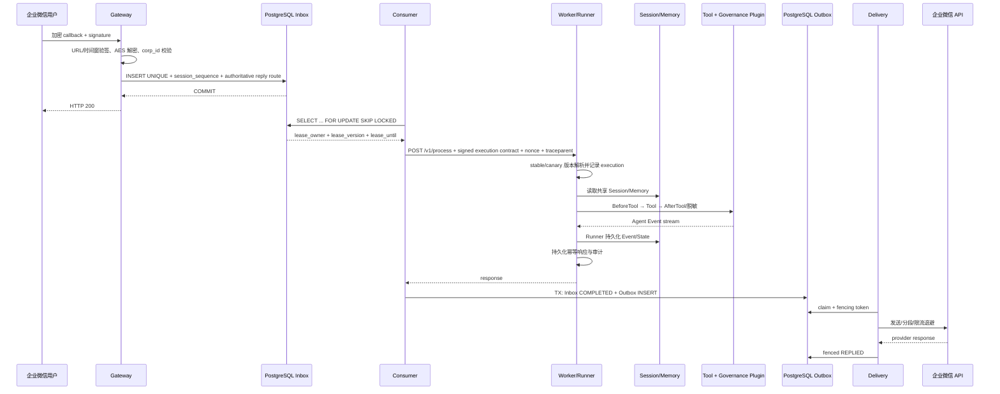

# 企业级架构与一致性设计

## 1. 设计目标与非目标

平台把 tRPC-Agent-Go 的 Runner、Session、Memory、Tool 和 Plugin 能力放进一个多租户控制面与可靠数据面。设计优先级依次是：不丢已确认消息、租户不可串数据、重复投递可判定、失效 Worker 不可复活写入、版本可追溯、故障可观测和可回滚。

本实现不是“所有后端与 IM 的全集”。它实现企业微信与 Telegram 主路径、OpenAI 模型工厂、Redis/PostgreSQL Session/Memory 生产选择；InMemory 仅用于测试/显式单进程组合，Admin 与生产 Worker 会拒绝它。其他 provider/backend 通过接口扩展，不能仅凭枚举值视为已实现。

模型治理分为两层：本地零预算 fixture 可使用占位模型名以便测试工厂与治理流程；不可变 AgentVersion 的 publish admission 必须命中本构建绑定的 operator-approved model catalog，并记录 revision/context window。这样未知模型会在发布前失败，而不是进入队列后才在 Worker 中失败。

## 2. 组件职责

- Gateway：使用非密钥 `webhookKey` 查租户，恢复并解析所选 channel 的加密凭据/SecretRef，验签/解密，限制 body/JSON 深度/内容长度，生成租户作用域 session，提交 Inbox 后才回复 200。缺少 scoped tenant reader 时直接拒绝，不加载完整租户配置。
- Consumer：只领取 session 流中不存在未完成前序的 Inbox，再用 `SKIP LOCKED` 和 fence 竞争所有权；租约短于最大处理窗口时拒绝配置；调用 Worker；在同一数据库事务中把 Inbox 置为 COMPLETED 并插入唯一 Outbox。
- Inbox FIFO 分区当前使用 `(tenant_id, agent_app_name, session_id)`。生产 Gateway 必须使用 canonical session ID 生成器：单聊把外部用户主体编码进 session，群聊把会话编码进 session；`session_owner_id` 另用于 Runner Session、Summary 与审批作用域。兼容旧请求允许非 canonical ID，但不得让生产入口用它跨主体复用同一 `session_id`，否则会产生非数据泄露性质的跨主体队头阻塞。该兼容边界属于 P2，后续若改变分区键必须配套迁移和 group-chat ordering 演练。
- Worker：验证 Consumer HMAC 与 nonce，解析 Channel 绑定的 Agent App，将幂等请求固定到不可变版本，连接租户 Session/Memory，运行 Runner 与治理 Plugin，持久化 execution/audit/result；没有 active stable deployment 时拒绝执行。不可变 Runner 由带容量和空闲 TTL 的并发安全缓存复用，key 包含 tenant/config/app/version/deployment；引用计数确保使用中实例不被关闭。Worker 在构造/执行前校验 immutable snapshot 中的 runtime capability fingerprint，拒绝 Admin 与 Worker 安装集不一致的执行；生产 strict Worker 与 Admin admission 对非内置 runtime 拒绝 type-only 注册，自定义 runtime 必须提供稳定 capability identity。
- Delivery：领取 Outbox，按 tenant/channel/account 恢复并解析单个 Channel 密钥，调用 Adapter；区分永久错误、普通重试和 provider Retry-After。分段消息每次只发送一段并 fenced 持久化 `delivery_cursor`，永久错误直接 DLQ，完整成功后更新 REPLIED。缺少 scoped tenant reader 时 fail-closed。
- Admin：管理 Tenant 与 Agent App/Version/Deployment。bootstrap token 和可选 scoped token 均解析为 Principal；角色权限和 tenant allowlist 在数据访问前校验，审计 actor 不接受客户端 header。`pkg/adminauth` 同时提供 `PrincipalResolver` seam，供已在 Ingress 验证 OIDC/IAP/mTLS 的部署注入短期主体；解析器返回的 Principal 仍经过服务端 ID、角色与租户范围归一化校验。当前二进制默认组合仍是 bootstrap bearer，外部身份接管属于部署组合根的 `EXTERNAL_REQUIRED`。响应永不回显模型、IM 或存储凭据；遮盖值 PUT 回来不会覆盖原密钥。
- Storage Adapter：按租户 StorageConfig 选择官方 Session/Memory Service。生产 Worker 把共享 SessionService 与 MemoryService 都注入 Runner，不使用进程内 sticky session，也不以手工 prompt 拼接冒充框架记忆接线。
- Memory 工具从租户实际 `memory.Service.Tools()` 动态解析；只有同时进入 Agent 版本快照和租户 whitelist 的工具才暴露，并继续经过 Runner governance plugin。默认 recall 预算为 10，避免无界上下文增长；不会无条件把每条原始输入保存成长期记忆。
- Telemetry：Prometheus 指标、PostgreSQL 审计、OTLP trace。异步边界把 traceparent 写入 Inbox/Outbox，再由下游恢复。

## 3. 核心时序



正常完成或非超时错误时，Worker 会继续消费 Runner Event channel 直到关闭，以便释放合作的 producer；请求 context 超时或取消时会立即停止等待并返回不确定结果，不能承诺排空不合作的 producer。此类工具必须通过 context 合作或进程级隔离收敛生命周期。进程 shutdown 先关闭 intake/readiness，再等待固定 Worker Pool，最后关闭数据库与 Redis。

### 3.1 企业微信与 Telegram 的接入差异

| 项目 | 企业微信应用回调 | Telegram Bot |
|---|---|---|
| 初次验证 | GET `echostr` 验签并 AES 解密后原样返回 | 设置 webhook 时配置 secret token，无独立 echostr |
| 回调认证 | token + timestamp + nonce + encrypted payload 做 SHA1；再校验 corp ID | `X-Telegram-Bot-Api-Secret-Token` 常量时间比较 |
| 消息解密 | AES-CBC、PKCS#7、随机前缀、接收方 ID | JSON 明文，必须依赖 HTTPS |
| 幂等 ID | 文本消息 `MsgId`，事件无 ID 时回退 payload hash | 优先全局 `update_id`，再用 `chat_id:message_id` |
| 会话 | tenant + channel account + group/user/conversation | tenant + bot account + chat ID；群/私聊天然由 chat ID 区分 |
| 回复 | access token 获取与缓存、平台频率/媒体限制 | 4096 字符分段、429/Retry-After、可 reply_to |

两类 Adapter 都只负责协议转换和投递，不拥有会话、Agent 执行或重试状态；可靠状态统一属于 Inbox/Outbox。

## 4. 幂等、并发和恢复语义

### 4.1 Inbox

唯一键为 `(tenant_id, channel_type, channel_account_id, external_message_id)`。Telegram 使用 bot 作用域全局 `update_id`，不存在时用 `chat_id:message_id`；企业微信使用 MsgId；无 ID 事件退化为 raw payload SHA-256。相同 key、不同 payload hash 返回 409，而不是静默丢弃。重复入队返回最初持久化的权威记录，不消耗新的 session 序号，也不会接受重试请求携带的路由覆盖。

入队事务通过 `inbox_session_sequences` 为 `(tenant_id, agent_app_name, session_id)` 分配单调 `session_sequence`。候选消息只有在该流所有更小序号都为 COMPLETED 时才可领取；RECEIVED、PROCESSING、RETRY_WAIT、WAITING_RECONCILIATION 和 DEAD_LETTERED 前序都会阻塞后续，其他 session 流仍可独立领取。死信或待核对状态因此有意暂停单个 session，而不是让后续消息越过已知失败破坏因果顺序；恢复需要租户已激活、完成外部结果核对，并带 actor/reason 的审计重放后成功完成前序。

领取在事务内完成。每次领取把 `lease_version + 1`；完成、重试和续租必须同时满足 status、owner、version、未过期四个条件。旧 Worker 即使恢复，也只能得到 `ErrStaleLease`。Claim 只负责领取，不在每次空轮询时扫描和更新全局过期行；Consumer 与 Delivery 每个进程各启动一个 `ReapExpired` 循环，启动立即执行、随后默认每分钟执行。PostgreSQL 用有界候选 CTE、专用 partial index 和 `FOR UPDATE SKIP LOCKED` 终结最终 lease/审批超时，每次最多处理 100 条 Inbox 与 100 条 Outbox（运行时上限 1000），因此多副本可以并行运行而不会等候或破坏 fence。最后一次租约过期会进入 DEAD_LETTERED，避免永久 PROCESSING；重放才递增 fence，终结状态本身已拒绝陈旧 Worker 提交。

QueueInspector 是只读运维 seam：它只统计自动处理状态，排除终态和
`WAITING_RECONCILIATION`，并返回 Inbox/Outbox depth 与最早创建时间。每次
有界 reaper 维护后，Pipeline 将该快照发布为不含 tenant 标签的 depth/oldest-age
gauge；检查失败保留最后已知值并递增 failure counter，避免错误读数伪装成空队列。
迁移 034 为这两个查询增加自动状态的 `(created_at, id)` partial index；迁移 035
增加 operator-owned `tenant_queue_schedule`。启用 `FAIR_QUEUE_ENABLED` 后，
Consumer 通过带 schedule 行锁的 virtual-runtime 选择租户 session head，并在
同一 claim 临界区检查 `max_inflight`，且只计入仍在有效 lease 内的
`PROCESSING` 行；Gateway 通过 `QueueAdmissionStore` 在同一入队事务内检查
`max_queued`，超限返回 429 且不分配 session 序号。migration 035 回填已有租户，
后续租户由 admission 入队按单行 upsert 补齐，claim 不执行全 Inbox 初始化扫描。该能力仍需
所有副本完成迁移和能力门禁后再启用，真实多副本公平性与容量结果不能由源码测试代替。

持久化 FIFO 是因果顺序的主约束；Worker 的 Redis lease 是纵深保护。Worker 对 `tenant/app/user/session` 的哈希键持有覆盖 memory read、model、tool 和 Event drain 的可续约 lease，丢失 lease 会取消 Runner context 并拒绝成功响应。该 UUID 是所有权 token，不冒充单调 fencing token；durable Inbox/Outbox 提交仍由 PostgreSQL `lease_version` fence 保护。

### 4.2 Worker 结果

Consumer 发送 `inbox:{id}` 与 payload hash。Worker 在模型完成后、HTTP 成功前写 `invocation_results`；Inbox 重试首先读取该结果，避免重复模型成本。该缓存不替代 Tool 的业务幂等：付款、发券、删库等工具仍必须接受业务 idempotency key，并在目标系统唯一约束下执行。

### 4.3 Outbox

`outbox_messages.inbox_id` 唯一，创建与 Inbox 完成同事务，因此不会出现“执行成功但永远没有回复任务”。投递路由只从被租约保护的 Inbox 权威行派生；Worker 只能提交 `OutboxReply` 中的 content/content_type/trace，不能伪造 tenant、channel account、conversation、reply target 或重试策略。Adapter 每次只发送一个长度受限片段，Delivery 在调用 Provider 前先以 owner/fence/lease 条件写入 `DISPATCH_STARTED`，再发送并 fenced 写回 `delivery_cursor` 或 `REPLIED`；Store 的 `AdvanceOutbox`/`MarkDelivered` 也只接受 `DISPATCH_STARTED`，因此绕过 fence 的自定义调用者不能把未发送内容标记为已交付。永久 4xx 直接进入 DLQ，429 使用 provider delay，网络/5xx 使用指数退避。未写入 fence 的过期 `DELIVERING` 可安全接管；已写入 fence 的过期行只进入 `WAITING_RECONCILIATION`，不会自动重发结果未知的片段。即使如此，语义仍是 at-least-once：完成外部核对后显式 resume 仍可能重复，支持 provider idempotency key 时应使用 outbox ID+cursor，不能宣称 exactly-once。

### 4.4 重放

`DEAD_LETTERED` 和 `WAITING_RECONCILIATION` 可在完成外部核对且租户恢复 active 后审计重放；attempt 清零、fence 递增，actor/reason/mode 进入 `message_replay_audit`。Inbox 重放恒为 restart。Outbox 默认 resume 并保留 `delivery_cursor`；可选 `OutboxRestartStore` 只供显式 `--restart` 使用，它把 cursor 清零并可能重发已确认片段。生产 Admin 通过受保护的 `POST /api/v1/outbox-replays` 入口提交 `tenantId`、`outboxId` 和审计 `reason`，服务端复用可靠 Store 的租约/fence 和租户 scope 校验。基础 `Store` 不暴露破坏性操作，普通 Adapter 无需为了运维命令扩展接口。重放是受控变更，不是 UPDATE status 的随意脚本。

## 5. 租户与安全边界

隔离不是只加 tenant_id：

1. 配置：PostgreSQL 是唯一租户源；服务缓存的是解密后深拷贝，调用者不能篡改共享缓存。
2. 路由：WebhookKey 与 IM 验签 Token 分离；ChannelAccountID 与 AgentApp 显式绑定；reply target 在验签后的 Gateway 固化，Worker 完成接口从类型上不包含租户或 IM 路由字段。
3. 数据：session appName 为 `tenantID:agentName`；session ID 含 tenant/channel/account；队列表与控制面有 tenant 外键/复合约束。
4. 工具：Runner Plugin 是唯一真实执行拦截点；不保留不在 Runner 路径上的静态 Tool/Agent wrapper，以免它与审批和审计语义漂移。旧配置也必须是显式 whitelist；租户只能引用运维注册的工具目录，版本创建时再次验证可执行性。Plugin 在执行前记录授权决定、执行后记录 tool name/结果/耗时；审计不可用时阻断新工具执行。需人工批准的工具走持久化 challenge → operator grant → 一次性消费，未授权、过期或作用域不匹配时 fail-closed。
5. 密钥：API Key、IM Token/Secret/AES Key 用 AES-GCM 加密且 Admin 响应固定遮盖；Channel.Config 仅允许已安装适配器的 `account_id`、`corp_id`、`encoding_aes_key`，不能作为任意秘密字典。Session/Memory DSN 或 URL 不属于租户配置：租户仅保存 operator-owned profile ID，Worker 通过环境 Secret/Secret Manager resolver 取连接串。Key-ring 启动加载还支持受限的 `env://TRPC_SECRET_*` SecretRef；这是可注入的安全边界，不是 KMS/Vault 实现。生产应把 `SecretResolver` 接到 KMS/Vault workload identity，并增加 key version/轮换作业。
6. 服务身份：Consumer 请求签名绑定 service、timestamp、nonce、method、path 和 body hash；Redis SETNX 消费 nonce，防五分钟窗口内跨节点重放。自定义模型 Endpoint 当前禁止；接入 SSRF-safe transport 与出网 allowlist 后才能开放。预算感知 Worker HTTP Client 另外跟踪请求写入边界：写入前连接失败可重试，写入后连接失败归类为结果未知并暂停到 reconciliation，避免已到达 Worker 的模型/Tool 调用被盲目重跑。
7. 内容与日志：输入在 memory/model 前执行 block/warn/log 策略；工具输出和最终模型文本递归脱敏。审计结构没有 prompt/response/credential 字段；credential-bearing HTTP 请求的构造和 transport 错误在 Adapter 边界映射为稳定错误类，不传播原始 URL 或底层错误文本。
8. 控制面：租户配置更新使用 `config_version` CAS；Tenant CRUD、Agent 创建、版本创建/发布和部署切换均与操作者审计同事务。认证 token 映射不可变 Principal、权限和 tenant scope；`X-Admin-Actor` 完全不参与授权或审计身份。生产可由 OIDC/IAP 发行短期主体，但必须保留同样的服务端 scope 校验。
9. token 预算：控制面要求 `maxTokensPerDay` 与 `maxTokensPerRequest` 成对配置。硬预算仅接受 operator 不可变目录中的精确模型 ID，并把 catalog revision、context window 和最大输出限制写入版本快照；单请求 reservation 必须覆盖 `context window × MaxLLMCalls`。Redis Lua 在 UTC 日账本中原子验证 `used + pending + requested <= daily limit`。模型调用前的 dispatch 授权一次性使用，OpenAI SDK 隐式重试被禁用。只有从未 dispatched 的过期 reservation 可回收；已 dispatched 且结果未知的记录转为 uncertain，并持续占用当日日账本，不能因 Worker 崩溃自动释放。正常完成按 provider usage 结算：同 response ID 的累计流只取最大值，多 response ID 求和；缺失 usage、无稳定 response ID 或执行开始后的失败均按完整 reservation 计费。结算幂等但冲突 fail-closed，provider 超 reservation 仍先记录真实值再拒绝响应，预算存储失败绝不返回成功。该账本防止并发穿透，但不能撤销 provider 已产生的超额消费。
10. 危险 Tool 审批：`BeforeTool` 先 canonicalize 参数并创建/复用 tenant-scoped challenge；Admin 通过带 scope 的 principal grant，数据库只保存 token hash，HTTP 响应仅返回 challenge ID 和过期时间。Worker 428 只返回 challenge ID 和过期时间，Consumer 将 Inbox 原子转为 `WAITING_APPROVAL`，按受限 `Retry-After` 轮询且不消耗普通 attempt；过期 challenge 转为可审计 DLQ。没有把 raw token 写进 Inbox/Session/模型输入。HTTP admission 通过 `ApprovalResumeStateInspector` 在同一一致性边界读取 challenge 与 grant，未授权轮询不创建 execution attempt；已授权请求携带内部 challenge fence，若并发 Worker 已消费或替换该 grant 则转入 reconciliation，不得降级为新的 user turn。重试时按完整 ApprovalRequest 原子消费已授予行，消费成功后才允许工具执行；重复、过期、错参数、错 actor、错 owner 或并发消费均拒绝。未实现审批等待 seam 的外部 Store 会 fail-closed 到 reconciliation，无 PostgreSQL ApprovalStore 的组合仍 fail-closed。

公网 TLS 在专用 Ingress/Gateway 终止；清单提供 default-deny 与 Gateway/Consumer/Worker/Delivery/Admin 的显式 NetworkPolicy。生产集群还应启用 service mesh mTLS、DB/Redis TLS，并把公网 443 egress 替换成受控 egress gateway/provider allowlist。Compose 的明文内部链路只用于本机集成。

Consumer→Worker 的应用层配置默认是 `WORKER_TRANSPORT_MODE=production`，启动时只接受 HTTPS；这项校验不能把当前 Worker 的普通 `http.Server` 描述成已实现 TLS。`development` 仅用于隔离的本地/Compose 端点，`mesh` 仅在运维显式设置 `WORKER_MESH_MTLS_ASSERTED=true` 且已验收 service-mesh 严格双向认证时放行 HTTP app-hop。该标记是外部部署前置条件，不是代码级 mTLS 证明；没有 HTTPS terminator 或可复现 mesh 证据时，生产部署应保持 fail-closed。

## 6. 数据模型与存储分工

| 逻辑数据 | 推荐后端 | 一致性 | 说明 |
|---|---|---|---|
| Tenant/Channel/Agent Version/Deployment | PostgreSQL | 强一致 | `config_version` CAS、唯一约束、事务切换、控制面审计 |
| Inbox/Outbox/DLQ/Replay audit | PostgreSQL | 强一致 | 状态机、fence、恢复边界 |
| Session Event/State | PostgreSQL 或 Redis | 同 session 强顺序 | 由租户选择的 tRPC SessionService 保存 |
| Memory | Redis/PostgreSQL/外部 Memory | 提交后可见/最终一致 | 当前搜索能力取决于官方 backend；不能把 lexical search 称为向量语义搜索 |
| Summary | SQL + 异步任务 | Event/State 提交后生成 | 生成结果必须携带 max_event_sequence，旧任务不得覆盖新摘要 |
| Knowledge embeddings | Qdrant/Milvus 等 | 最终一致 | 元数据仍放 SQL，向量写入需版本/校验 |
| Artifact | S3/COS + SQL metadata | 最终一致 | 对象 key 含 tenant，签名 URL 短 TTL |
| Audit | PostgreSQL/日志管道 | 追加写 | 当前 Worker 同步写 PostgreSQL并输出结构化日志 |

迁移 `001` 描述平台租户/审计逻辑模型；实际 Session/Memory 表生命周期由选中的 tRPC backend 负责。不得让平台重复写两套“看起来完整”但不在运行路径的 Session 表。完整关系和逻辑字段见 [DATA_MODEL.md](DATA_MODEL.md)。

## 7. Event → State → Summary 顺序

强制顺序是：Runner 把 Event/State 提交共享 SessionService → 提交 summary job（记录目标 max sequence）→ `summary.Processor` 领取带 lease 的 job → 注入的 Generator 重新从主存储读取 → 生成 → CAS 发布到 `summary.Sink` → 只有 checkpoint 已达到目标序号时才将 job 标记完成。Memory 在事务提交后对其他节点可见；若选向量后端，则元数据 SQL 成功与 embedding 成功通过 job 状态最终收敛。

V14 已把通用协调器接到生产 `summaryruntime.Runtime`：它按 job 固定的 Agent 版本重新解析 tenant model 和 Session/Memory profile，在同一 Session lease 下冻结目标序号、重读稳定事件前缀，通过 tRPC-Agent-Go Summarizer 生成并进行预算 reservation/dispatch/settlement。migration 042 保存最后覆盖事件的 `cutoff_at` 与 `last_event_id`；PostgreSQL `FencedSink` 在同一事务锁定 job lease 后发布 checkpoint，旧 Worker 即使晚完成也不能写入。下一轮 Worker 在访问后端前校验 tenant/app/owner/session scope，把 checkpoint overlay 到克隆 Session 的 `Session.Summaries`，并显式启用 `WithAddSessionSummary(true)`；读取失败 fail-closed。独立 `cmd/summary-worker` 停止时先停止新 claim，再有界排空活跃 job，超时/取消后的 FAILED 状态使用独立短 deadline 持久化。

## 8. 后端迁移状态机

迁移不能只写“五步流程”。每个 tenant/backend-domain 独立记录：

```text
PREPARE → SNAPSHOT_COPY → DUAL_WRITE → CATCH_UP → VALIDATE
        → READ_SHADOW → CUTOVER → ROLLBACK_WINDOW → COMPLETE
```

- PREPARE：冻结 schema version，验证目标 capability 与容量。
- SNAPSHOT_COPY：按稳定游标分页；目标写使用源 record ID/version 幂等 upsert；保存 checkpoint。
- DUAL_WRITE：主写旧端，Outbox 异步写新端；记录每条差异和 retry_at。
- CATCH_UP：消费 snapshot watermark 后增量日志。
- VALIDATE：比较 count、hash sample、tenant/session 最大版本和向量维度。
- READ_SHADOW：线上仍读旧端，同时抽样读新端并比较，不影响用户。
- CUTOVER：租户 config_version CAS 切读；写仍双写。
- ROLLBACK_WINDOW：观察 SLO；回滚只切读旧端，增量仍保留。
- COMPLETE：停止旧端写，保留审计 checkpoint，延迟清理。

任何阶段均需 owner lease、单调 migration fence、pause/resume、错误分类和 DLQ。本包刻意没有复制另一版本中“只有状态字段、没有 copy/dual-write executor”的模块，因为那不能称为已实现迁移工具。

Session/Memory 的控制面 fencing 使用连接级 PostgreSQL advisory lock；因此生产数据库连接必须是直连 PostgreSQL 或 PgBouncer session pooling。transaction/statement pooling 会把加锁、guard 校验、续租和解锁分配到不同物理连接，属于不支持的配置，部署应 fail closed。

## 9. 灰度与回滚

版本快照包含 Agent 与非密钥 Model 配置，发布后不可修改。Worker 查询一个 stable 与至多一个 canary，以 SHA-256(`tenant\0app\0session`) 映射 10,000 桶，保证同 session 稳定。首次执行把 `(tenant_id,idempotency_key)` 与 version/deployment 写入 `invocation_bindings`；Inbox 重试先读取该绑定，因此即使灰度比例或 active deployment 已改变，也不会跨版本。部署切换在一个事务里锁 Agent App、校验 published version、结束旧 active set、创建新 stable/canary。ExecutionRecord 在模型调用前固定 version/deployment，审计可复现。

配置回滚创建新的 DeploymentSet，不修改历史 Version。若数据库没有 active stable，生产 Worker 直接返回不可用；它不会使用可变 Tenant JSON，也不会悄悄执行第一个 Agent。上线前必须先创建、发布并激活 stable deployment。

## 10. 容量模型

不能直接写“每节点 100 并发”。需用实测输入：

- `arrival_rate = IM 峰值 callback/s`
- `worker_concurrency >= arrival_rate × p95_agent_seconds × headroom(1.5~2)`
- `consumer_replicas = ceil(worker_concurrency / per_consumer_concurrency)`
- `DB claim QPS ≈ idle_pollers/poll_interval + 2×message_rate + retry_rate`
- `Redis QPS ≈ service_auth + locks + budget × request_rate`
- `outbox_growth/s = agent_success_rate - delivery_success_rate`
- `daily_tokens = daily_requests × (p50_prompt + p50_completion)`，同时用 p95 做预算压力测试。

压测必须覆盖正常、模型变慢、IM 429、Redis 抖动、PostgreSQL checkpoint、20% retry amplification 和热点单 session。输出 p50/p95/p99、吞吐、错误率、queue lag、DB/Redis QPS、连接池等待、CPU/内存和成本；没有原始命令、环境与结果文件不能声称容量达标。

## 11. 主要生产风险

| 风险 | 后果 | 缓解/验收证据 |
|---|---|---|
| Gateway 先回 200 后落库 | 消息丢失 | 只在 Inbox COMMIT 后 200；kill-point 集成测试 |
| 同消息重复/ID 冲突 | 重复执行或静默丢失 | 复合唯一键 + payload hash，冲突 409 |
| 旧 Worker 复活写 | 覆盖新结果 | lease_version + owner + expiry；stale fence 测试 |
| Worker 成功后 Consumer 崩溃 | 重复模型/工具 | invocation result cache；工具自身幂等键 |
| Worker 在 execution finish 前退出 | RUNNING 审计永久悬挂 | 有界 stale reconciler 标记 ABANDONED；只更新 RUNNING；终态回归测试 |
| Runner 前 admission 超时 | 无副作用却阻塞同 session | `ErrExecutionPreflightTimedOut` → execution `SafeToRetry=true` → HTTP 503/Consumer retry |
| `Runner.Run` 后超时 | 模型/Tool 副作用未知 | `ErrExecutionTimedOut` → execution `SafeToRetry=false` → HTTP 423/reconciliation |
| IM 成功后 Delivery 崩溃 | 当前片段进入 `WAITING_RECONCILIATION`，等待外部核对 | provider 幂等键；审计 replay 后继续，明确 at-least-once |
| 跨租户 session/memory 串数据 | 数据泄露 | tenant appName/session namespace、复合约束、隔离测试 |
| 同 session 两次 Agent 并发或乱序 | Event/工具交错、因果倒置 | 持久化 session_sequence 前序门禁；全 invocation 可续约 lease；死信暂停/重放与跨 session 回归测试 |
| Runner Plugin 未装配或被绕过 | 危险工具绕过 | Worker 构造固定注册 Plugin，Runner BeforeTool/AfterTool 回归测试 |
| 内部 Worker 暴露 | 未授权模型调用 | body-bound HMAC、nonce replay store、NetworkPolicy/mTLS |
| Admin 遮盖值回写 | 永久覆盖真实密钥 | preserve masked secrets 测试 |
| 日志/URL 泄密 | 凭据泄露 | 固定遮盖、严格凭据格式、opaque transport error、无 raw prompt 审计 |
| Redis 故障或并发预检穿透预算 | 失控成本 | Lua 原子预留、UTC 日账本、租约回收、usage 保守结算；任一落账失败 fail-closed |
| 摘要乱序覆盖 | 上下文倒退 | max_event_sequence CAS 与晚到任务测试 |
| 向量/SQL 双写不一致 | 检索缺失 | Outbox、checkpoint、shadow read、差异表 |
| 无基准容量数据 | 峰值雪崩 | 可复现 load test + SLO/error budget gate |

## 12. 最小部署与生产部署

最小集成栈：1 PostgreSQL、1 Redis、1 Gateway、1 Worker、1 Consumer、1 Delivery、1 Admin、Migrate、Prometheus、Grafana、OTel Collector。

当前 Redis 运行时使用 `redis.NewClient`/`*redis.Client` 的单 endpoint 接线；该 endpoint 可以是托管 HA 服务的稳定代理地址，但本包没有实现 Redis Cluster 或 Sentinel 的原生拓扑发现与故障切换，不能仅凭部署文档宣称支持。生产建议：托管 HA PostgreSQL/PITR、带 TLS/ACL 的托管 Redis 稳定 endpoint；Gateway/Consumer/Worker/Delivery 分别 HPA；Consumer/Delivery 按 queue lag 而非仅 CPU 扩容；PDB 与 topology spread；独立 Admin ingress；KMS/Vault；service mesh mTLS；OTel Collector gateway + Tempo/供应商后端；Prometheus Alertmanager；迁移 Job 先于 workload 发布；所有镜像用不可变 digest 并生成 SBOM/签名。NetworkPolicy 的托管数据库目标必须在环境 overlay 中替换为精确 CIDR。
