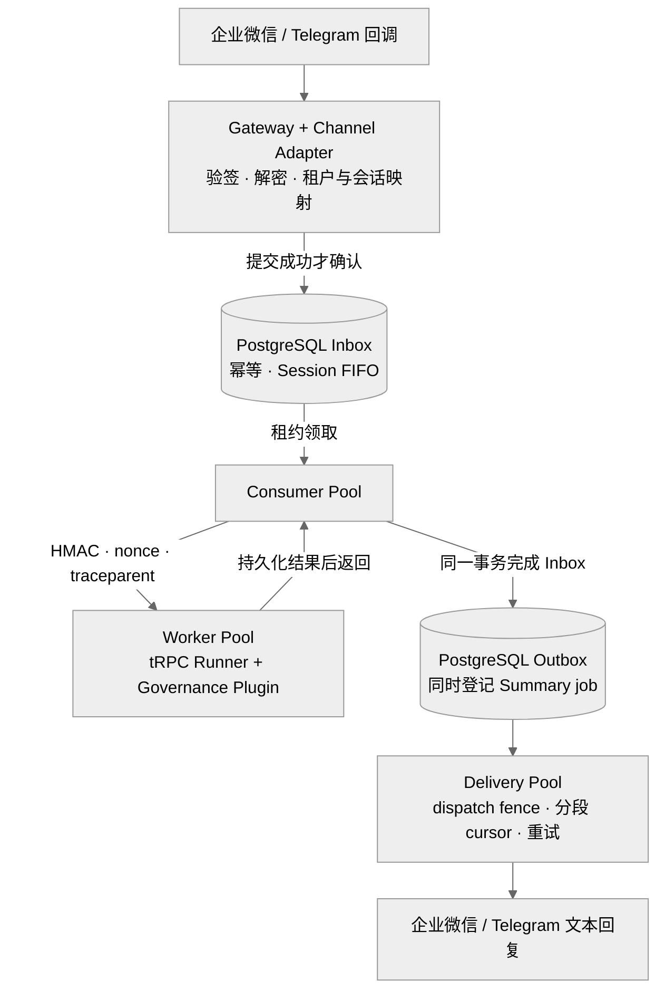
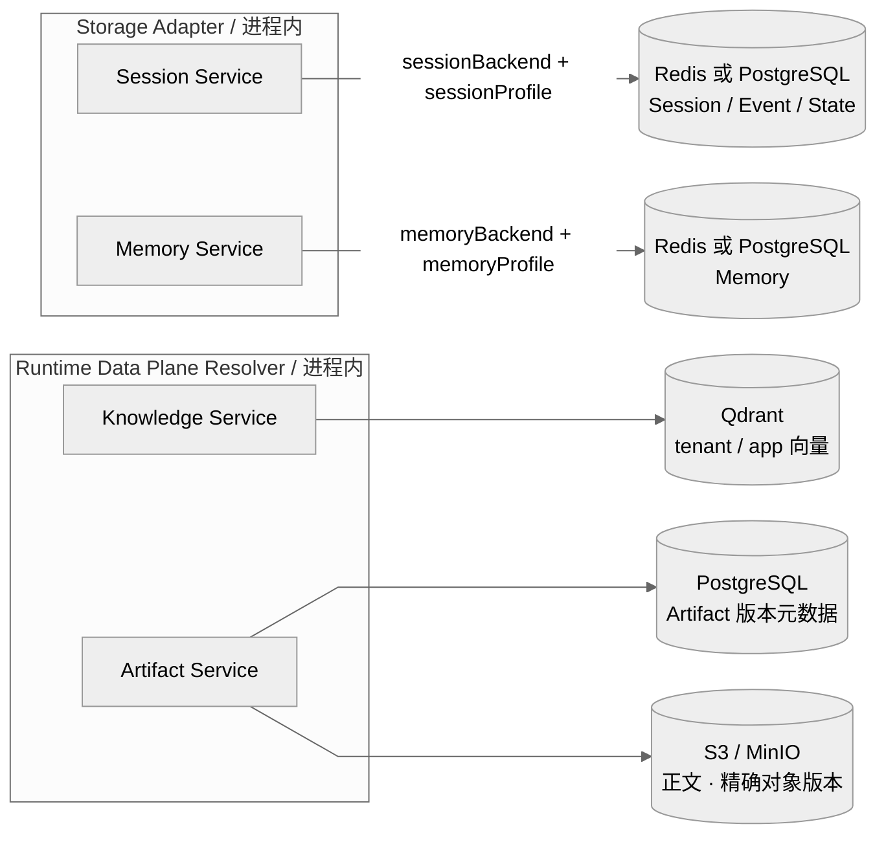
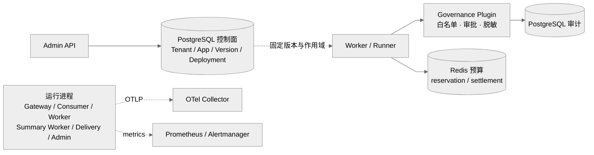
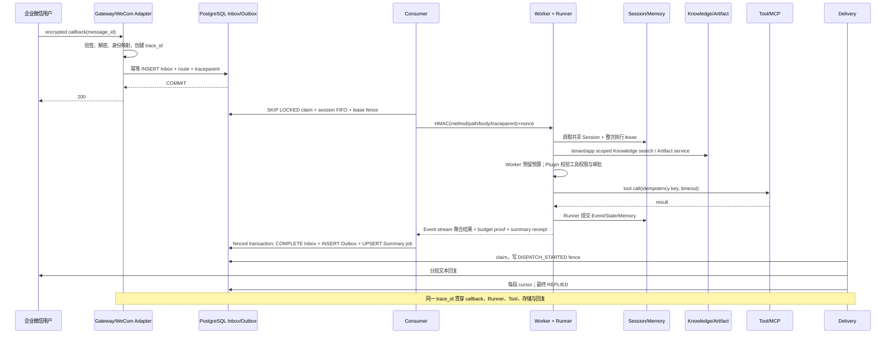
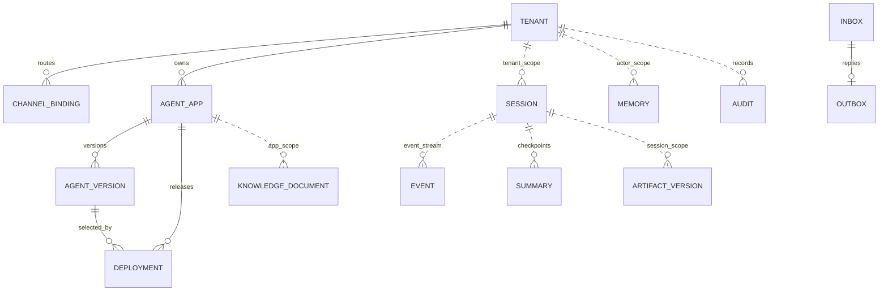

# Enterprise Multi-Tenant Agent Platform

作者：王子龙  
实现框架：tRPC-Agent-Go v1.11.2  
生产工具链：Go 1.26.7；模块下限：Go 1.25.14

## 1. 设计原则与实现依据

平台围绕租户级数据面组合、可恢复的数据迁移协议和跨节点执行一致性构建。入口、队列、执行、数据面、治理和控制面独立部署，每类状态指定权威所有者：PostgreSQL 持久化队列、版本、审计与执行身份；所选 Session/Memory 后端保存会话和长期记忆；Qdrant 保存向量；S3/MinIO 保存对象正文。

| 核心设计 | 配置或故障场景 | 实现依据 |
|---|---|---|
| 租户级数据面组合 | 租户 A 使用 Redis Session + PostgreSQL Memory，B 使用相反组合；两域各有 backend/profile。共享或专属实例通过运维 profile 和租户 allowlist 选择，同一 Worker 二进制处理不同组合 | [后端工厂](../pkg/storage/backend_factory.go)、[跨节点存储适配集成](../test/integration/cross_backend_storage_test.go)、[配置与 SDK 调用链](MULTI_BACKEND_DESIGN.md) |
| 可恢复的数据迁移协议 | 复制期间发生写入、删除或进程中断：intent 保存源端写入身份，journal 保留有序版本，目标读回验证后推进；回滚窗口内源端持续接收写入 | [生产协调器](../pkg/datamigration/live.go)、[Session 迁移集成](../test/integration/online_session_migration_test.go) |
| 跨节点执行一致性 | Worker A 宕机后 B 领取同一消息，继续使用已绑定版本和共享上下文；旧 fence 不能提交，Consumer 创建唯一对应 Outbox，未知外部副作用进入核对 | [持久化接管与 FIFO 集成](../test/integration/postgres_reliable_test.go)、[执行解析](../pkg/controlplane/resolver.go) |

平台复用 tRPC-Agent-Go 的 Runner、LLMAgent、Chain/Graph/Parallel/Cycle、Event、存储和 Plugin 接口，增加租户与可靠执行协议。组合 Runtime 支持节点提示词、工具白名单、节点与全局调用预算、Graph DAG/可达性校验和 Cycle 有限迭代；Admin/Worker 通过 capability fingerprint 与启动后封存的注册表校验实现一致性。

## 1.1 代码仓库与可复现入口

[公开仓库](https://github.com/ltyfulan9/trpc-agent-service/tree/submission-online-migration-20260906)采用 Apache-2.0 许可证。从全新目录执行：

```bash
git clone --branch submission-online-migration-20260906 --single-branch https://github.com/ltyfulan9/trpc-agent-service
cd trpc-agent-service
git rev-parse HEAD
./scripts/validate.sh
```

Windows 服务栈入口为 `scripts/run_c_local_stack.ps1 -ProjectName agent-platform-review -Build`；`go run ./cmd/demo` 提供无需外部账号的内存状态机故障演示。评审步骤见 [JUDGE_QUICKSTART.md](JUDGE_QUICKSTART.md)，以提交 SHA 关联[验收记录](ACCEPTANCE_EVIDENCE.md)和公开 CI。

## 2. 系统架构图

包含 Channel Adapter、无状态 Worker、Storage Adapter、Plugin/Guardrail、Telemetry 与四类后端的 [系统总览图](ARCHITECTURE.md#12-系统总览) 展示完整关系，以下分图展开消息、数据和治理职责。租户配置样例与实际 SDK 调用路径见 [多后端适配方案](MULTI_BACKEND_DESIGN.md)。

### 2.1 可靠消息与执行



Gateway 在文本消息的 Inbox 事务提交后返回 2xx；数据库失败由 IM 重试。Consumer 用 `SKIP LOCKED`、单调 `lease_version` 和持久化 `session_sequence` 实现跨会话并行、同会话 FIFO。Worker 在整个 Runner 生命周期持有可续约 Session lease，副本共享已提交数据；有界缓存按 tenant/config/app/version/deployment 绑定并通过引用计数排空。

### 2.2 Storage Adapter 与共享后端



Storage Adapter 选择官方 Session/Memory Service，独立 Resolver 装配 Knowledge/Artifact；两者在注入框架前绑定租户作用域。profile 表达实例、命名空间和授权，存储引擎类别按 PostgreSQL、Redis、Qdrant、S3-compatible 四类计算。平台 PostgreSQL 与协调 Redis 仍承担队列、执行 guard、lease、nonce 和预算职责。

### 2.3 控制、治理与观测



各运行进程独立扩缩容；虚线表示配置读取或遥测。运维提供 profile catalog 与 SecretRef，解析器按租户、用途和进程职责授予实际秘密；Worker 完成预算预留、dispatch 与结算，Plugin 处理工具授权、审批和脱敏。

## 3. 租户与隔离模型

`Tenant` 包含身份、Agent/模型、工具白名单、Channel、数据面 profile、审计、预算和队列配额。Agent 配置经历 App → immutable Version → stable/canary Deployment；幂等请求首次选定版本后持久化，重试沿用该绑定。

隔离覆盖五个边界：

1. 配置：Admin 使用 tenant-scoped Principal/RBAC；更新带 `config_version` CAS。
2. 数据：查询、复合键、锁及返回对象校验 tenant；Session app name 使用长度前缀命名空间，Knowledge 物理 ID 和 Artifact object key 绑定完整作用域。
3. 工具：Agent 版本与租户白名单共同授权，`BeforeTool` 校验审批和参数 hash；MCP 使用运维 HTTPS profile 与 `mcp_<profile>_<remote>` 声明，按版本延迟建立官方 ToolSet，禁用 stdio 和租户自设 URL/Header/凭据。
4. 密钥：租户保存加密业务密钥或 SecretRef/profile ID；数据面、模型、通道和 MCP 秘密分别授予消费进程。
5. 观测：用户标识按租户 HMAC 假名化，高基数指标汇聚到 `__other__`；日志、trace 和镜像排除秘密与原始正文。

Session ID 是 `tenant/channel/account/scope/subject` 的稳定 SHA-256 散列：单聊使用 `scope=direct`、发送者为 subject；Telegram 群聊使用 `scope=group`、chat ID 为 subject。企业微信应用回调采用单聊规则。单聊 Session owner 为发送者，群聊 owner 为同会话共享的确定性标识，actor 保留实际发送者；Agent App 另通过 Runner app namespace 和 Inbox 分区隔离。跨群、跨 Channel account、跨租户不会共享 Session；Memory 可按显式租户策略以用户作用域共享，但不能跨租户。

## 4. 企业微信与 Telegram 接入

企业微信 Adapter 支持 URL 验证、SHA1 回调签名、AES-CBC 解密、CorpID 校验，接收应用单聊文本；Telegram 使用 webhook secret header，接收 private/group/supergroup 用户文本。两种 Adapter 将消息转换成 `channel.InboundMessage`，由 Worker 构造 `model.Message` 并调用 `runner.Runner.Run` 输出 Event。最终文本交给 Outbox：企业微信使用文本应用消息，Telegram 使用文本消息并支持 Markdown 格式；Delivery 根据 Provider 限长分段，每段成功后提交 cursor。

差异点是企业微信回调时限短且加密字段多，适合快速 durable ack；Telegram JSON 较直接但 Bot API 有 429/`Retry-After`。企业微信以必填 `MsgId` 标识消息，缺失则拒绝；Telegram 使用 `update_id`，为 0 时用 `chat_id:message_id`。该消息 ID + tenant/channel/account 构成 Inbox 唯一键；相同 ID 同 payload 返回已有结果，不同 payload hash 直接冲突。

通过验签的非文本回调按忽略事件返回成功确认，不进入 Inbox 或触发 Agent。Worker 通用请求接口另支持图片、音频、视频和文件 URL 的格式、地址及元数据校验，随后构造模型附件引用，由 Provider 处理，Worker 本身不下载。该接口与两种 IM 的文本适配边界分离；媒体通道扩展需负责媒体标识转换、有效期和访问授权，下载侧执行出网限制、DNS 与重定向校验。

## 5. 核心消息时序



模型或 Tool 已越过副作用边界但响应丢失时，记录转 `WAITING_RECONCILIATION`，暂停自动重跑。IM 投递在 Provider 调用前写 `DISPATCH_STARTED`；调用结果未知时由运维核对后审计 replay。系统采用 at-least-once 语义，以幂等键、执行结果记录与受控恢复管理重复副作用。

## 6. 数据模型、一致性与多后端

Agent 的稳定身份、不可变配置和发布路由分别由 App、Version 和 Deployment 表达。下图概括业务关系；Session/Event/Memory 由 SDK 后端管理，Summary 按会话与事件覆盖边界关联。实际平台表、复合键、外键和迁移日志见 [DATA_MODEL.md](DATA_MODEL.md) 的物理 ER 与 migrations 001–045。



| 数据 | 已接入后端 | 一致性 | 关键策略 |
|---|---|---|---|
| 控制面、Inbox/Outbox、Audit | PostgreSQL | 强一致 | 事务、唯一键、行锁、fence |
| Session/Memory | Redis 或 PostgreSQL | 提交后跨节点可见 | 整次 Session lease；无本地权威副本 |
| Summary | PostgreSQL job/checkpoint + Session overlay | 单调最终一致 | Event commit 后入队；cutoff/last event；fenced CAS |
| Knowledge | Qdrant + embedding provider | 最终一致 | tenant/app scoped ID；版本/hash；shadow validation |
| Artifact | PostgreSQL metadata + S3/MinIO | 元数据强一致、对象补偿 | 不可变版本、SHA-256、tombstone |

Summary 由独立 Worker 执行：`Event/State commit → Inbox 完成事务 upsert job → lease 下冻结 target → 重读事件前缀 → 生成与预算结算 → fenced checkpoint CAS → job complete → 下一轮 Session overlay`。`cutoff_at + last_event_id` 精确标识覆盖边界；`WithAddSessionSummary(true)` 与 `BranchFilterModeAll` 将全会话摘要注入 Runner。集成测试捕获模型请求，检查摘要、新消息和历史裁剪；旧任务受到单调序号保护，退出时停止领取并有界排空。

迁移按 `(tenant, domain)` 持有 owner lease、fence 和持久化 route/intent/journal，以 cursor/watermark 恢复复制进度。生产 Worker 与 Summary Worker 的装饰器在创建迁移时即捕获增量：源端写入前提交 intent，之后读取规范记录、同步投影目标并读回验证；恢复未完成记录后才接受下一次写入，删除与重建保留独立版本。路由同时保存实际存储身份和兼容性，已有缓存每次操作均重读路由。

`cmd/data-migrate` 提供创建、推进、查询、暂停、恢复、终止、回滚和完成，阶段为：

```text
PREPARE → SNAPSHOT_COPY → DUAL_WRITE → CATCH_UP → VALIDATE
        → READ_SHADOW → CUTOVER → ROLLBACK_WINDOW → COMPLETE
```

VALIDATE/READ_SHADOW 全量比较规范记录与 inventory，在线查询流量抽样不在实现范围。CUTOVER 在排他 gate 内排空并复核，将 tenant config_version CAS、路由、阶段、fence 和审计合并为同一事务。回滚窗口读目标、写源并镜像目标；`rollback` 将读写切回源，`complete` 最终验证后读写目标并停止镜像，保留终态路由和源数据。

迁移支持 Session、Knowledge、Artifact。Session 从原生元数据枚举历史会话，经官方 Service 迁移 session-owned State/Event/Track，要求关闭 TTL、不含 App/User shared state 或 native summary，读取未达安全上限；目标只追加严格历史后缀。平台 Summary checkpoint 持续保存在 PostgreSQL。Knowledge 要求兼容 embedding 定义与维度；Artifact 保留精确版本、正文、元数据和 tombstone。

部署要求所有写入副本升级、使用相同不可变 profile，并为域内串行操作、同步镜像及全量校验预留窗口。源端提交后镜像失败时保留 intent，后续操作先恢复再推进。其他支持条件与操作步骤见 [ONLINE_MIGRATION.md](ONLINE_MIGRATION.md)、[多后端方案](MULTI_BACKEND_DESIGN.md)和[验收记录](ACCEPTANCE_EVIDENCE.md)。

## 7. 治理、监控与安全

预算按 UTC 日账本原子预留 token，dispatch 后 usage 未知的调用保留占用；金额预算配置为 `maxCostPerDay=0`。Plugin 在 Tool 前校验白名单、参数 hash 和一次性审批，在 Tool 后及模型输出回调执行递归脱敏与审计。审计至少记录 `tenant_id/channel/user_id/session_id/agent_name/tool_name/decision/latency/error_type/cost/trace_id`，并关联 token、version/deployment、幂等键和审批身份。

指标包括入口 QPS/错误率、Inbox/Outbox depth/oldest age、Runner 与模型耗时、Tool 耗时、IM 成功率、token/租户成本、Session/Memory 延迟、Summary 失败率/耗时、migration lag、lease/fence rejection。W3C trace context 进入 Inbox 后持久化，并在 Consumer→Worker 的 HMAC body 和 Outbox 中传播。Prometheus 规则覆盖队列积压、SLO burn rate、retry storm、Summary 突发失败/高延迟；Alertmanager receiver 连接部署组织的告警接收端。

外部调用使用 context deadline；后台循环响应终止信号，以有限并发和 WaitGroup 排空。必须落盘的失败记录使用独立有界 context，Runner Event channel 持续读取至关闭或在取消后有界排空。

模型凭据授予 Worker/Summary Worker，通道凭据授予 Gateway/Delivery，MCP 凭据授予 Worker；数据面凭据按消费服务与迁移任务授权。SecretRef 作用域、出网和传输配置见[安全设计](SECURITY_REVIEW.md)。

## 8. 故障恢复、发布与容量

- Worker 宕机：lease 超时后高 fence 接管；旧 Worker 提交被拒绝。
- PostgreSQL 短暂不可用：Gateway 不 ack；Consumer/Delivery 指数退避，队列状态不在内存推进。
- Redis 不可用：nonce、预算或 Session lease fail-closed，不退回本地锁。
- 模型超时：取消请求并按已 dispatch 的最坏 reservation 计费；未知副作用进入 reconciliation。
- Tool 失败：按 typed retryability 分类；危险或非幂等 Tool 不自动重放。
- IM 429：遵循有界 `Retry-After`；分段 cursor 防止已知成功段重发。

发布使用 immutable AgentVersion + stable/canary 万分桶；同一 Session 稳定命中。回滚创建新的 deployment 切换，不篡改旧版本。Kubernetes 先运行 checksum migration，再 Worker、Consumer，配合 PDB、HPA、拓扑分散、readiness、默认拒绝 NetworkPolicy 和 digest-pinned image；breaking migration 必须先排空旧协议。

同一 Session 的前序消息处于未知副作用或死信时，后续消息暂停以保持因果顺序。运维核对外部结果后携带 actor/reason 执行 replay/resume，其他 Session 独立推进。这是会话一致性与可用性的明确取舍。

容量以峰值回调 QPS × 平均端到端时长估算并发执行，再分别预算模型 token/min、Worker goroutine/连接池、Redis lease/nonce/budget QPS、PostgreSQL claim/commit QPS、向量检索 P95 与 IM 出站额度。本地基准用于可重复回归；部署容量测试比较普通/公平 Claim 在 1/4/8/16 Consumer 下的吞吐、锁等待与 P95/P99。Compose 提供最小可运行方案；生产拓扑采用多副本 Gateway/Consumer/Worker/Summary/Delivery、PostgreSQL HA、Redis HA、托管 Qdrant/S3、OTel Collector 和独立告警。实际副本数由目标 payload 压测和故障演练确定。

## 9. 验证与部署

交付包的 `verification-evidence/current-validation.log` 记录 Go 1.26.7 下的模块校验、build/vet/unit/race 和本地状态机演示。PostgreSQL/Redis/Qdrant/MinIO 集成、Compose、镜像及 Prometheus 规则由完整验证脚本执行；各项测试入口和验收断言见 [ACCEPTANCE_EVIDENCE.md](ACCEPTANCE_EVIDENCE.md)。

企业微信/Telegram 账号接入、生产身份与网络、HA/DR、容量和备份恢复的环境配置与验收步骤统一见 [EXTERNAL_ACCEPTANCE_RUNBOOK.md](EXTERNAL_ACCEPTANCE_RUNBOOK.md)。

## 10. 生产风险与缓解

| 风险 | 控制与恢复 | 观测或验收依据 |
|---|---|---|
| 先确认回调后落库导致消息丢失 | Inbox COMMIT 后返回成功；数据库失败允许 IM 重试 | callback 状态与 Inbox 提交记录 |
| 重复消息或同 ID 内容冲突 | tenant/channel/account/message 唯一键与 payload hash | duplicate/conflict 计数与持久化记录 |
| 同 Session 乱序或旧 Worker 晚提交 | FIFO、可续约 lease、owner/fence/expiry 条件写入 | session_sequence、stale fence 拒绝 |
| 模型或工具已执行但响应丢失 | 结果缓存、未知结果进入 reconciliation；工具使用业务幂等键 | invocation 状态与外部业务结果核对 |
| IM 已发送但 cursor 未落库 | 发送前记录 DISPATCH_STARTED；外部核对后审计重放 | Outbox 状态、cursor、Provider 回执 |
| 跨租户数据或工具越权 | profile/SecretRef 作用域、复合键、白名单、BeforeTool 审批 | 作用域拒绝与授权/拒绝回归 |
| Redis 故障或预算并发穿透 | lease/nonce/budget fail-closed；Lua 原子预留与保守结算 | Redis 错误、预算 pending/usage |
| 旧摘要覆盖新上下文 | 固定事件边界、job lease、checkpoint fenced CAS | max_event_sequence、CAS 冲突 |
| 对象正文与元数据不一致 | 不可变版本、SHA-256、提交未知核对、tombstone 清理重试 | 对象状态、内容 hash、清理重试 |
| 在线迁移增量遗漏或目标失败 | 创建时捕获、intent 恢复、同步镜像、全量比对、CAS 与回滚窗口 | pending journal、迁移水位、目标错误及 gate 等待 |
| 遥测高基数或敏感内容泄漏 | 有界标签、租户 HMAC 假名、稳定错误类、脱敏与 OTLP TLS | series 数量、脱敏断言、目标 TLS 验收 |
| HA、PITR 或备份恢复失败 | 目标环境定期执行 restore drill | 实测 RPO/RTO、备份还原与 backlog 恢复记录 |

完整风险、观测信号与责任模块见 [风险登记册](RISK_REGISTER.md)。

## 11. tRPC-Agent-Go 复用与平台新增

| 能力 | 直接复用 | 平台新增 |
|---|---|---|
| Agent 执行 | Runner、LLMAgent、Chain/Graph/Parallel/Cycle、Event 流 | 版本快照、发布准入、拓扑与调用预算、执行身份绑定 |
| Session / Memory | 官方 Redis/PostgreSQL Service | 租户命名空间、profile/SecretRef、共享后端缓存、Session lease |
| Knowledge | 官方 Knowledge/VectorStore 与 Qdrant 适配 | tenant/app ScopedStore、保留字段校验、投影 ledger |
| Artifact | 官方 `artifact.Service` 接口及 Runner 注入点 | PostgreSQL 元数据 + S3/MinIO 实现、版本/hash/删除恢复 |
| 治理与工具 | Plugin/Callbacks、Tool、官方 MCP ToolSet | 白名单、预算账本、持久审批、审计、MCP profile 与秘密解析 |
| Summary | 官方 Summarizer 与 Session summary 接口 | 异步 job、固定事件边界、预算结算、fenced checkpoint 与 overlay |
| 企业消息与运维 | OpenTelemetry 接口 | IM Adapter、Inbox/Outbox、控制面、部署门禁、在线迁移捕获/协调器/命令与投影器 |

框架接口在 `pkg/worker`、`pkg/storage`、`pkg/governance`、`pkg/runtimeplane`、`pkg/platformtool` 对接；平台领域协议由 `pkg/*` 实现，各独立服务在 `cmd/*` 装配。

## 12. 七项要求对照

| 要求 | 方案位置 | 设计与实现对应关系 |
|---|---|---|
| 多租户、节点部署、同步、多后端、IM、治理与恢复 | 第 2–8 节 | 可靠消息链路、租户数据访问、运行时装配与恢复协议 |
| tenant/agent/binding/session/event/memory/summary/audit 关系 | 第 6 节、DATA_MODEL | 均有模型表达；Session/Event/Memory 由 SDK 后端管理 |
| 两种 IM，至少含微信或企业微信 | 第 4 节 | 企业微信与 Telegram 文本 Adapter、身份映射、去重、限流与分段回复 |
| 至少三类后端的存储和同步策略 | 第 6 节 | PostgreSQL、Redis、Qdrant、S3/MinIO 的数据分工、一致性与迁移策略 |
| 完整消息时序及 trace_id 或 request_id | 第 5、7 节 | traceparent 持久化、跨进程传播与 trace_id 关联 |
| 至少 8 个生产风险和缓解 | 第 10 节、RISK_REGISTER | 主方案列出 12 项风险；登记册提供 29 项控制、观测与责任分工 |
| tRPC-Agent-Go 复用与新增平台模块 | 第 11 节 | 按实际接口调用与平台实现逐项区分 |
