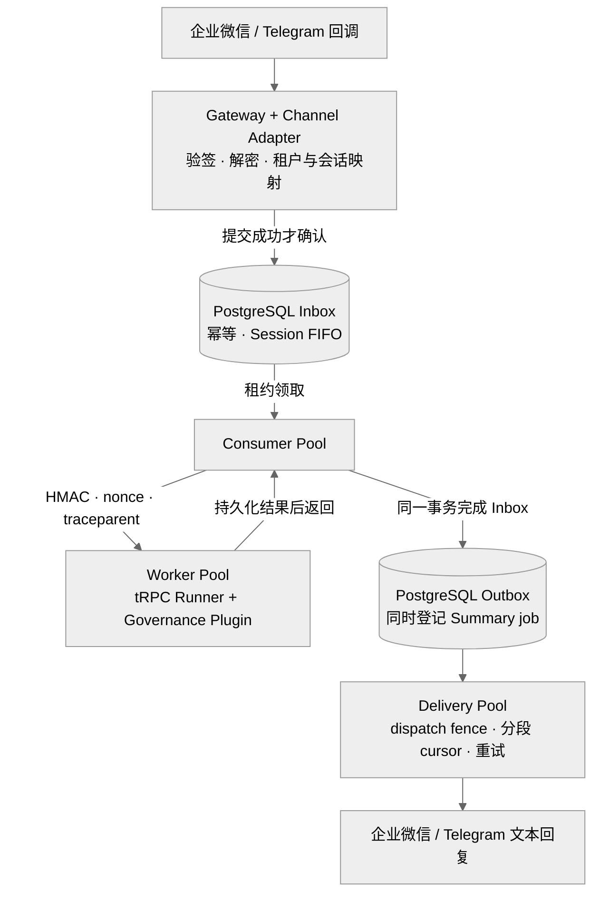
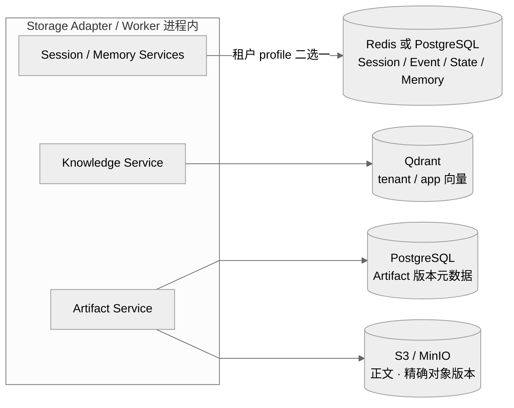
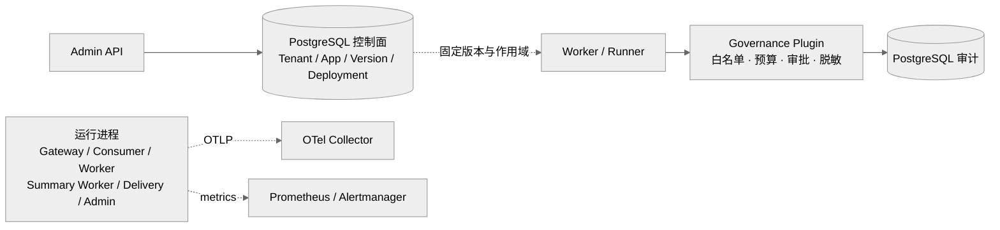
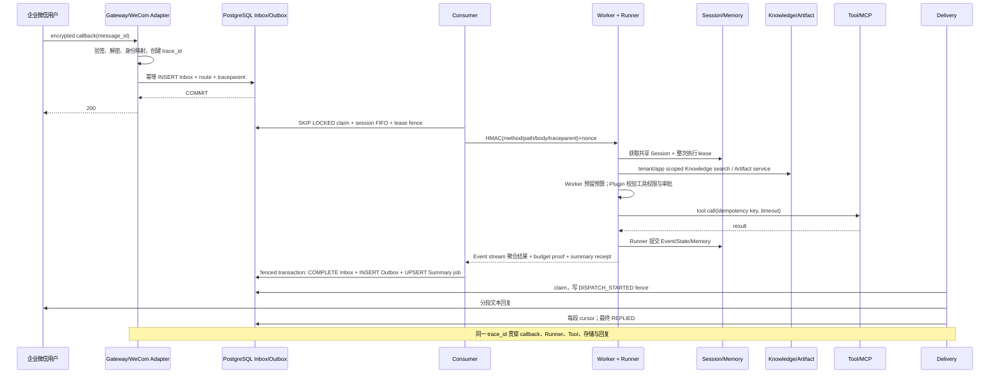

# Enterprise Multi-Tenant Agent Platform

作者：王子龙  
实现框架：tRPC-Agent-Go v1.11.2  
生产工具链：Go 1.26.7；模块下限：Go 1.25.14

## 1. 设计结论

平台由“可信入口、可靠队列、无状态执行、专用数据面、治理审计、控制面”六个边界组成，核心原则是每类状态只有一个权威所有者：PostgreSQL 决定 Inbox/Outbox、版本、审计、执行 guard 和迁移 fence；tRPC Session/Memory backend 决定会话与长期记忆；Qdrant 决定 Knowledge 向量；S3/MinIO 保存 Artifact 正文；控制面保存 profile ID。Worker 不依赖 sticky session，可按队列长度水平扩展。Session/Memory 可按租户选择 Redis 或 PostgreSQL；Runtime Coordination Plane 统一依赖 PostgreSQL。

平台直接复用 tRPC-Agent-Go 的 `runner.Runner`、`LLMAgent`、Chain/Graph/Parallel/Cycle Agent、Event 流、Session、Memory、Knowledge、Artifact、Plugin/Callbacks 与 OpenTelemetry 接口；新增租户控制面、可靠消息状态机、IM Adapter、版本路由、租户 profile resolver、预算/审批治理、Summary worker、迁移协调器和部署运维边界。

四种组合 Runtime 内置具体 factory：独立节点提示词、工具白名单和调用限额，Graph DAG/可达性校验，Cycle 有限迭代以及全局调用预算均进入 Worker 组合根。自动化测试使用确定性模型执行真实拓扑并验证 Worker composition；Admin/Worker capability fingerprint 与启动后的注册表封存共同保持 runtime 实现一致性。

## 1.1 代码仓库与可复现入口

项目仓库与验证入口：

```text
公开仓库：https://github.com/ltyfulan9/trpc-agent-service/tree/submission-online-migration-20260906
提交校验：在评审 checkout 后执行 `git rev-parse HEAD`，并将结果记录到验收证据。
提交分支：submission-online-migration-20260906
许可证：Apache-2.0（见 LICENSE）
```

从全新目录执行：

```bash
git clone --branch submission-online-migration-20260906 --single-branch https://github.com/ltyfulan9/trpc-agent-service
cd trpc-agent-service
git rev-parse HEAD
./scripts/validate.sh
```

Windows 本地验证入口是 `scripts/run_c_local_stack.ps1 -ProjectName trpc-platform-c-local-final -Build`，脚本在当前进程注入一次性验证凭据。CI 门禁见 `.github/workflows/verify.yml`；启动步骤与验证结果见 [评委快速摘要](JUDGE_QUICKSTART.md) 和 [验收证据矩阵](ACCEPTANCE_EVIDENCE.md)。运行 `go run ./cmd/demo` 可演示 lease 接管、旧 fence 拒绝、Inbox/Outbox 原子完成和未知投递结果核对；本地基准入口与数据解释见 [BENCHMARK.md](BENCHMARK.md)。

## 2. 系统架构图

包含 Channel Adapter、无状态 Worker、Storage Adapter、Plugin/Guardrail、Telemetry 与四类后端的 [系统总览图](ARCHITECTURE.md#12-系统总览) 展示完整关系，以下分图展开消息、数据和治理职责。租户配置样例与实际 SDK 调用路径见 [多后端适配方案](MULTI_BACKEND_DESIGN.md)。

### 2.1 可靠消息与执行



对进入执行链路的文本消息，Gateway 只在 Inbox 事务提交成功后返回 2xx；数据库不可用时返回可重试错误，不能先确认再异步落库。Consumer 使用 `FOR UPDATE SKIP LOCKED`、单调 `lease_version` 和持久化 `session_sequence`，既允许不同会话并行，也禁止同一会话乱序。Worker 的整次 Runner 生命周期持有可续约 Session lease，Session/Memory 存在共享后端，因此任意副本都能继续处理。

Storage Adapter 是执行进程内的数据适配边界：Session/Memory 按租户 profile 选择 Redis 或 PostgreSQL；Knowledge 连接 Qdrant；Artifact 将版本元数据与对象正文分别写入 PostgreSQL 和 S3/MinIO。各服务注入 Runner 时已绑定租户作用域，Summary Worker 复用同一 Session/Memory 后端选择规则。

### 2.2 Storage Adapter 与共享后端



独立 Summary Worker 从 PostgreSQL 领取 job，复用租户 Session/Memory 适配，生成结果经 fenced CAS 写入 checkpoint；下一轮 Worker 将其叠加到 Session。Summary 的异步流程、Redis 的 lease/nonce/budget 协调职责见 [详细架构](ARCHITECTURE.md)。图中 PostgreSQL 节点按数据所有权分开表示，不代表必须部署多个数据库实例。

### 2.3 控制、治理与观测



每类运行进程可独立部署与扩缩容；虚线表示配置读取或遥测关系。profile catalog 与 SecretRef 由运维提供，解析器按租户、用途和进程职责授予实际秘密，不经过模型输入。Kubernetes/mesh、真实告警接收端和容量参数需要在目标环境验收。

## 3. 租户与隔离模型

`Tenant` 至少包含 `tenant_id`、Agent 应用/模型配置、工具白名单、Channel 配置、Session/Memory/Knowledge/Artifact profile、审计级别、预算和队列配额。Agent 配置经历 App → immutable Version → stable/canary Deployment；同一幂等请求首次选定版本后持久化，重试不跨版本。

隔离采用五层防线：

1. 配置：Admin 使用 tenant-scoped Principal/RBAC；更新带 `config_version` CAS。
2. 数据：所有 SQL 唯一键、查询条件和锁作用域包含 tenant；Session app name、Knowledge 物理 ID、Artifact object key均带不可混淆租户作用域。
3. 工具：只有 Agent 版本和租户策略共同允许的工具才注册；`BeforeTool` 是唯一授权、审批和审计入口。MCP 采用 operator-owned HTTPS profile，Admin 只准入 `mcp_<profile>_<remote>` 声明，Worker 按实际 AgentVersion 延迟建立官方 MCP ToolSet；租户不能提交 URL/Header/凭据或启用 stdio。
4. 密钥：租户 JSON 保存加密业务密钥或 operator-owned SecretRef/profile ID；数据面和 MCP Header Secret 只进入 Worker，模型 Key 只进入 Worker/Summary Worker，Channel Secret 只进入 Gateway/Delivery。
5. 观测：日志不记录 token、API key、DSN 和原始用户标识；用户标识按租户 HMAC 假名化，指标高基数标签默认汇聚到 `__other__`。

Session ID 是 `tenant/channel/account/scope/subject` 的稳定 SHA-256 散列：单聊使用 `scope=direct`、发送者为 subject；Telegram 群聊使用 `scope=group`、chat ID 为 subject。企业微信应用回调采用单聊规则。单聊 Session owner 为发送者，群聊 owner 为同会话共享的确定性标识，actor 保留实际发送者；Agent App 另通过 Runner app namespace 和 Inbox 分区隔离。跨群、跨 Channel account、跨租户不会共享 Session；Memory 可按显式租户策略以用户作用域共享，但不能跨租户。

## 4. 企业微信与 Telegram 接入

企业微信 Adapter 支持 URL 验证、SHA1 回调签名、AES-CBC 解密、CorpID 校验，接收应用单聊文本；Telegram 使用 webhook secret header，接收 private/group/supergroup 用户文本。两种 Adapter 将消息转换成 `channel.InboundMessage`，由 Worker 构造 `model.Message` 并调用 `runner.Runner.Run` 输出 Event。最终文本交给 Outbox：企业微信使用文本应用消息，Telegram 使用文本消息并支持 Markdown 格式；Delivery 根据 Provider 限长分段，每段成功后提交 cursor。

差异点是企业微信回调时限短且加密字段多，适合快速 durable ack；Telegram JSON 较直接但 Bot API 有 429/`Retry-After`。企业微信以必填 `MsgId` 标识消息，缺失则拒绝；Telegram 使用 `update_id`，为 0 时用 `chat_id:message_id`。该消息 ID + tenant/channel/account 构成 Inbox 唯一键；相同 ID 同 payload 返回已有结果，不同 payload hash 直接冲突。

通过验签的非文本回调按忽略事件返回成功确认，不进入 Inbox 或触发 Agent。Worker 通用请求接口另支持图片、音频、视频和文件 URL 的格式、地址及元数据校验，随后构造模型附件引用，由 Provider 处理，Worker 本身不下载。该接口与两种 IM 的文本适配边界分离；媒体通道扩展需负责媒体标识转换、有效期和访问授权，下载侧执行出网限制、DNS 与重定向校验。

## 5. 核心消息时序



模型或 Tool 已越过副作用边界但响应丢失时，记录转 `WAITING_RECONCILIATION`，暂停自动重跑。IM 投递在 Provider 调用前写 `DISPATCH_STARTED`；调用结果未知时由运维核对后审计 replay。系统采用 at-least-once 语义，以幂等键、执行结果记录与受控恢复管理重复副作用。

## 6. 数据模型、一致性与多后端

核心关系是 `Tenant 1-N ChannelBinding`、`Tenant 1-N AgentApp 1-N AgentVersion`、`AgentApp 1-N Deployment`、`Session 1-N Event`、`Session 1-N Summary`、`Tenant/User 1-N Memory`、`Inbox 1-0..1 Outbox`、`Tenant/App 1-N KnowledgeDocument`、`Tenant/Session 1-N ArtifactVersion`。Agent 用 App、不可变 Version 和 Deployment 表达；Summary 按 Session 与事件覆盖边界关联，不是单个 Event 的子记录。逻辑关系、物理键和 SDK 管理的数据边界见 [DATA_MODEL.md](DATA_MODEL.md) 与 migrations 001–045。

| 数据 | 推荐后端 | 一致性 | 关键策略 |
|---|---|---|---|
| 控制面、Inbox/Outbox、Audit | PostgreSQL | 强一致 | 事务、唯一键、行锁、fence |
| Session/Memory | Redis 或 PostgreSQL | 提交后跨节点可见 | 整次 Session lease；无本地权威副本 |
| Summary | PostgreSQL job/checkpoint + Session overlay | 单调最终一致 | Event commit 后入队；cutoff/last event；fenced CAS |
| Knowledge | Qdrant + embedding provider | 最终一致 | tenant/app scoped ID；版本/hash；shadow validation |
| Artifact | PostgreSQL metadata + S3/MinIO | 元数据强一致、对象补偿 | 不可变版本、SHA-256、tombstone |

Summary 固定顺序为：`Event/State commit → 在 Inbox 完成事务中 upsert job → lease 下冻结 target → 重读稳定事件前缀 → 生成/预算结算 → fenced checkpoint CAS → job complete → 下一轮 Worker overlay Session.Summaries`。平台生成的是全会话 checkpoint，因此 Worker 同时开启 `WithAddSessionSummary(true)` 与 `BranchFilterModeAll`，避免框架默认分支前缀模式跳过空 filter key。集成测试捕获下一次真实 Runner 发出的 messages，证明摘要和 cutoff 后消息保留、cutoff 前原始 Event 被裁剪。旧任务不能覆盖较新序号；生成超时使用脱离请求取消但有界的失败写入，进程收到终止信号后停止 claim 并排空活跃 job。

在线迁移由 `(tenant, domain)` owner lease、单调 fence、持久化 route/intent/journal 和 cursor/watermark 驱动。Worker 的 Session/Knowledge/Artifact 和 Summary Worker 的 Session 服务已接入生产装饰器；创建迁移即开始捕获，写源前提交 intent，随后读取规范记录、同步投影目标并真实读回校验。未完成 intent 会在后续操作前恢复；删除和重建保留独立版本。存储身份及兼容性随路由持久化，阻止同名 profile 在不同节点指向不同存储。

Session projector 通过官方 Service 转换 session-owned State/Event/Track，并从原生元数据发现历史会话；重复版本只补严格历史后缀，目标分叉或疑似截断立即阻断。当前拒绝 App/User shared state、SDK native summary、TTL 和达到配置安全上限的数据；平台 Summary checkpoint 位于独立 PostgreSQL 权威表。Memory 在线迁移尚未实现。Knowledge 在兼容 embedding 定义和维度的 Qdrant 之间投影，Artifact 保留精确 S3/MinIO 版本、正文、元数据和 tombstone。

`cmd/data-migrate` 驱动 PREPARE → SNAPSHOT_COPY → DUAL_WRITE → CATCH_UP → VALIDATE → READ_SHADOW → CUTOVER → ROLLBACK_WINDOW，支持状态查询、暂停、恢复、终止、回滚和完成。VALIDATE/READ_SHADOW 全量比较规范记录与 inventory，真实查询流量、检索排名和用户响应抽样尚未实现。切换在排他 gate 内排空并重新比对，将 tenant config_version CAS、持久化路由、阶段、fence 和审计合并为同一事务；回滚窗口读目标、写源并镜像目标，显式 `complete` 后读写目标且停止镜像，保留终态路由和源数据。

所有写入副本必须先升级并共享不可变 profile，外部直接写入不受捕获保护。活跃迁移串行化该租户数据域操作，全量校验可能暂时阻塞请求；同步镜像增加目标延迟和故障依赖，源写入可能先于调用失败提交。运行说明见 [ONLINE_MIGRATION.md](ONLINE_MIGRATION.md)。能力状态为 `IMPLEMENTED`，新增生产装饰器集成入口与实际执行状态见 [ACCEPTANCE_EVIDENCE.md](ACCEPTANCE_EVIDENCE.md)；目标负载和恢复演练仍须验收。

## 7. 治理、监控与安全

Worker 在执行生命周期中校验内容与身份策略，完成预算 reservation、dispatch 和 token settlement。治理 Plugin 在 Tool 前校验白名单、规范化参数 hash 和危险操作 challenge，在 Tool 后及模型输出回调执行递归脱敏与审计。审计至少记录 `tenant_id/channel/user_id/session_id/agent_name/tool_name/decision/latency/error_type/cost/trace_id`，并额外记录 Agent 版本、deployment、idempotency key 和 approval challenge。

指标包括入口 QPS/错误率、Inbox/Outbox depth/oldest age、Runner 与模型耗时、Tool 耗时、IM 成功率、token/租户成本、Session/Memory 延迟、Summary 失败率/耗时、migration lag、lease/fence rejection。W3C trace context 进入 Inbox 后持久化，并在 Consumer→Worker 的 HMAC body 和 Outbox 中传播。Prometheus 规则覆盖队列积压、SLO burn rate、retry storm、Summary 突发失败/高延迟；Alertmanager receiver 连接部署组织的告警接收端。

所有外部调用都使用 `context.Context` timeout；后台循环响应信号取消，不把请求 ctx 用作必须落盘的失败记录；goroutine 由 WaitGroup/有限 worker pool 回收，Runner Event channel 必须持续读取到关闭或在取消后有界排空。秘密不进入错误、日志、trace、Kubernetes ConfigMap 或镜像层。

## 8. 故障恢复、发布与容量

- Worker 宕机：lease 超时后高 fence 接管；旧 Worker 提交被拒绝。
- PostgreSQL 短暂不可用：Gateway 不 ack；Consumer/Delivery 指数退避，队列状态不在内存推进。
- Redis 不可用：nonce、预算或 Session lease fail-closed，不退回本地锁。
- 模型超时：取消请求并按已 dispatch 的最坏 reservation 计费；未知副作用进入 reconciliation。
- Tool 失败：按 typed retryability 分类；危险或非幂等 Tool 不自动重放。
- IM 429：遵循有界 `Retry-After`；分段 cursor 防止已知成功段重发。

发布使用 immutable AgentVersion + stable/canary 万分桶；同一 Session 稳定命中。回滚创建新的 deployment 切换，不篡改旧版本。Kubernetes 先运行 checksum migration，再 Worker、Consumer，配合 PDB、HPA、拓扑分散、readiness、默认拒绝 NetworkPolicy 和 digest-pinned image；breaking migration 必须先排空旧协议。

同一 Session 的 FIFO 选择 `Consistency > Availability`：前序处于未知副作用或死信时，后续消息暂停，以保持上下文因果关系。运维先核对外部结果，再携带 actor/reason 对前序执行受控 replay/resume；其他 Session 独立推进。

容量以峰值回调 QPS × 平均端到端时长估算并发执行，再分别预算模型 token/min、Worker goroutine/连接池、Redis lease/nonce/budget QPS、PostgreSQL claim/commit QPS、向量检索 P95 与 IM 出站额度。本地基准用于可重复回归；部署容量测试比较普通/公平 Claim 在 1/4/8/16 Consumer 下的吞吐、锁等待与 P95/P99。Compose 提供最小可运行方案；生产拓扑采用多副本 Gateway/Consumer/Worker/Summary/Delivery、PostgreSQL HA、Redis HA、托管 Qdrant/S3、OTel Collector 和独立告警。实际副本数由目标 payload 压测和故障演练确定。

## 9. 验证与部署

交付包的 `verification-evidence/current-validation.log` 记录 Go 1.26.7 下的模块校验、build/vet/unit/race 和本地状态机演示。PostgreSQL/Redis/Qdrant/MinIO 集成、Compose、镜像及 Prometheus 规则由完整验证脚本执行；各项测试入口和验收断言见 [ACCEPTANCE_EVIDENCE.md](ACCEPTANCE_EVIDENCE.md)。

企业微信/Telegram 账号接入、生产身份与网络、HA/DR、容量和备份恢复的环境配置与验收步骤统一见 [EXTERNAL_ACCEPTANCE_RUNBOOK.md](EXTERNAL_ACCEPTANCE_RUNBOOK.md)。

## 10. 生产风险与缓解

| 风险 | 缓解与恢复 | 当前边界 |
|---|---|---|
| 先确认回调后落库导致消息丢失 | Inbox COMMIT 后才返回成功；数据库失败允许 IM 重试 | 已实现 |
| 重复消息或同 ID 内容冲突 | tenant/channel/account/message 唯一键与 payload hash | 已实现 |
| 同 Session 乱序或旧 Worker 晚提交 | FIFO、可续约 lease、owner/fence/expiry 条件写入 | 已实现 |
| 模型或工具已执行但响应丢失 | 结果缓存、未知结果暂停至 reconciliation；工具使用业务幂等键 | 平台已实现；业务工具需验收 |
| IM 已发送但 cursor 未落库 | 发送前记录 DISPATCH_STARTED；未知结果外部核对后审计重放 | 已实现；真实 IM 待验收 |
| 跨租户数据或工具越权 | profile/SecretRef 作用域、复合键、白名单、BeforeTool 审批 | 已实现 |
| Redis 故障或预算并发穿透 | lease/nonce/budget fail-closed；Lua 原子预留与保守结算 | 已实现；目标容量待验收 |
| 旧摘要覆盖新上下文 | 固定事件边界、job lease、checkpoint fenced CAS | 已实现 |
| 对象正文与元数据不一致 | 不可变版本、SHA-256、提交未知核对、tombstone 清理重试 | 已实现 |
| 在线迁移增量遗漏或目标失败 | 创建时捕获、intent 恢复、同步镜像、全量规范记录比对、CAS 与源写回滚窗 | 生产装配已实现；旧外部写入不覆盖，目标延迟/容量待验收 |
| 遥测高基数或敏感内容泄漏 | 有界标签、租户 HMAC 假名、稳定错误类和脱敏 | 已实现；OTLP TLS 待验收 |
| HA、PITR 或备份恢复失败 | 目标环境 restore drill，测量 RPO/RTO 并保留恢复证据 | 待外部验收 |

完整风险、观测信号与责任模块见 [风险登记册](RISK_REGISTER.md)。

## 11. tRPC-Agent-Go 复用与平台新增

| 能力 | 直接复用 | 平台新增 |
|---|---|---|
| Agent 执行 | Runner、LLMAgent、Chain/Graph/Parallel/Cycle、Event 流 | 版本快照、发布准入、拓扑与调用预算、执行身份绑定 |
| Session / Memory | 官方 Redis/PostgreSQL Service | 租户命名空间、profile/SecretRef、共享后端缓存、Session lease |
| Knowledge | 官方 Knowledge/VectorStore 与 Qdrant 适配 | tenant/app ScopedStore、保留字段校验、投影 ledger |
| Artifact | 官方 `artifact.Service` 接口及 Runner 注入点 | PostgreSQL 元数据 + S3/MinIO 实现、版本/hash/删除恢复 |
| 治理与工具 | Plugin/Callbacks、Tool、官方 MCP ToolSet | 白名单、预算账本、持久审批、审计、MCP profile 与秘密解析 |
| Summary | 官方 Summarizer 与 Session summary 接口 | 异步 job、固定事件边界、预算结算、fenced checkpoint 与 overlay |
| 企业消息与运维 | OpenTelemetry 接口 | IM Adapter、Inbox/Outbox、控制面、部署门禁、在线迁移捕获/协调器/命令与投影器 |

实现入口主要在 `pkg/worker`、`pkg/storage`、`pkg/governance`、`pkg/runtimeplane`、`pkg/platformtool`；独立服务在 `cmd/*` 装配。复用接口不表示相关平台后端也由 SDK 提供。

## 12. 七项要求对照

| 要求 | 方案位置 | 实现与验收判断 |
|---|---|---|
| 多租户、节点部署、同步、多后端、IM、治理与恢复 | 第 2–8 节 | 主消息链、专用数据面和在线迁移生产入口已装配；最新执行及目标验收见验收证据 |
| tenant/agent/binding/session/event/memory/summary/audit 关系 | 第 6 节、DATA_MODEL | 均有模型表达；Session/Event/Memory 由 SDK 后端管理 |
| 两种 IM，至少含微信或企业微信 | 第 4 节 | 企业微信与 Telegram 文本 Adapter 已实现；真实账号收发待验收 |
| 至少三类后端的存储和同步策略 | 第 6 节 | SQL、Redis、Qdrant、S3/MinIO 分工、生产捕获和迁移投影已实现；支持与性能边界见第 6 节 |
| 完整消息时序及 trace_id 或 request_id | 第 5、7 节 | traceparent 持久化并恢复到 trace_id；真实 IM 端到端记录待验收 |
| 至少 8 个生产风险和缓解 | 第 10 节、RISK_REGISTER | 本方案列出 12 项，并标明已实现与待完成控制 |
| tRPC-Agent-Go 复用与新增平台模块 | 第 11 节 | 按实际接口调用与平台实现逐项区分 |
