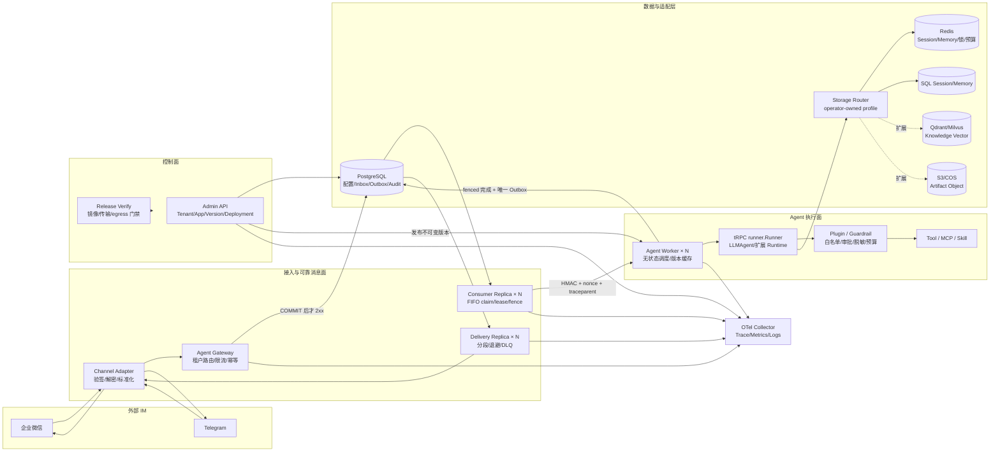
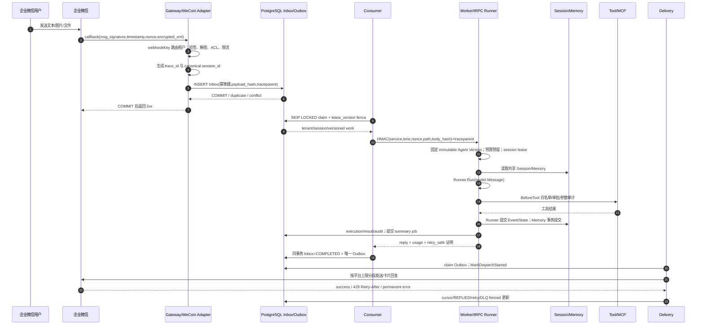

# tRPC-Agent-Go 多租户节点化 Agent 平台——决赛架构设计 V13

> 历史归档：当前权威方案为 `COMPETITION_SUBMISSION_V14.md`。

## 0. 核心判断

本方案不是把 `tenant_id` 塞进单体 Chat API，而是把 Agent 执行拆成“可靠消息数据面 + 无状态 Runner 数据面 + 版本化控制面”。平台以 PostgreSQL Inbox/Outbox 为事实源，以共享 Session/Memory 和 session 级执行租约承载上下文，以不可变 Agent Version/Deployment 保证可复现，以 Runner Plugin 作为工具治理的唯一真实拦截点。设计目标按优先级排列为：**已确认消息不丢、租户绝不串数据、陈旧节点不能复活写、外部副作用不盲目重放、成本可封顶、每次决策可审计**。

这套取舍的关键不是“组件多”，而是每个一致性边界只有一个权威所有者：PostgreSQL 决定消息状态和 fencing，tRPC Session backend 决定 Event/State，Memory backend 决定长期记忆，向量库和对象存储只承载各自擅长的数据；平台不再复制一套影子 Session 表制造双写幻觉。

## 1. 系统架构



组件职责：Gateway 只做可信接入和 Inbox 提交；Consumer 只做可靠领取与 Worker 调度；Worker 固定 tenant/app/version/deployment 后运行 tRPC Runner；Delivery 独占 IM 外发副作用；Admin 管理配置、RBAC、发布、灰度和回滚；Storage Router 只接受运维预注册 profile，不接受租户提交 DSN；Telemetry 以 `trace_id` 串起整个链路。Worker 不需要 sticky session，任意副本都能通过共享 Session/Memory 恢复上下文。

## 2. 企业微信完整时序



`traceparent` 从 callback 进入 Inbox，再进入 Consumer、Worker、Runner、Tool、Session/Memory 和 Outbox；审计仅保存稳定身份、决定、耗时、成本与错误分类，不保存原始密钥、prompt 或模型全文。

## 3. 租户模型与隔离

控制面逻辑模型如下，凭据字段只存加密 envelope 或 operator-owned `SecretRef`：

```json
{
  "tenant_id": "t_customer_service",
  "status": "active",
  "config_version": 42,
  "agent_apps": [{"name":"support","stable_version":"v17","canary_version":"v18","canary_bps":500}],
  "models": [{"provider":"openai","model":"gpt-4o-mini","api_key_ref":"env://TRPC_SECRET_T1_MODEL"}],
  "tool_policy": {"mode":"whitelist","allowed":["crm.read"],"require_confirmation":["refund.create"]},
  "channels": [{"type":"wework","account_id":"corp-a","webhook_key":"opaque-route","secret_ref":"env://TRPC_SECRET_T1_WECOM"}],
  "storage": {"session":{"backend":"redis","profile":"redis-cn-a"},"memory":{"backend":"postgres","profile":"pg-cn-a"}},
  "audit_policy": {"level":"detailed","retention_days":180,"masking":["phone","email","api_key"]},
  "budget": {"max_tokens_per_request":32000,"max_tokens_per_day":5000000}
}
```

隔离分五层：配置以 `tenant_id + config_version` CAS；数据 key/复合唯一键带 tenant/app/account；工具由平台目录、Agent 快照和租户 whitelist 三重交集；密钥 AES-GCM 的 AAD 绑定 tenant 与字段；日志与 trace 使用 HMAC/哈希化身份和低基数标签。数据库生产部署应使用租户/服务最小权限角色或独立 schema/实例；高合规租户可以升级为物理隔离，而不改变上层接口。

Session ID 由可信 Gateway 生成：

```text
direct = sess_SHA256(tenant\0channel\0account\0direct\0external_user)
group  = sess_SHA256(tenant\0channel\0account\0group\0conversation)
```

群聊以 conversation 作为共享 Session owner，但 Memory actor 仍是发送者；跨群、跨通道账号、跨租户天然得到不同命名空间。原始 IM 身份不出现在 URL 和普通日志中。

## 4. 数据模型和一致性

核心关系为 `Tenant 1-N ChannelBinding`、`Tenant 1-N AgentApp 1-N AgentVersion`、`AgentApp 1-N Deployment`、`Session 1-N Event 1-N Summary`、`Tenant/User 1-N Memory`、`Inbox 1-0..1 Outbox`。详细字段和实际表见 [DATA_MODEL.md](DATA_MODEL.md) 与 `migrations/001..037`。

一致性按数据类型选择，不强行“一刀切”：

| 数据 | 后端 | 语义 | 关键机制 |
|---|---|---|---|
| Tenant/App/Version/Channel/Audit | PostgreSQL | 强一致 | 事务、CAS、唯一约束、追加审计 |
| Inbox/Outbox/DLQ | PostgreSQL | 强一致状态机 | provider 幂等键、payload hash、lease_version fence |
| Session Event/State | Redis 或 PostgreSQL | 同 session 串行、提交后可见 | 持久 FIFO + 全 Runner 生命周期 lease |
| Memory | Redis/PostgreSQL/外部服务 | 提交后可见或最终一致 | tenant/user scope、版本化写、失效通知 |
| Summary | SQL job + backend checkpoint | 单调最终一致 | Event 提交后入队、`max_event_sequence` CAS |
| Knowledge Vector | SQL 元数据 + Qdrant/Milvus | 最终一致 | embedding job、版本/hash、shadow read |
| Artifact | SQL 元数据 + S3/COS | 最终一致 | tenant object key、hash、短 TTL URL |

更新顺序固定为：`Event/State commit → summary job(target sequence) → 重新读取稳定事件快照 → 生成 → checkpoint CAS → job complete`。旧 Summary 不得覆盖新 Summary。Memory 的主记录先提交，再异步建向量；检索端按版本忽略旧 embedding。

同一 provider 消息的唯一键为 `(tenant, channel, account, external_message_id)`；相同 hash 返回已接收，相同键不同 hash 返回冲突，绝不静默覆盖。同 session 由 `session_sequence` 阻止后序抢跑；Worker A 租约失效后 Worker B 以更高 fence 接管，A 的迟到结果被 PostgreSQL 拒绝。外发在 `MarkDispatchStarted` 后若进程崩溃，状态进入 reconciliation，而不是自动重发可能已经成功的消息。

## 5. 多后端迁移

租户只选择 capability/profile；连接串、TLS、ACL 和连接池由运维目录掌控。迁移状态机是：

```text
PREPARE → SNAPSHOT_COPY → DUAL_WRITE → CATCH_UP → VALIDATE
        → READ_SHADOW → CUTOVER → ROLLBACK_WINDOW → COMPLETE
```

每个 `(tenant, domain)` 有 owner lease、单调 fence、cursor、watermark、校验 hash 和审计。主写旧端时通过迁移 Outbox 写新端；追平后抽样 shadow read；`config_version` CAS 切读；回滚窗口内继续双写。Redis→PostgreSQL 的版本化 opaque-record 垂直切片已实现；具体 Session/Memory provider schema、向量和对象迁移必须分别实现 projection，不能用一个通用 JSON copy 冒充全部后端迁移。

## 6. IM 适配差异

| 维度 | 企业微信 | Telegram |
|---|---|---|
| 入站认证 | SHA1 签名 + AES 消息解密 + corp/receiver 校验 | `X-Telegram-Bot-Api-Secret-Token` 常量时间比较 |
| 载荷 | XML/加密 XML，URL 验证回调独立 | JSON Update，多事件类型需显式忽略或转换 |
| 外发凭据 | corpsecret 换短期 access token，缓存并处理过期 | Bot token 直接调用 Bot API |
| 回复能力 | 应用消息/文本/图片，需考虑被动回调超时 | sendMessage/editMessage，Markdown 转义差异 |
| 限制处理 | 长度、频控、token 刷新、异步发送 | 429 `retry_after`、消息长度、chat/thread ID |

Adapter 输出统一 `InboundMessage`，Gateway 再生成可信 tenant/session 身份。文本超长按 rune 安全分段，每段持久化 cursor；图片/文件只接受受控 URL/大小/MIME，下载需 SSRF-safe transport。撤回事件写审计或业务补偿，不反向删除已发生的工具副作用。

## 7. 治理、安全与可观测性

Runner `BeforeTool/AfterTool` 是唯一执行拦截面：校验 Agent 快照工具集合与租户 whitelist，危险工具创建持久化 challenge，管理员按 tenant/actor/session/tool/args 精确批准，一次性消费；输入内容策略在 Memory/模型前执行，工具结果和最终输出递归脱敏。预算采用 Redis Lua 原子预留，模型 dispatch 后结果未知按完整 reservation 计费，防止崩溃后“退钱”造成并发穿透。

核心指标包括 callback QPS、Inbox/Outbox depth 与 oldest age、Runner/model/tool p50/p95/p99、Session/Memory backend latency、IM delivery success/429/DLQ、token 与 tenant cost、budget rejection、stale fence、reconciliation 数量、连接池等待和 goroutine 数。高基数 tenant/agent 不直接进入 Prometheus 默认标签，而进入受控 allowlist、审计或日志分析系统。

审计最小字段：`tenant_id, channel, actor_user_hash, session_id, agent_name, agent_version, tool_name, decision, latency_ms, error_type, input_tokens, output_tokens, cost, trace_id, created_at`。IM token、模型 key、数据库密码及带凭据 URL禁止进入 log/trace/error；密钥通过 workload identity + KMS/Vault 的 `SecretResolver` 注入并按版本轮换。

## 8. 故障恢复、发布与容量

- 节点故障：Inbox/Outbox lease 到期可被新副本领取，所有完成动作带 fence；最后一次失败进入 DLQ。
- 数据库短暂不可用：Gateway 不回 2xx；Consumer/Delivery 指数退避并停止 claim；连接恢复后从 durable queue 继续。
- Redis 不可用：session lease、nonce 或预算不能验证时 fail-closed，不降级成本地锁。
- 模型/工具超时：`context.Context` 贯穿 Runner/Tool；Runner 前超时可安全重试，进入 Runner 后结果未知转 reconciliation。
- Go 生命周期：固定 Worker pool，不为每条消息放任后台 goroutine；shutdown 先关闭 intake/readiness，再取消 context、等待有界 drain，最后关闭 DB/Redis。正常和确定错误消费 Event channel 至关闭；超时取消后不无限等待不合作 producer。
- 灰度：immutable Version + stable/canary 万分桶，同 session 稳定；首次请求绑定确切版本，重试不跨版本；回滚创建新 DeploymentSet，不修改历史。

容量不写拍脑袋数字：`worker_concurrency ≥ peak_callback_rps × p95_agent_seconds × 1.5~2`，再按单 Worker 实测并发换算副本；分别压测模型变慢、IM 429、20% retry amplification、热点 session、PostgreSQL checkpoint 和 Redis 抖动。HPA 以 queue lag/oldest age 为主，CPU 为辅；上线门必须保留原始压测配置、版本、p95/p99、DB/Redis QPS、成本和错误预算。

最小可运行栈为 PostgreSQL、Redis、Migrate、Gateway、Consumer、Worker、Delivery、Admin、OTel Collector、Prometheus/Grafana。生产推荐托管 HA PostgreSQL/PITR、TLS/ACL Redis 稳定端点、各数据面独立 HPA/PDB/topology spread、受控 egress、service mesh mTLS、KMS/Vault、不可变镜像 digest/SBOM/签名和独立灾备演练。

## 9. tRPC-Agent-Go 复用边界

| 平台问题 | 直接复用 | 平台新增 |
|---|---|---|
| Agent 执行 | `llmagent`, `runner.Runner`, Event stream | Tenant/App/Version/Deployment、runtime capability registry |
| Session/Memory | 官方 Service 与 Redis/PostgreSQL adapter | tenant profile 路由、session lease、迁移控制面 |
| Tool/MCP | Tool/MCP/Skill 与 Runner Plugin lifecycle | 三重白名单、审批、预算、审计 |
| 服务协议 | server/openai、AG-UI、A2A 可作为北向协议 | IM Gateway、durable Inbox/Outbox、Admin API |
| IM | OpenClaw Gateway/Channel 设计 | WeCom/Telegram 认证、租户绑定、可靠投递 |
| Telemetry | OpenTelemetry hooks | tenant 成本、审计模型、SLO/告警 |

当前内置真实 runtime 是 `llm`。Chain/Graph/Parallel/Cycle 由上游能力和 `RuntimeAgentRegistry` 扩展，但必须注册 concrete factory 与 capability fingerprint；未安装时 fail-closed，绝不静默降级为 LLMAgent。Knowledge/Artifact 数据面同样遵守“有真实消费者、迁移和测试后才宣称实现”的规则。

## 10. 交付和验收边界

源码已覆盖可靠 Inbox/Outbox、多租户控制面、共享 Session/Memory、治理 Plugin、WeCom/Telegram、审计/Telemetry、灰度回滚、迁移协调器和 Compose/Kubernetes 模板。当前版本还在本地三节点 K3d 上完成 compatible migration、digest rollout/undo、Linkerd identity allow/deny、NetworkPolicy、HPA、Vault dev-mode workload identity 和 2,200 条公平队列容量复验；并据此修复了一处会复活终态 Inbox 的真实并发竞态。逐项状态见 [ACCEPTANCE_EVIDENCE_V13.md](ACCEPTANCE_EVIDENCE_V13.md)，完整本地数据见 [LOCAL_PRODUCTION_VALIDATION_20260830.md](LOCAL_PRODUCTION_VALIDATION_20260830.md)，风险见 [RISK_REGISTER_V13.md](RISK_REGISTER_V13.md)，安全审计见 [SECURITY_REVIEW_V13.md](SECURITY_REVIEW_V13.md)。

生产上线前仍必须在目标环境完成：真实 IM sandbox；供应商支持版本上的 Kubernetes/mesh rollout/rollback；正式信任根、KMS/Vault HA 与双 key 轮换；PostgreSQL/Redis HA 故障注入；生产 OTLP 后端；业务 payload 容量、成本与灾备演练。本地基础设施证据降低风险但不替代目标账号验收；低次数顺序见 [EXTERNAL_ACCEPTANCE_RUNBOOK.md](EXTERNAL_ACCEPTANCE_RUNBOOK.md)。
