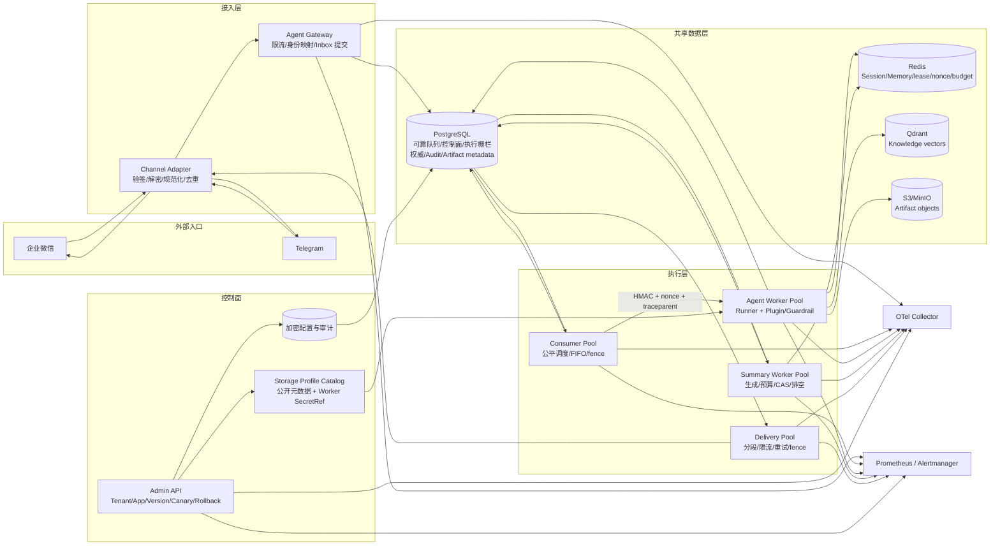
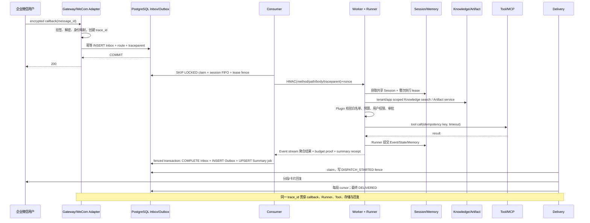

# 基于 tRPC-Agent-Go 的多租户节点化 Agent 平台——决赛方案 V14

作者：王子龙  
实现框架：tRPC-Agent-Go v1.11.2  
生产工具链：Go 1.26.7；模块下限：Go 1.25.14

## 1. 设计结论

本方案把 Agent 从单进程 Demo 拆成“可信入口、可靠队列、无状态执行、专用数据面、治理审计、控制面”六个边界。最重要的原则不是组件数量，而是每类状态只有一个权威所有者：PostgreSQL 决定 Inbox/Outbox、版本、审计、执行 guard 和迁移 fence；tRPC Session/Memory backend 决定会话与长期记忆；Qdrant 决定 Knowledge 向量；S3/MinIO 保存 Artifact 正文；控制面只保存 profile ID，不复制连接串和密钥。Worker 不依赖 sticky session，可按队列长度水平扩展。这里的“租户后端可选”不表示平台可以去掉 PostgreSQL：即使 Session/Memory 使用 Redis，PostgreSQL 仍是 Runtime Coordination Plane 的强依赖。

平台直接复用 tRPC-Agent-Go 的 `runner.Runner`、`LLMAgent`、Chain/Graph/Parallel/Cycle Agent、Event 流、Session、Memory、Knowledge、Artifact、Plugin/Callbacks 与 OpenTelemetry 接口；新增租户控制面、可靠消息状态机、IM Adapter、版本路由、租户 profile resolver、预算/审批治理、Summary worker、迁移协调器和部署运维边界。

四种组合 Runtime 已内置具体 factory，不再只是扩展设计：独立节点提示词、工具白名单和调用限额，Graph DAG/可达性校验，Cycle 有限迭代以及全局调用预算均进入正式 Worker 组合根。自动化测试执行真实拓扑并验证 Worker composition；Admin/Worker capability fingerprint 防止同名 runtime 实现漂移。模型响应使用本地测试模型，因此该证据不包含外部模型供应商验收。

## 1.1 代码仓库与可复现入口

以下入口固定到本次 V14 发布检查点；评委应从全新目录重新 clone 和校验，不把本地目录或压缩包当作 GitHub 仓库：

```text
公开仓库：https://github.com/ltyfulan9/trpc-agent-service
固定发布标签：v14.0.4-final
固定提交校验：`git rev-parse v14.0.4-final^{}`
仓库默认分支：main
V14 发布分支：v14-final
许可证：Apache-2.0（见 LICENSE）
```

评委拿到地址后应从全新目录执行以下入口：

```bash
git clone https://github.com/ltyfulan9/trpc-agent-service
cd <repository>
    git checkout v14.0.4-final
    git rev-parse v14.0.4-final^{}
./scripts/validate.sh
docker compose -f deploy/docker-compose.yml config
```

Windows C 盘无 E 盘依赖的验证入口是 `scripts/run_c_local_stack.ps1 -ProjectName trpc-v14-c-local-final -Build`。源码不携带真实 `.env`，首次直接启动出现缺少密码变量是预期的 fail-closed 行为；验证脚本只在当前进程注入一次性值。CI 门禁见 `.github/workflows/verify.yml`，本机命令、容器后状态和外部验收边界见 [评委快速摘要](JUDGE_QUICKSTART_V14.md) 与 [验收证据矩阵](ACCEPTANCE_EVIDENCE_V14.md)。

## 2. 系统架构图



Gateway 只在 Inbox 事务提交成功后返回 2xx；数据库不可用时返回可重试错误，不能先确认再异步落库。Consumer 使用 `FOR UPDATE SKIP LOCKED`、单调 `lease_version` 和持久化 `session_sequence`，既允许不同会话并行，也禁止同一会话乱序。Worker 的整次 Runner 生命周期持有可续约 Session lease，Session/Memory 存在共享后端，因此任意副本都能继续处理。

## 3. 租户与隔离模型

`Tenant` 至少包含 `tenant_id`、Agent 应用/模型配置、工具白名单、Channel 配置、Session/Memory/Knowledge/Artifact profile、审计级别、预算和队列配额。Agent 配置经历 App → immutable Version → stable/canary Deployment；同一幂等请求首次选定版本后持久化，重试不跨版本。

隔离采用五层防线：

1. 配置：Admin 使用 tenant-scoped Principal/RBAC；更新带 `config_version` CAS。
2. 数据：所有 SQL 唯一键、查询条件和锁作用域包含 tenant；Session app name、Knowledge 物理 ID、Artifact object key均带不可混淆租户作用域。
3. 工具：只有 Agent 版本和租户策略共同允许的工具才注册；`BeforeTool` 是唯一授权、审批和审计入口。MCP 采用 operator-owned HTTPS profile，Admin 只准入 `mcp_<profile>_<remote>` 声明，Worker 按实际 AgentVersion 延迟建立官方 MCP ToolSet；租户不能提交 URL/Header/凭据或启用 stdio。
4. 密钥：租户 JSON 保存加密业务密钥或 operator-owned SecretRef/profile ID；数据面和 MCP Header Secret 只进入 Worker，模型 Key 只进入 Worker/Summary Worker，Channel Secret 只进入 Gateway/Delivery。
5. 观测：日志不记录 token、API key、DSN 和原始用户标识；用户标识按租户 HMAC 假名化，指标高基数标签默认汇聚到 `__other__`。

群聊 Session ID 为 `tenant/channel/account/group/agent` 的稳定散列，单聊为 `tenant/channel/account/user/agent`；Session owner 另持久化真实用户映射。跨群、跨 Channel account、跨租户不会共享 Session；Memory 可按显式租户策略以用户作用域共享，但不能跨租户。

## 4. 企业微信与 Telegram 接入

企业微信 Adapter 支持 URL 验证、SHA1 回调签名、AES-CBC 解密、CorpID 校验；Telegram 使用 webhook secret header。二者统一转换成内部 `NormalizedMessage`，构造 `model.Message` 后由 `runner.Runner.Run` 输出 Event。最终文本交给 Outbox，Delivery 根据 Provider 限长分段；每段成功后提交 cursor。

差异点是企业微信回调时限短且加密字段多，适合快速 durable ack；Telegram JSON 较直接但 Bot API 有 429/`Retry-After`。外部消息 ID + tenant/channel/account 构成 Inbox 唯一键；相同 ID 同 payload 返回已有结果，不同 payload hash 直接冲突。图片/文件只保存经过验证的元数据或安全引用；当前 Worker 不下载用户 URL。撤回、媒体下载、微信公众号/微信客服属于独立协议，不假装与企微应用回调相同。

## 5. 核心消息时序



模型或 Tool 已越过副作用边界但响应丢失时，记录转 `WAITING_RECONCILIATION`，不自动重跑。IM 投递在 Provider 调用前写 `DISPATCH_STARTED`；若调用结果未知，也必须人工核对后审计 replay，因此明确是 at-least-once，而不是虚假的 exactly-once。

## 6. 数据模型、一致性与多后端

核心关系是 `Tenant 1-N ChannelBinding`、`Tenant 1-N AgentApp 1-N AgentVersion`、`AgentApp 1-N Deployment`、`Session 1-N Event 1-N Summary`、`Tenant/User 1-N Memory`、`Inbox 1-0..1 Outbox`、`Tenant/App 1-N KnowledgeDocument`、`Tenant/Session 1-N ArtifactVersion`。实际字段见 [DATA_MODEL.md](DATA_MODEL.md) 与 migrations 001–042。

| 数据 | 推荐后端 | 一致性 | 关键策略 |
|---|---|---|---|
| 控制面、Inbox/Outbox、Audit | PostgreSQL | 强一致 | 事务、唯一键、行锁、fence |
| Session/Memory | Redis 或 PostgreSQL | 提交后跨节点可见 | 整次 Session lease；无本地权威副本 |
| Summary | PostgreSQL job/checkpoint + Session overlay | 单调最终一致 | Event commit 后入队；cutoff/last event；fenced CAS |
| Knowledge | Qdrant + embedding provider | 最终一致 | tenant/app scoped ID；版本/hash；shadow validation |
| Artifact | PostgreSQL metadata + S3/MinIO | 元数据强一致、对象补偿 | 不可变版本、SHA-256、tombstone |

Summary 固定顺序为：`Event/State commit → 在 Inbox 完成事务中 upsert job → lease 下冻结 target → 重读稳定事件前缀 → 生成/预算结算 → fenced checkpoint CAS → job complete → 下一轮 Worker overlay Session.Summaries`。平台生成的是全会话 checkpoint，因此 Worker 同时开启 `WithAddSessionSummary(true)` 与 `BranchFilterModeAll`，避免框架默认分支前缀模式跳过空 filter key。集成测试捕获下一次真实 Runner 发出的 messages，证明摘要和 cutoff 后消息保留、cutoff 前原始 Event 被裁剪。旧任务不能覆盖较新序号；生成超时使用脱离请求取消但有界的失败写入，进程收到终止信号后停止 claim 并排空活跃 job。

迁移由 `(tenant, domain)` owner lease、单调 fence、cursor、watermark 和 projection ledger 驱动。Redis→PostgreSQL Session 通过官方 Redis Service 读取规范化 Session-owned State/Event/Track，以版本化 journal 捕获 snapshot/catch-up，再由专用 projector 通过官方 PostgreSQL Service 落地；重复版本只补严格历史后缀，目标分叉或读取疑似截断立即阻断。平台 Summary checkpoint 本来就在独立 PostgreSQL 权威表，不搬运后端私有 summary schema。Knowledge/Artifact 分别写 Qdrant 和精确 S3 版本。目标副作用前后均检查 fence；只有目标应用成功才写 `projected_at`。流程是 COPY → DUAL_WRITE → CATCH_UP → VALIDATE → SHADOW_READ → `config_version` CAS CUTOVER → 保留回滚窗；不同物理 schema 必须实现专用 projector，不能用通用 JSON copy 冒充。

## 7. 治理、监控与安全

Plugin/Guardrail 在模型前做内容策略、IM 用户授权、预算 reservation；在 Tool 前做白名单、规范化参数 hash、危险操作 challenge；Tool 后和最终输出做递归脱敏、审计与 token settlement。审计至少记录 `tenant_id/channel/user_id/session_id/agent_name/tool_name/decision/latency/error_type/cost/trace_id`，并额外记录 Agent 版本、deployment、idempotency key 和 approval challenge。

指标包括入口 QPS/错误率、Inbox/Outbox depth/oldest age、Runner 与模型耗时、Tool 耗时、IM 成功率、token/租户成本、Session/Memory 延迟、Summary 失败率/耗时、migration lag、lease/fence rejection。W3C trace context 进入 Inbox 后持久化，并在 Consumer→Worker 的 HMAC body 和 Outbox 中传播。Prometheus 规则覆盖队列积压、SLO burn rate、retry storm、Summary 突发失败/高延迟；Alertmanager receiver 仍需目标环境配置。

所有外部调用都使用 `context.Context` timeout；后台循环响应信号取消，不把请求 ctx 用作必须落盘的失败记录；goroutine 由 WaitGroup/有限 worker pool 回收，Runner Event channel 必须持续读取到关闭或在取消后有界排空。秘密不进入错误、日志、trace、Kubernetes ConfigMap 或镜像层。

## 8. 故障恢复、发布与容量

- Worker 宕机：lease 超时后高 fence 接管；旧 Worker 提交被拒绝。
- PostgreSQL 短暂不可用：Gateway 不 ack；Consumer/Delivery 指数退避，队列状态不在内存推进。
- Redis 不可用：nonce、预算或 Session lease fail-closed，不退回本地锁。
- 模型超时：取消请求并按已 dispatch 的最坏 reservation 计费；未知副作用进入 reconciliation。
- Tool 失败：按 typed retryability 分类；危险或非幂等 Tool 不自动重放。
- IM 429：遵循有界 `Retry-After`；分段 cursor 防止已知成功段重发。

发布使用 immutable AgentVersion + stable/canary 万分桶；同一 Session 稳定命中。回滚创建新的 deployment 切换，不篡改旧版本。Kubernetes 先运行 checksum migration，再 Worker、Consumer，配合 PDB、HPA、拓扑分散、readiness、默认拒绝 NetworkPolicy 和 digest-pinned image；breaking migration 必须先排空旧协议。

同一 Session 的 FIFO 明确选择 `Consistency > Availability`：前序处于未知副作用或死信时，后续消息不会越过它污染上下文。运维逃生口不是无审计跳号，而是先核对外部结果，再携带 actor/reason 对前序执行受控 replay/resume；其他 Session 不受影响。若未来增加“放弃 gap 并继续”，必须把业务补偿与 tombstone 作为新的显式状态机能力，不能用手工 SQL 绕过。

容量以峰值回调 QPS × 平均端到端时长估算并发执行，再分别预算模型 token/min、Worker goroutine/连接池、Redis lease/nonce/budget QPS、PostgreSQL claim/commit QPS、向量检索 P95 与 IM 出站额度。现有 2,200 条数据只是一台笔记本/K3d/单 PostgreSQL 的回归基线，不用于宣称大规模吞吐；目标测试必须比较普通/公平 Claim 在 1/4/8/16 Consumer 下的吞吐、锁等待与 P95/P99。Compose 是最小可运行方案；生产建议多副本 Gateway/Consumer/Worker/Summary/Delivery、PostgreSQL HA、Redis HA、托管 Qdrant/S3、OTel Collector 和独立告警。实际副本数必须由目标 payload 压测和故障演练决定。

## 9. 验收边界

本机已经用 Go 1.26.7 通过模块校验、全量 build/vet/unit/race、真实 PostgreSQL+Redis+Qdrant+MinIO 集成、Compose 六应用加 Summary 进程的隔离启动、健康探针、Prometheus 规则解析和生产镜像构建。详细证据见 [ACCEPTANCE_EVIDENCE_V14.md](ACCEPTANCE_EVIDENCE_V14.md)。

仍必须在目标环境完成：真实企业微信/Telegram sandbox、正式 Kubernetes/mesh rollout 与 rollback、KMS/Vault workload identity、OTLP TLS/告警接收端、PostgreSQL/Redis HA 故障注入、正式容量/成本/备份恢复演练。这里明确列为外部验收，不用本地假模型或源码门禁替代。
