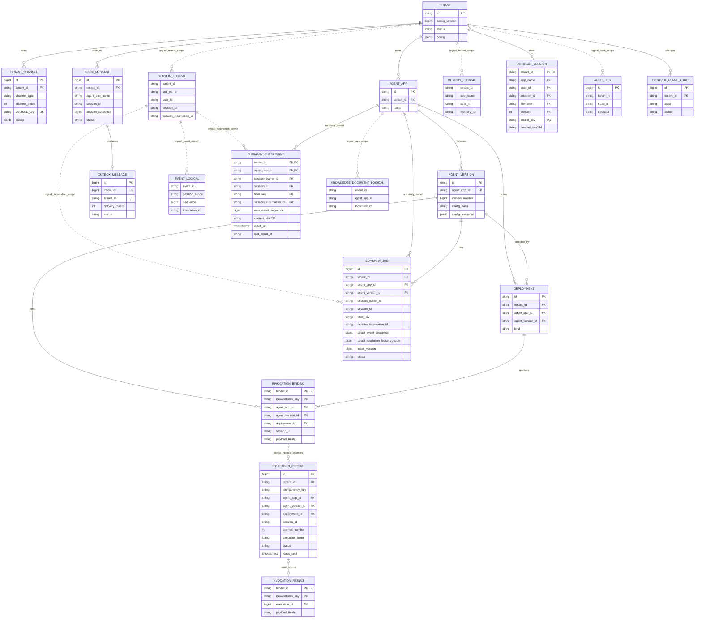
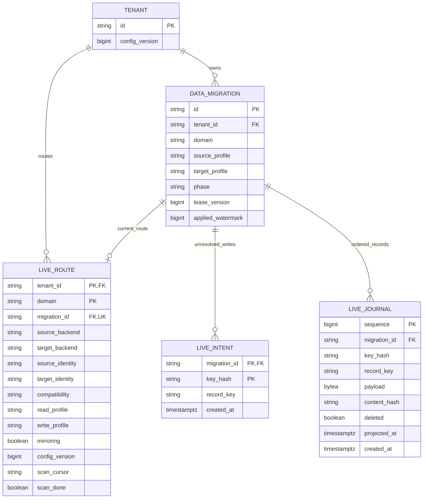

# 核心数据模型

数据所有权分为平台协调表和后端实体：平台表由 `migrations/*.sql` 创建，保存控制面、可靠队列、执行、摘要和迁移等状态；Session/Memory 由所选 tRPC backend 管理，Knowledge 向量保存在 Qdrant，Artifact 正文保存在 S3/MinIO，其版本元数据由平台管理。

## 关系

```text
Tenant 1 ── N ChannelBinding
Tenant 1 ── N AgentApp 1 ── N AgentVersion
AgentApp 1 ── N Deployment ── 1 AgentVersion
Tenant 1 ── N Session 1 ── N Event
Session 1 ── N SessionIncarnation 1 ── N Summary(max_event_sequence)
Tenant/User 1 ── N Memory
Tenant/AgentApp 1 ── N KnowledgeDocument
Tenant/Session 1 ── N Artifact
Tenant 1 ── N AuditLog / ControlPlaneAudit
InboundMessage 1 ── 0..1 OutboundMessage
Invocation 1 ── 1 pinned AgentVersion/Deployment
```

## 平台表与后端逻辑实体

ER 图列出平台表的关键字段与带 `_LOGICAL` 后缀的后端逻辑实体。平台 ID 按 SQL 类型表示：`string` 对应 VARCHAR/CHAR/TEXT，`bigint` 包括 BIGSERIAL；同一实体内多个 `PK` 字段共同组成复合主键，多个 `FK` 字段可能共同参与同一外键。`logical_` 关系表示应用作用域或请求身份关联；SQL 外键与 SDK 后端逻辑关系分别标注，SDK 实体不标注平台 PK/FK。

Agent 的稳定身份是 `agent_apps`，不可变配置保存在 `agent_versions.config_snapshot`，发布路由由 `deployments` 选择版本。ChannelBinding 的 `accountId`、`agentApp` 保存在 `tenants.config.channels` 内，通过 `tenant_channels.channel_index` 定位；`tenant_channels.config` 保存该绑定的扩展配置。身份字段的解析以租户配置与通道索引的关联为准。



`execution_records` 以 `(tenant_id, idempotency_key, attempt_number)` 区分追加的执行尝试，通过 `execution_token` 和 `lease_until` 验证提交身份；Inbox 的记录身份与 `lease_version` 由可靠队列独立管理。Worker 先锁定并核对 `invocation_bindings` 的请求、会话和版本身份，再创建执行记录，通过应用校验建立请求关联。`invocation_results` 以 `(tenant_id, idempotency_key)` 为主键，通过 `(execution_id, tenant_id)` 外键关联具体执行；`execution_id` 允许为空且非空时唯一，对应图中的可选关系。schema 定义见 [执行尝试与结果来源](../migrations/018_execution_attempts.up.sql)，身份校验见 [Worker 执行记录器](../pkg/controlplane/resolver.go)。

`audit_logs.tenant_id` 由应用填写并约束审计作用域；`control_plane_audit.tenant_id` 通过 SQL 外键关联 `tenants`。平台 Summary 与 Artifact 通过包含 app/user 的完整作用域关联 Session，跨 SDK 后端的 Session 关联由应用层维护。Summary 另按 `session_incarnation_id` 区分同一会话身份的生命周期；图中 Session 逻辑字段从 State 保留键读取，SDK 无需新增平台关系表。逻辑 Event 的 `sequence` 表示当前代次稳定转录中的绝对顺序，其可验证性由所选后端的数据读取契约决定。

## 平台协调表

| 表 | 主键/唯一键 | 关键版本或隔离字段 | 所有者 |
|---|---|---|---|
| `tenants` | `id` | `config_version`, `status`, encrypted `config` | Admin/Tenant Service |
| `tenant_channels` | `id`, unique opaque `webhook_key` | `tenant_id`, channel index/type/account config; `webhook_token` is retained only as a legacy storage column and is never a lookup fallback | Admin/Gateway |
| `agent_apps` | `id`, unique `(tenant_id,name)` | tenant-scoped lifecycle | Agent control plane |
| `agent_versions` | `id`, unique app/version/hash | immutable secret-free snapshot | Agent control plane |
| `deployments` | `id`, one active app/kind | stable/canary bps, actor | Agent control plane |
| `invocation_bindings` | `(tenant_id,idempotency_key)` | exact version/deployment | Worker resolver |
| `execution_records` | `id`；有效请求 unique `(tenant_id,idempotency_key,attempt_number)` | tenant/session/version/deployment、`execution_token`、`lease_until`、`RUNNING/SUCCEEDED/FAILED/ABANDONED` | Worker audit + stale reconciler |
| `inbox_messages` | source composite unique key；unique `(tenant,app,session,session_sequence)` | authoritative `reply_to_id`, status, attempt, `lease_version` | Gateway/Consumer |
| `inbox_session_sequences` | `(tenant_id,agent_app_name,session_id)` | monotonic `last_sequence` | Gateway/Reliable Store |
| `tenant_queue_schedule` | `tenant_id` | weight、max_queued、max_inflight、virtual_runtime | Queue policy / Consumer |
| `inbox_fair_queue_clock` | singleton | monotonic `virtual_time`，公平领取事务的共享时钟 | Consumer |
| `outbox_messages` | unique `inbox_id` | status, attempt, `lease_version`, `delivery_cursor` | Consumer/Delivery |
| `invocation_results` | `(tenant_id,idempotency_key)` | payload hash、`execution_id`、expiry | Worker result cache |
| `message_replay_audit` | `id` | tenant, actor, reason, `replay_mode` | Replay command |
| `audit_logs` | `id` | tenant/channel/session/tool/trace/cost，共享 HMAC 用户伪名 | Gateway / Worker telemetry |
| `control_plane_audit` | `id` | tenant/actor/action/resource | Admin transactions |
| `summary_jobs` | `id`, unique `(tenant_id,agent_app_id,session_owner_id,session_id,filter_key,session_incarnation_id)` | pinned `agent_version_id`, target sequence（0=lease 下延迟冻结）, `target_resolution_lease_version`, status, owner lease/fence, bounded attempts | Summary Processor |
| `summary_checkpoints` | `(tenant_id,agent_app_id,session_owner_id,session_id,filter_key,session_incarnation_id)` | 同代次单调 `max_event_sequence`, `cutoff_at`, `last_event_id`, content SHA-256 | Summary Sink / Runner overlay |
| `data_migrations` | `id`；活跃阶段 unique `(tenant_id,domain)` | source/target profile、phase、owner lease/fence、cursor/watermark | Migration coordinator |
| `data_migration_records` | `(tenant_id,domain,record_key,migration_id)` | 最新 version、payload/hash、tombstone、`projected_at` | 通用投影 ledger |
| `data_migration_live_routes` | `(tenant_id,domain)`；unique `migration_id` | 实际存储 identity/compatibility、read/write profile、mirroring、config_version、scan cursor | 生产迁移协调器及运行时装饰器 |
| `data_migration_live_intents` | `(migration_id,key_hash)` | 源写前持久化的 record_key、created_at | 生产写入捕获与恢复 |
| `data_migration_live_journal` | `sequence` | migration_id、record_key、完整 payload/hash、deleted、projected_at | 有序版本投影与目标读回验证 |
| `artifact_versions` | `(tenant_id,app_name,user_id,session_id,filename,version)` | unique object key、MIME、size、SHA-256、tombstone | Artifact Service |

## 在线迁移物理模型

[迁移 045](../migrations/045_online_data_migrations.up.sql) 定义生产路由、写意图和有序日志，与 `data_migrations` 共同保存迁移状态。以下实体均为 PostgreSQL 表，关系线表示 SQL 外键，字段列出协议关键子集。



| 表/字段 | 物理类型与约束 | 协议含义 |
|---|---|---|
| Route `tenant_id` / `domain` / `migration_id` | VARCHAR(64/32/128)；domain 限 session/knowledge/artifact；tenant 和 migration 外键 | 每租户数据域一条当前路由，一个迁移至多关联一条路由 |
| Route `source_backend` / `target_backend` | VARCHAR(32)，非空 | 源目标后端类型 |
| Route `source_identity` / `target_identity` / `compatibility` | TEXT；identity 各 1..2048 字节且互不相同，compatibility 1..4096 字节 | 不含凭据的实际存储身份与兼容协议；拒绝 profile 别名指向同一存储及跨节点定义漂移 |
| Route `read_profile` / `write_profile` / `config_version` | VARCHAR(128)；BIGINT > 0 | 运行时每次调用读取的持久化路由和租户配置 CAS 版本 |
| Route `mirroring` / `scan_cursor` / `scan_done` | BOOLEAN 默认 true；TEXT 默认空；BOOLEAN 默认 false | 捕获与同步镜像开关、原生 inventory 复制进度 |
| Route `actor` / `reason` / `updated_at` | VARCHAR(256)、TEXT、TIMESTAMPTZ，均非空 | 创建审计身份和最后路由更新时间 |
| Intent `migration_id` / `key_hash` / `record_key` | VARCHAR(128) 外键；CHAR(64) 小写 hex；TEXT 1..4096 字节 | 源写前提交的记录身份；进程中断或结果未知时供重读恢复 |
| Journal `sequence` / `migration_id` / `key_hash` / `record_key` | BIGSERIAL 主键；VARCHAR(128) 外键；CHAR(64) 小写 hex；TEXT 1..4096 字节 | `sequence` 是规范 Record.Version，保留同 key 的每个持久化版本 |
| Journal `payload` / `content_hash` / `deleted` | BYTEA 最大 16 MiB；CHAR(64) 小写 hex；BOOLEAN，均非空；deleted 要求空 payload | 规范正文及哈希，删除单独记录 tombstone |
| Journal `projected_at` / Intent、Journal `created_at` | TIMESTAMPTZ；仅 projected_at 可空，created_at 默认数据库时钟 | 实际目标读回匹配后才标记投影；pending partial index 支持有序恢复 |

`idx_live_journal_key` 索引 `(migration_id,key_hash,sequence DESC)`；`idx_live_journal_pending` 索引 `(migration_id,sequence)` 且仅包含 `projected_at IS NULL`。`data_migration_records` 作为通用投影 ledger，保存每个迁移身份下的最新记录；`data_migration_live_journal` 保存不可变有序版本，用于在线捕获与恢复。`data_migrations.domain` 的 schema 包含 memory/summary，生产 live route 的准入范围限定为 session、knowledge、artifact。

切换事务同时更新租户配置版本、live route、迁移 phase 和审计并核对 fence。回滚窗口的 `read_profile` 为目标、`write_profile` 为源且 `mirroring=true`；完成后读写目标、`mirroring=false`，终态 route 保留供旧缓存客户端使用。运维步骤及部署写入边界见 [ONLINE_MIGRATION.md](ONLINE_MIGRATION.md)。

## Session/Event/State/Summary 逻辑契约

不同 tRPC Session backend 的物理表名可以不同，但平台要求保留完整 Session 作用域与已提交 Event 顺序；摘要检查点由平台表保存：

```sql
-- Session/Event 逻辑示意，不由平台 migration 重复创建
Session(tenant_id, app_name, user_id, session_id, state_version, updated_at)
-- Session State 保留 platform:session_incarnation_id，值为当前代次 UUID
Event(tenant_id, app_name, user_id, session_id, sequence,
      invocation_id, role, payload, created_at)
-- 平台 summary_checkpoints 实际字段
SummaryCheckpoint(tenant_id, agent_app_id, session_owner_id, session_id,
                  filter_key, session_incarnation_id, max_event_sequence, cutoff_at, last_event_id,
                  content, content_sha256, updated_at)
```

- `(tenant_id, app_name, user_id, session_id)` 必须唯一；`app_name` 本身也带 tenant namespace。
- 平台副本以覆盖完整 Runner 生命周期的 session lease 串行化；Event `sequence` 与 State 原子性遵循 backend 契约。所有权 UUID 标识持有者，数据库单调 fence 约束持久化提交；外部副作用采用 at-least-once 和目标系统幂等契约。
- Summary 只能基于已提交 Event 生成，并以 `max_event_sequence` CAS；`cutoff_at + last_event_id` 精确描述最后覆盖事件，晚完成的旧任务不能覆盖新摘要或错误裁剪同时间戳事件。
- `summary_jobs` 保存协调元数据；相同代次的重复入队合并目标或登记重新解析请求，保持同 scope 唯一任务。生成期间到达的零序号回执通过 `target_resolution_lease_version` 留给后续租约，当前生成继续使用已冻结边界；存在待解析请求时完成操作将任务置回 PENDING。同代次的 `summary_checkpoints` 拒绝旧序号和同序号不同哈希，防止延迟写入覆盖可见摘要。

### Summary 代次与调度字段

| 位置 | 类型与约束 | 运行契约 |
|---|---|---|
| `summary_jobs.target_resolution_lease_version` | [046](../migrations/046_summary_target_resolution.up.sql)；BIGINT NOT NULL DEFAULT 0，CHECK >= 0 | 0 表示无需重新解析；零 target 回执登记当前 lease_version + 1，合并为下一次领取时的完整转录解析请求 |
| `summary_jobs.session_incarnation_id` | [047](../migrations/047_summary_session_incarnation.up.sql)；VARCHAR(36) NOT NULL DEFAULT ''，参与 scope 唯一约束 | 新生产任务绑定 Session State 中的 UUID；存储及运行时按完整代次键查找、生成和完成 |
| `summary_checkpoints.session_incarnation_id` | 同上，参与复合主键 | 同一会话身份下的多个代次拥有独立覆盖序号和摘要；旧代次不能成为新 Session 的 overlay |
| Session State `platform:session_incarnation_id` | 平台保留键，规范非零 UUID；应用写入拒绝覆盖 | Worker 在完整 Session lease 与 execution fence 内初始化并捕获；删除或 TTL 到期后重建生成新 UUID，规范 Session State 迁移保留 UUID |

首次零序号任务登记解析版本 1。领取和解析持有 job lease；`ResolveTarget` 仅清除当前租约已经覆盖的解析标记，生成期间新到的请求保留到后续领取。完成条件同时要求 checkpoint 覆盖目标、没有待解析标记且 lease/fence 有效，确保长会话的新消息持续触发摘要更新。

空 `session_incarnation_id` 用于保留未绑定的派生记录，不映射到当前活跃 Session。047 保留已有 checkpoint，将未完成的未绑定 job 置为 FAILED、耗尽 attempts 并释放 lease。旧 Inbox 回执可继续入队空代次以完成消息事务，生产 Summary runtime 拒绝生成该任务；新 Worker 回执携带实际 UUID，overlay 和 Generator 均校验代次一致。持有旧代次的 Worker 晚到结果即使满足其任务约束，也只能写入旧代次键。

047 改变 SQL `ON CONFLICT` 对应的唯一键，是需要排空并停止写入后升级的协议边界。按 breaking migration 流程停止相关工作负载，执行完整 schema 后部署新 Worker、Summary Worker 与 Consumer。存在非空代次记录时，047 down 明确拒绝自动降级，避免不同生命周期的摘要被合并；派生数据处理和回退需独立审批。

## Memory/Knowledge/Artifact 逻辑契约

```text
Memory: tenant_id + app_name + user_id + memory_id + content
KnowledgeDocument: tenant_id + agent_app_id + document_id + content + metadata + embedding
ArtifactVersion: tenant_id + app_name + user_id + session_id + filename + version
                + object_key + content_sha256 + metadata
```

- SQL 保存租户、ACL、版本和 Artifact 对象元数据；向量内容进入 Qdrant。Qdrant 物理 ID 是 tenant/app/logical document ID 的稳定 SHA-256，保留 scope metadata 不能由用户覆盖。
- Artifact 对象存储 key 对 tenant/app/user/session/filename 分段做 base64url 编码，并包含不可变版本和独立写入标识；元数据保存实际对象 key。读取同时校验 SQL size 和 SHA-256，访问由租户和会话作用域约束。提交结果未知时保留对象，补偿清理在同作用域锁下确认该对象未被元数据引用后执行。
- Memory 在 Redis/PostgreSQL 提交后跨节点可见，搜索语义遵循对应 backend；Knowledge 向量检索通过 Qdrant 提供，遵循最终一致性。

## 保留与删除

- Inbox/Outbox/result/binding 的保留期必须按租户合规策略配置；删除顺序为 result/binding → Outbox → Inbox，并保留聚合审计。
- AgentVersion、Deployment、ExecutionRecord 和控制面审计默认不可物理覆盖；法规要求删除时走审批任务并保留 tombstone。
- Artifact 删除先提交 tombstone，再清理正文；重试包含已标记删除的对象，继续完成未成功的清理。Knowledge 删除与 migration projector 的目标副作用成功、最终 fence 校验共同决定是否写入 `projected_at`。
- Session 迁移记录使用规范化 `session/v1` envelope，包含 session-owned State（含代次 UUID）、按序 Event 和 Track；迁移准入拒绝 App/User shared state、SDK native summary、TTL，以及达到配置安全上限的 inventory/history。平台 `summary_checkpoints` 保持 PostgreSQL 权威，通过保留的代次身份关联迁移后的 Session。目标只接受源历史的严格前缀追加，缺失记录形成 tombstone。
- 在线迁移 complete、abort、rollback 均不删除源数据；终态路由持续服务已有缓存客户端。旧数据和 intent/journal 的保留、备份及清理由操作者单独安排，不能在仍需恢复或回滚时清除协议记录。
