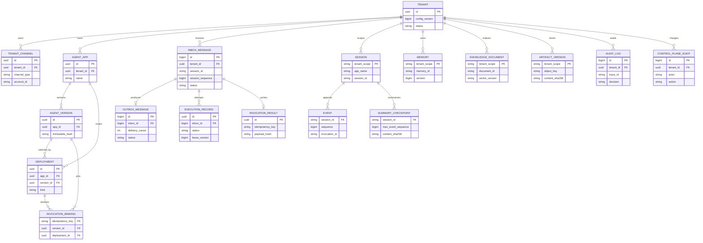

# 核心数据模型

本文件区分“平台实际迁移表”和“租户选择的 tRPC 后端逻辑实体”。前者由 `migrations/*.sql` 创建；后者由对应 Session/Memory/Knowledge/Artifact backend 管理，平台不能再建一套影子表并双写。

## 关系

```text
Tenant 1 ── N ChannelBinding
Tenant 1 ── N AgentApp 1 ── N AgentVersion
AgentApp 1 ── N Deployment ── 1 AgentVersion
Tenant 1 ── N Session 1 ── N Event
Session 1 ── N Summary(max_event_sequence)
Tenant/User 1 ── N Memory
Tenant 1 ── N KnowledgeBase ── N KnowledgeDocument
Tenant/Session 1 ── N Artifact
Tenant 1 ── N AuditLog / ControlPlaneAudit
InboundMessage 1 ── 0..1 OutboundMessage
Invocation 1 ── 1 pinned AgentVersion/Deployment
```

## 可视化 ER 图（平台表与逻辑后端边界）

下面的 Mermaid 图只描述平台拥有的关系和逻辑实体边界；Session、Event、Memory、KnowledgeDocument 的具体物理表仍由所选 tRPC 后端管理，不应据此推断平台创建了第二套影子表。



## 已落地平台表

| 表 | 主键/唯一键 | 关键版本或隔离字段 | 所有者 |
|---|---|---|---|
| `tenants` | `id` | `config_version`, `status`, encrypted `config` | Admin/Tenant Service |
| `tenant_channels` | `id`, unique opaque `webhook_key` | `tenant_id`, channel index/type/account config; `webhook_token` is retained only as a legacy storage column and is never a lookup fallback | Admin/Gateway |
| `agent_apps` | `id`, unique `(tenant_id,name)` | tenant-scoped lifecycle | Agent control plane |
| `agent_versions` | `id`, unique app/version/hash | immutable secret-free snapshot | Agent control plane |
| `deployments` | `id`, one active app/kind | stable/canary bps, actor | Agent control plane |
| `invocation_bindings` | `(tenant_id,idempotency_key)` | exact version/deployment | Worker resolver |
| `execution_records` | `id` | tenant/session/version/deployment, `RUNNING/SUCCEEDED/FAILED/ABANDONED` | Worker audit + stale reconciler |
| `inbox_messages` | source composite unique key；unique `(tenant,app,session,session_sequence)` | authoritative `reply_to_id`, status, attempt, `lease_version` | Gateway/Consumer |
| `inbox_session_sequences` | `(tenant_id,agent_app_name,session_id)` | monotonic `last_sequence` | Gateway/Reliable Store |
| `outbox_messages` | unique `inbox_id` | status, attempt, `lease_version`, `delivery_cursor` | Consumer/Delivery |
| `invocation_results` | `(tenant_id,idempotency_key)` | payload hash, expiry | Worker result cache |
| `message_replay_audit` | `id` | tenant, actor, reason, `replay_mode` | Replay command |
| `audit_logs` | `id` | tenant/channel/session/tool/trace/cost | Worker telemetry |
| `control_plane_audit` | `id` | tenant/actor/action/resource | Admin transactions |
| `summary_jobs` | `id`, unique `(tenant_id,agent_app_id,session_owner_id,session_id,filter_key)` | pinned `agent_version_id`, target sequence（0=lease 下延迟冻结）, status, owner lease/fence, bounded attempts | Summary Processor |
| `summary_checkpoints` | `(tenant_id,agent_app_id,session_owner_id,session_id,filter_key)` | monotonic `max_event_sequence`, `cutoff_at`, `last_event_id`, content SHA-256 | Summary Sink / Runner overlay |
| `data_migrations` / `data_migration_records` | tenant/domain + record version | owner lease/fence、cursor、source hash、`projected_at` | Migration coordinator/projector |
| `artifact_versions` | `(tenant_id,app_name,user_id,session_id,filename,version)` | unique object key、MIME、size、SHA-256、tombstone | Artifact Service |

## Session/Event/State/Summary 逻辑契约

不同 tRPC Session backend 的物理表名可以不同，但平台要求表达以下不可变关系：

```sql
-- 逻辑示意，不由平台 migration 重复创建
Session(tenant_id, app_name, user_id, session_id, state_version, updated_at)
Event(tenant_id, session_id, sequence, invocation_id, role, payload, created_at)
Summary(tenant_id, app_id, owner_id, session_id, max_event_sequence,
        cutoff_at, last_event_id, content, model_version, updated_at)
```

- `(tenant_id, app_name, user_id, session_id)` 必须唯一；`app_name` 本身也带 tenant namespace。
- 平台副本以覆盖完整 Runner 生命周期的 session lease 串行化；Event `sequence` 与 State 原子性仍遵循 backend 契约。所有权 UUID 不是数据库 fencing token，不能据此宣称跨任意外部写的 exactly-once。
- Summary 只能基于已提交 Event 生成，并以 `max_event_sequence` CAS；`cutoff_at + last_event_id` 精确描述最后覆盖事件，晚完成的旧任务不能覆盖新摘要或错误裁剪同时间戳事件。
- `summary_jobs` 是协调元数据而不是 Event 的副本；重复入队只提升目标序号（或由显式 operator force 重置），不会创建并发的同 scope 队列。`summary_checkpoints` 拒绝旧序号和同序号不同哈希，防止旧 Worker 或非确定性生成器覆盖可见摘要。

## Memory/Knowledge/Artifact 逻辑契约

```text
Memory: tenant_id + user_id + memory_id + content/version + created_at
KnowledgeBase: tenant_id + kb_id + embedding_model/version + ACL
KnowledgeDocument: tenant_id + kb_id + document_id + object_uri + vector_version
Artifact: tenant_id + session_id + artifact_id + object_key + content_hash + metadata
```

- SQL 保存租户、ACL、版本和 Artifact 对象元数据；向量内容进入 Qdrant。V14 的 Qdrant 物理 ID 是 tenant/app/logical document ID 的稳定 SHA-256，保留 scope metadata 不能由用户覆盖。
- Artifact 对象存储 key 对 tenant/app/user/session/filename 分段做 base64url 编码并包含不可变版本；读取同时校验 SQL size 和 SHA-256。对外下载若后续开放，必须使用短 TTL 签名 URL 并审计访问主体。
- Memory 在 Redis/PostgreSQL 提交后跨节点可见；向量检索是最终一致，不能把 PostgreSQL 全文检索称为语义向量检索。

## 保留与删除

- Inbox/Outbox/result/binding 的保留期必须按租户合规策略配置；删除顺序为 result/binding → Outbox → Inbox，并保留聚合审计。
- AgentVersion、Deployment、ExecutionRecord 和控制面审计默认不可物理覆盖；法规要求删除时走审批任务并保留 tombstone。
- Knowledge/Artifact 删除采用 tombstone + 对象/向量清理，支持幂等重试和差异扫描；migration projector 只有在目标副作用成功且最终 fence 仍有效后才写 `projected_at`。
- Session 迁移记录使用规范化 `session/v1` envelope，包含 session-owned State、按序 Event 和 Track；App/User shared state 不进入该 envelope，若租户启用共享作用域状态，必须由独立 scope record/adapter 完成迁移并验证后才允许 cutover。平台 `summary_checkpoints` 已是后端中立权威，不复制 Redis/PostgreSQL 私有 summary 表。读取达到配置上限时视为疑似截断并 fail-closed，目标只接受源历史的严格前缀追加。
