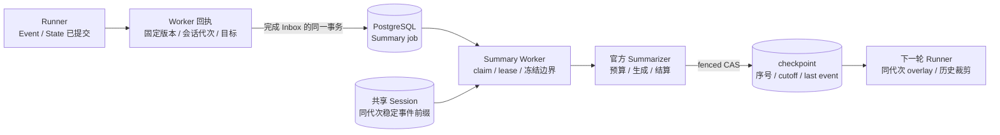
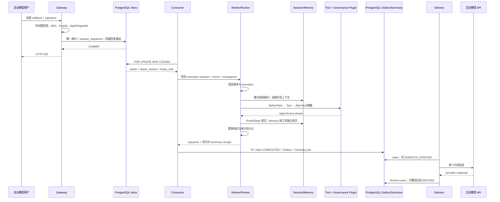

# 数据同步与幂等设计

## 1. 状态权威与提交边界

平台以持久化身份、明确提交顺序和条件写入连接 IM、执行节点与多类后端。跨节点共享数据通过实际后端读写实现；派生数据通过任务、版本、日志和读回验证收敛。下表给出每类状态的权威所有者。

| 状态 | 权威存储 | 提交与可见性 |
|---|---|---|
| Tenant、AgentApp、Version、Deployment | PostgreSQL | 配置 CAS、发布切换与控制面审计在数据库事务内提交 |
| Inbox、Outbox、执行绑定与结果 | PostgreSQL | 消息身份唯一；完成 Inbox、创建 Outbox 与登记 Summary job 同事务 |
| Session Event、会话 State、Track | 租户选定的 Redis/PostgreSQL Session Service | 官方服务完成提交后其他客户端可读取；平台用完整调用租约保持同会话顺序 |
| Memory | 租户选定的 Redis/PostgreSQL Memory Service | 工具明确执行写入，后续查询读取所选后端；不与 Session 或 Inbox 组成跨库事务 |
| Summary | PostgreSQL job/checkpoint | 原始事件先提交，后台生成按代次与覆盖边界发布，下一轮 Runner overlay |
| Knowledge | Qdrant | tenant/app 作用域写入、检索和删除；迁移目标以记录版本、内容和哈希验证 |
| Artifact | PostgreSQL 元数据与 S3/MinIO 正文 | 不可变版本、精确对象引用、SHA-256 校验与 tombstone 恢复跨存储残留 |
| 迁移 route、intent、journal、水位 | PostgreSQL | 所有者与 fence 约束推进；目标投影验证后登记完成，切换时与租户配置原子更新 |

平台 SQL schema 与官方 Session/Memory schema 分别管理，逻辑关联跨越存储服务时由应用层校验。物理外键、复合主键和字段见[数据模型](DATA_MODEL.md)，配置组合见[多后端适配方案](MULTI_BACKEND_DESIGN.md)。

## 2. 身份、顺序与写入所有权

Inbox 唯一身份为 `(tenant_id, channel_type, channel_account_id, external_message_id)`。内容哈希判定重发与冲突：同身份同内容返回原记录，同身份异内容返回冲突；原回复路由和会话序号不被新请求覆盖。入队事务为 `(tenant_id, agent_app_name, session_id)` 分配单调 `session_sequence`，只允许不存在未完成前序的消息领取。

Gateway 构造的会话标识包含租户、通道、账号、单聊/群聊类型与主体。单聊的主体是用户，群聊的主体是群；群会话所有者与实际发言者分离。Runner 使用长度前缀的 tenant/app 命名空间，Summary 再绑定应用 ID、会话所有者、会话、过滤器与代次。调用方传入相同会话 ID 的兼容接口仍须保持主体映射稳定。

每次领取增加单调 `lease_version`。完成、续租和失败条件同时包含状态、owner、version 和有效期；数据库时间在可能等待行锁后重新计算。旧执行者即使恢复，也不能越过当前 fence。Redis 的完整 Session lease 覆盖 Memory 读取、模型、Tool、Event 消费和回执采集；失去租约时取消 Runner 并拒绝成功结果。Redis 所有权 UUID 与数据库 fence 是两个不同约束。

同会话前序处于审批等待、重试、未知结果或死信时，后续消息保持等待。持久化 FIFO 保证因果关系；租户公平调度仅在可领取的会话队头之间分配份额。过期维护使用有界批次，最终失败不会永久悬挂在处理中。恢复必须核对业务结果、保持租户有效并写入操作者与原因。

## 3. Event 与 State 提交

Runner 消费模型和工具输出，将应保存的 Event 交给官方 Session Service。事件携带的会话 StateDelta 随后端追加操作应用：PostgreSQL 实现在事务中更新会话状态并插入事件；Redis 默认索引实现通过 Lua 原子追加事件并应用状态增量。平台的生产工厂使用同步服务接线，不能把进入本地通道或异步队列当成后端已提交。

这里的顺序是“事件及其状态增量完成后端提交，再允许依赖它们的派生任务推进”。它不表示先把 Event 和 State 写成两个无保护的独立步骤，也不表示整次 Agent 调用只有一个数据库事务。独立 State 更新、Track、Memory 工具以及外部业务动作各有提交边界；执行失败可能保留已经提交的前缀，需要执行结果与恢复策略共同解释。

Worker 正常执行时持续消费 Runner Event channel 至关闭，确保事件生产者和持久化路径完成；超时或取消停止执行，并根据是否越过执行边界记录结果未知。跨节点接管重新从共享 Session 读取，进程内会话对象不作为权威恢复来源。事件前缀的完整性、顺序和读取上限由实际后端能力决定，不能用有界查询返回的条数冒充全量转录长度。

会话 State 保留 `platform:session_incarnation_id`，值为规范非零 UUID。平台在完整 Session lease 和 execution fence 保护下初始化并捕获代次，普通应用状态修改不能覆盖此键。删除或 TTL 到期后创建的是新代次；迁移原会话必须保留该键。代次身份依靠明确 UUID，不以摘要生成时间或跨后端时间戳精度替代。

## 4. Summary 的有序派生

1. Worker 在执行持久化结束、仍持有会话租约时生成 typed receipt，绑定 tenant、应用、不可变版本、owner、session、filter 与代次。目标读取不可用或达到有界读取上限时使用零目标，保留已经捕获的代次，不因摘要计数失败重跑业务模型。
2. Consumer 在完成 Inbox 和插入唯一 Outbox 的同一 PostgreSQL 事务中 upsert Summary job。作用域或版本约束不满足时整体回滚，不出现已确认业务完成却缺少应登记任务的半提交状态。
3. Summary Worker 领取任务并按固定 AgentVersion 解析模型和数据 profile。在与普通 Worker 相同的会话租约下读取完整稳定转录，必要时把零目标解析为精确正序号，随后冻结当前生成的事件边界。
4. Generator 重新读取同代次目标前缀，校验完整性、事件顺序和边界，调用官方 Summarizer。摘要模型执行独立预算 reservation、dispatch 和 settlement；未达到摘要条件时完成本次检查，不发布空 checkpoint。
5. PostgreSQL Sink 在同一事务核对 job 的有效 owner/fence，再发布包含 `max_event_sequence`、`cutoff_at`、`last_event_id`、内容与哈希的 checkpoint。同代次拒绝旧序号和同序号不同哈希；陈旧租约不能发布。
6. 下一轮 Worker 先校验 scope 与代次，再把 checkpoint 注入克隆后的 `Session.Summaries`，启用框架的全会话摘要和历史边界裁剪。已覆盖历史被移出模型请求，摘要、未覆盖事件与当前用户输入同时保留；读取失败拒绝继续执行。

`target_resolution_lease_version` 持久化后续刷新请求。正在生成时收到零目标，将标记登记给后续 lease，当前生成继续使用已冻结边界；完成后仍有待解析请求则回到 PENDING。更高已知目标或新的延迟目标为新增工作重新分配尝试预算，不替换当前租约；没有新增工作的重复失败仍受最大尝试次数约束。并发到达的多个零目标合并为后续一次完整前缀检查。

job 唯一键和 checkpoint 主键都包含 `session_incarnation_id`。旧代次持有者的晚到结果只能写入其原代次，不能成为重建会话的 overlay。空代次派生记录保留供诊断，生产运行时拒绝生成和注入；旧 Inbox 回执可完成兼容事务，但不会被猜测绑定到当前会话。代次 schema 改变冲突键，升级须按 breaking migration 排空、停止旧写入、执行 schema，再启动兼容服务；降级不合并不同代次。具体字段与限制见[Summary 代次与调度字段](DATA_MODEL.md#summary-代次与调度字段)。

## 5. Memory 的写入与可见性

Memory 是显式长期记忆接口，支持写入、更新、删除、读取和搜索。工具来自租户实际 `memory.Service.Tools()`，同时满足租户白名单与固定 Agent 版本授权后才暴露。默认 recall 有界；平台不会无条件保存原始用户输入，也不会把一次检索结果当成已经写入的长期状态。

群聊使用共享 Session owner，但 Memory 请求携带实际 actor。Worker 以 `tenant/channel/account/external_user_id` 的长度编码计算稳定 `memory_actor_id`，SDK Memory 以该标识和租户应用范围读写；Session owner 与提供方原始 ID 保持不变。同一通道账号的同一用户可跨群或单聊复用个人记忆，不同通道或账号的相同外部 ID 不关联。严格 fence 同时保留原始 actor 与独立 Memory actor，访问前检查 scope 并复核返回对象；同群其他成员不能借共享 Session 身份访问个人记忆。

原始 ID 命名的未归属 Memory 不参与运行时回退查询，避免把两个提供方的不同人员合并。身份迁移须先停止全部 Memory 写入者并备份，按经验证的账号归属清单离线搬迁和核验；不明确的归属保留在受限命名空间等待核对，不自动复制给任何新 actor。所有节点统一采用同一身份契约后恢复写入，防止并存写入规则形成两份状态。

Memory 写操作成功提交后，另一个连接到相同已选后端的客户端可以按后端查询契约读到记录。它与 Session Event/State、Inbox 完成和 Summary checkpoint 没有跨数据库原子事务：后续模型失败不能自动撤销已经写入的 Memory。业务需要幂等时，应明确“创建新记忆”与“更新既有记忆”的稳定身份及目标后端行为，不能仅凭 Inbox 去重推断每次工具写入都至多发生一次。

生产 Memory 后端可选 Redis 或 PostgreSQL。全文、主题或关键词检索遵循官方后端能力，不等同于 Qdrant 向量检索。当前在线 Memory 迁移未实现；已有 Memory 更换存储绑定不能沿用 Session 迁移的验收结论。

## 6. 各后端的同步策略

| 后端 | 节点共享与写入策略 | 幂等或恢复依据 | 部署验收边界 |
|---|---|---|---|
| PostgreSQL | 事务、唯一约束、行锁和条件更新；配置、队列、执行与派生元数据在各自事务中提交 | 请求身份、版本、owner/fence、内容哈希、迁移日志 | 事务隔离、连接池、锁等待、主备切换、PITR；连接级锁仅支持直连或 session pooling |
| Redis | 官方 Session/Memory 访问共享 endpoint；Lua 负责原子状态、预算与租约操作 | 完整会话租约、命名空间、后端提交结果；与 PostgreSQL fence 联合约束执行 | TLS/ACL、持久化与故障转移窗口；应用不自动发现 Cluster/Sentinel，也不退回本地锁 |
| Qdrant | tenant/app ScopedStore 绑定物理 ID 和保留字段，目标写入后执行内容校验 | 稳定记录身份、版本/hash、tombstone 与 projection ledger | embedding 定义、向量维度、检索排名、索引构建与一致性配置；业务效果另验 |
| S3/MinIO + SQL | 正文与版本元数据分别提交，读取按精确对象版本与 SHA-256 校验 | 不可变版本、同版本同内容幂等、异内容冲突、删除标记与清理重试 | 对象读写权限、版本与保留策略、提交结果未知核对、备份与跨存储恢复 |

Artifact 删除先登记 tombstone，再清理正文；后续重试继续清理已标记但尚未删除的对象。迁移投影只有在目标副作用成功、读回内容一致且最终 fence 校验通过后，才能写 `projected_at`。该字段表示实际目标完成，不只是规范记录已复制进平台表。

共享后端并不等于副本内存同步。每个节点独立持有有界连接池与服务引用，配置变化产生新的缓存身份；迁移期间每次操作仍依据持久化 route 选择后端。运维直接修改同名 profile 会破坏实际存储身份校验，应创建新 profile 并走受控迁移。

## 7. IM 接入与回复幂等

| 项目 | 企业微信 | Telegram |
|---|---|---|
| 认证 | GET URL 验证、SHA1 签名、AES 解密、CorpID 与 AppID/AgentID 绑定 | webhook secret header 常量时间比较，依赖 HTTPS |
| 文本消息身份 | 必填 `MsgId`，缺失拒绝 | 优先 `update_id`，为零时使用 `chat_id:message_id` |
| 会话 | 应用单聊，以发送者确定主体 | private 使用发送者；group/supergroup 使用 chat ID |
| 回复片段 | UTF-8 字节边界分段、access token 获取与缓存 | 字符边界分段、Markdown 与可选 reply_to |
| 频率限制 | 根据提供方错误与令牌语义处理 | 429 与有界 `Retry-After` 延迟 |

通过认证的非文本回调确认并忽略，不创建 Inbox 或触发 Agent。文本只有在 Inbox 事务提交后才确认，数据库失败交由提供方重试。`webhookKey` 是路由索引，与验签秘密分开；通道账号和 Agent App 显式绑定，不能只按 CorpID 接受另一个企业应用的消息。

Outbox 对 `inbox_id` 唯一，固定权威回复路由。Delivery 每次发送一个片段，在调用 Provider 前持久化 `DISPATCH_STARTED`；已知成功后以有效 owner/fence 推进 cursor。永久错误进入死信，普通可重试错误指数退避，限流按提供方延迟处理。已 dispatch 的过期记录进入 `WAITING_RECONCILIATION`，不能因租约到期直接重发。

提供方支持幂等键时用 Outbox ID 与 cursor 标识片段；不支持时，外部核对后的显式 resume 仍可能重复未知片段。resume 保留已确认 cursor，restart 清零并可能重发全部已确认片段。平台不宣称跨 IM 与数据库的恰好一次投递。

## 8. 执行结果与恢复判定

| 中断位置 | 持久化证据 | 恢复方式 |
|---|---|---|
| Inbox 提交前 | 没有确认的 Inbox | 不确认回调，允许通道重试 |
| Worker 尚未进入 Runner | 可校验的准入失败或执行前超时 | typed safe-to-retry 路径；不假设模型已运行 |
| DNS/连接建立失败 | 尚未取得 HTTP 连接 | 可重试；调用结果仍须遵循响应协议校验 |
| 取得连接后传输失败 | 可能已经发送 | reconciliation；缺少 `WroteRequest` 不能证明未执行 |
| 模型完成且结果记录已提交 | 稳定幂等结果 | 返回已有结果，继续 Consumer 完成事务 |
| 工具执行后但结果未持久化 | 目标系统可能已有副作用 | 核对业务幂等键和外部结果，禁止无证据自动重跑 |
| IM 成功但 cursor 未提交 | dispatch marker 与旧 cursor | 核对当前片段，再审计 resume/restart |
| 摘要生成或发布失败 | job、固定目标、代次和有效 fence | 有界尝试；新目标另获尝试预算；陈旧任务不能覆盖 |

恢复写入 `message_replay_audit`，包含 actor、reason 和 mode，清理普通尝试并增加 fence。Inbox 使用 restart；Outbox 默认 resume，显式 restart 走专门接口。后台记录失败使用独立短 deadline，保证原请求取消后仍能保存恢复依据。具体命令、角色与部署步骤见[交付指南](../ENTERPRISE_PLATFORM_HANDOFF.md)。

## 9. 在线迁移与同步恢复

协调器按 `(tenant, domain)` 管理 route、intent、journal、cursor、水位、owner 和 fence。创建事务核对当前 backend/profile/config_version、源目标实际身份、兼容性与空目标，并立即开启捕获；所有平台写入须经装饰器，已有缓存客户端也在操作时取得 PostgreSQL gate 并重读 route。

单次写入顺序为：恢复前次未完成 intent/journal；提交本次受影响记录的 intent；写源；读取完整规范记录；追加有序 journal；投影目标；读回比较内容及哈希；核对 fence 并登记完成。源端结果未知或目标失败保留可恢复状态，错误返回不等于源端没有写入。删除与重建保存不同版本，防止只看当前值而遗漏中间删除。

快照复制从真实后端 inventory 发现已有记录，按稳定 key 推进游标，同期增量已经捕获。追平后 VALIDATE 与 READ_SHADOW 全量比较记录集合、规范内容、版本和删除状态；该实现不采样在线业务查询。CUTOVER 在排他 gate 内排空增量并重新验证，把配置 CAS、路由、阶段、lease/fence 和审计放入同一事务。

ROLLBACK_WINDOW 读目标、写源并同步镜像目标，协调器等待操作者观察后选择 complete 或 rollback。complete 最终验证后让读写均指向目标，保留终态路由和源数据；rollback 让读写回源，切换前可 abort。pause 暂停协调推进，捕获仍有效。同步镜像增加目标故障依赖，扫描与排他操作会阻塞该租户数据域，部署必须预留窗口并记录延迟。

Session 支持会话自有 State、Event 和 Track，保留代次 UUID；要求关闭 TTL，拒绝 App/User shared state、SDK native summary 及达到安全上限的 inventory/history，目标只追加严格历史后缀。Knowledge 要求 embedding 和维度兼容，Artifact 保留精确版本、内容与 tombstone，Memory 在线迁移未实现。完整阶段、恢复命令、Compose 连接方式和运行条件见[迁移运行指南](ONLINE_MIGRATION.md)。

## 10. 验证契约

测试必须穿过最终消费边界并检查后状态，不能只断言一个返回码或模拟方法被调用。首次会话创建检查持久化 UUID 与回执一致，后端读回时间精度不能阻断创建；两个生产 Adapter 检查交叉后端选择和跨节点可见性；旧执行 fence、跨租户身份、群 owner 与 actor 混用必须拒绝。

| 检查项 | 测试入口与关键后状态 |
|---|---|
| 持久化 FIFO 与失联接管 | [PostgreSQL 队列集成](../test/integration/postgres_reliable_test.go)：独立连接池接管、旧 fence 拒绝、唯一 Outbox |
| 完成事务的原子性 | [Inbox/Outbox/Summary 事务集成](../test/integration/summary_completion_test.go)：正常回执一次提交三项状态；作用域错误及摘要入队冲突整体回滚，保留原租约以继续正确提交 |
| Summary 最终消费 | [后端 Summary 集成](../test/integration/summary_runtime_test.go)：实际模型请求中摘要、未覆盖消息和当前输入可见，已覆盖历史被裁剪 |
| 延迟目标与代次隔离 | [Summary 代次集成](../test/integration/summary_generation_test.go)：并发回执保留后续目标、旧代次不能覆盖新代次、最终尝试后新增工作继续推进 |
| Session 到期重建 | [Runner 生命周期](../pkg/summary/session_lifecycle_test.go)：新代次与旧摘要隔离；本地 Redis 协议模拟用于确定性到期控制 |
| 租户交叉后端 | [生产 Adapter 集成](../test/integration/cross_backend_storage_test.go)：实际 Redis/PostgreSQL、两个节点、未选择后端无记录、引用释放后关闭 |
| 迁移捕获与恢复 | [Session 在线迁移](../test/integration/online_session_migration_test.go)、[数据面迁移](../test/integration/online_dataplane_migration_test.go)：实际目标读回、日志恢复、切换及回滚 |

真实后端集成使用 integration 标签和指定测试连接，缺少必需连接直接失败。默认单测、真实后端集成、容器部署与真实 IM 账号验收分别记录源码身份、环境、命令、退出码和后状态。环境变量与执行方法见[验证指南](VERIFICATION.md)，目标环境要求见[验收 Runbook](EXTERNAL_ACCEPTANCE_RUNBOOK.md)。
