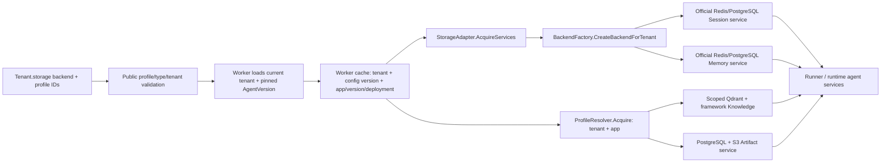

# Tenant Backend Selection and Consistency

This document describes the installed platform composition. Source and tests establish implementation boundaries; current execution results belong in [ACCEPTANCE_EVIDENCE.md](ACCEPTANCE_EVIDENCE.md). SDK adapters that are not selected by this platform's factories are extension candidates, not delivered platform capabilities.

## Installed Storage Domains

| Domain | Production implementation | Tenant choice | Authoritative data and access contract |
| --- | --- | --- | --- |
| Session / Event / State | Official Redis or PostgreSQL Session service | Independent `sessionBackend` and `sessionProfile` | `session.Service`; official backend owns its schema and committed session data |
| Memory | Official Redis or PostgreSQL Memory service | Independent `memoryBackend` and `memoryProfile` | `memory.Service`; tenant/app and authenticated actor scope |
| Summary | PostgreSQL job/checkpoint plus Session read overlay | Platform managed | `summary` store/sink; checkpoint linked to a stable event prefix, exposed through `Session.Summaries` |
| Knowledge | Qdrant plus an OpenAI-compatible embedding service | `knowledgeBackend: "qdrant"` and `knowledgeProfile` | Framework Knowledge/vector-store contracts; tenant/app physical IDs and filters |
| Artifact | PostgreSQL version metadata plus S3-compatible objects | `artifactBackend: "s3"` and `artifactProfile` | `artifact.Service`; scoped metadata, immutable object versions, content hash and tombstones |
| Audit / configuration / Inbox / Outbox / execution guards | PostgreSQL | Platform managed | Domain repositories, transactions, uniqueness constraints and fenced state transitions |

`inmemory` exists for local Session/Memory constructors and tests. Admin admission and `NewProductionWorkerWithOptionsContext` reject it for distributed execution. A tenant selecting PostgreSQL Session/Memory still needs the platform PostgreSQL and coordination Redis: these hold queue/execution state, leases, nonce replay protection and budgets independently of the selected data backend.

The installed storage factory accepts only `inmemory`, `redis` and `postgres`. It does not expose MySQL, arbitrary SQL drivers, an external Memory SaaS, a local vector engine, or every adapter offered by the wider SDK. The control-plane repository is PostgreSQL-only. See [backend_factory.go](../pkg/storage/backend_factory.go), [validation.go](../pkg/tenant/validation.go), [profiles.go](../pkg/runtimeplane/profiles.go) and [repository.go](../pkg/tenant/repository.go).

## Two Tenant Configurations

These are complete **storage sections**, shown with their owning tenant IDs. They are not standalone Admin create requests; application, model, channel, policy and other required fields remain part of the full Tenant configuration. The examples use the actual `StorageConfig` JSON field names.

```json
[
  {
    "id": "tenant-a",
    "storage": {
      "sessionBackend": "redis",
      "sessionProfile": "shared-redis",
      "memoryBackend": "postgres",
      "memoryProfile": "shared-postgres",
      "memoryConfig": {"memory_limit": "1000"},
      "knowledgeBackend": "qdrant",
      "knowledgeProfile": "shared-knowledge",
      "artifactBackend": "s3",
      "artifactProfile": "shared-artifacts"
    }
  },
  {
    "id": "tenant-b",
    "storage": {
      "sessionBackend": "postgres",
      "sessionProfile": "shared-postgres",
      "memoryBackend": "redis",
      "memoryProfile": "shared-redis",
      "memoryConfig": {"memory_limit": "500"},
      "knowledgeBackend": "qdrant",
      "knowledgeProfile": "shared-knowledge",
      "artifactBackend": "s3",
      "artifactProfile": "shared-artifacts"
    }
  }
]
```

The operator installs this public `STORAGE_BACKEND_PROFILES` manifest in the relevant processes:

```json
[
  {
    "id": "shared-redis",
    "backend": "redis",
    "connectionEnv": "TENANT_REDIS_URL",
    "tenantIds": ["tenant-a", "tenant-b"]
  },
  {
    "id": "shared-postgres",
    "backend": "postgres",
    "connectionEnv": "TENANT_POSTGRES_DSN",
    "tenantIds": ["tenant-a", "tenant-b"]
  }
]
```

The corresponding public `DATA_PLANE_PROFILES` manifest is:

```json
[
  {
    "id": "shared-knowledge",
    "backend": "qdrant",
    "endpoint": "qdrant.example.internal:6334",
    "tls": true,
    "tenantIds": ["tenant-a", "tenant-b"],
    "collection": "agent_documents",
    "dimension": 1536,
    "apiKeyEnv": "QDRANT_API_KEY",
    "embeddingEndpoint": "https://api.openai.com/v1",
    "embeddingModel": "text-embedding-3-small",
    "embeddingAPIKeyEnv": "EMBEDDING_API_KEY"
  },
  {
    "id": "shared-artifacts",
    "backend": "s3",
    "endpoint": "objects.example.internal:443",
    "tls": true,
    "tenantIds": ["tenant-a", "tenant-b"],
    "bucket": "agent-artifacts",
    "region": "us-east-1",
    "accessKeyEnv": "ARTIFACT_ACCESS_KEY",
    "secretKeyEnv": "ARTIFACT_SECRET_KEY",
    "maxBytes": 16777216
  }
]
```

Endpoints and names above are deployment examples. The operator must provision them and inject the named secret variables into the processes that use them. A production Redis URL uses `rediss://`; a production PostgreSQL URL uses `sslmode=verify-full`. The manifests contain references, not connection passwords. `allowInsecure` is absent, so the secure defaults apply.

These two tenants share physical profiles but select opposite Session/Memory combinations. Tenant scope is still enforced on every service call. A dedicated database, Redis endpoint, Qdrant collection or object bucket is selected by adding a separate operator profile with a single-tenant allowlist; it does not require a separate Worker binary. Omitting `tenantIds` intentionally grants the profile to all valid tenants, so dedicated profiles must carry an explicit allowlist.

## Selection Reaches the SDK



1. `cmd/worker/bootstrap.go` loads secret-bearing storage/data-plane catalogs and passes their validators into the Tenant service. `TenantService` defaults to uncached repository reads; the command authorizes each request from current tenant state.
2. The Worker cache includes tenant ID and configuration version, plus the pinned application/version/deployment. Storage instances additionally use a hash of the tenant's storage configuration and retain references until all users release them.
3. `AcquireServices` calls `CreateBackendForTenant`. The Session and Memory switches are independent. Their branches call official `session/redis.NewService`, `session/postgres.NewService`, `memory/redis.NewService` or `memory/postgres.NewService` with the resolved profile URL/DSN.
4. `pkg/worker/worker.go` injects these instances through `runner.WithSessionService` and `runner.WithMemoryService`. It supplies the acquired Knowledge and Artifact capabilities to the selected runtime. A declared capability without a usable profile/resolver fails construction.
5. Production Session services are wrapped by online routing and strict execution fencing. Memory receives strict execution fencing and an actor-scoping wrapper. Summary adds a checkpoint read overlay. During an online migration, wrappers consult durable routes on each operation, including instances retained in an older Worker cache entry.

Source: [Worker composition](../cmd/worker/bootstrap.go), [Worker construction](../pkg/worker/worker.go), [storage adapter](../pkg/storage/adapter_impl.go), [official constructors](../pkg/storage/backend_factory.go), [data-plane resolver](../pkg/runtimeplane/resolver.go), [actor-scoped Memory](../pkg/worker/memory_scope.go).

## Isolation and Configuration Changes

The canonical Session/Memory app name is length-prefixed: logical app `support` in `tenant-a` becomes `tsa1:8:tenant-a:support`. This encoding avoids tenant/app separator collisions. Strict wrappers validate the fence token, tenant, app, actor/session owner and returned objects. A group Session keeps a shared session owner while personal Memory resolves to the authenticated actor. Knowledge binds tenant/app filters and physical IDs; Artifact includes tenant/app/user/session/filename/version in metadata and object identity.

Public validators reject unknown, mistyped and unauthorized profile IDs. Tenant-controlled options allow only `session_ttl` or `memory_limit`; tenants cannot submit DSNs, endpoints, arbitrary SDK options or credentials through these maps. Worker catalogs hold actual connection secrets. Admin/Gateway/Consumer/Delivery use public profile metadata; Summary Worker needs the Session/Memory material it consumes. The migration operator separately requires the profiles involved in its job. Backend profile authorization is distinct from model/channel/MCP SecretRef binding.

Ordinary Tenant updates lock the current PostgreSQL row, decode its `StorageConfig`, reject changes to an already configured backend/profile pair, then apply configuration-version CAS. Clearing a binding is also rejected, preventing disable/re-enable from bypassing the guard. First configuration of an empty domain and changes to ordinary non-location options remain allowed. The stable `ErrStorageBindingChange` also matches `ErrInvalidTenantConfig`, which Admin maps to HTTP 400. Online migration uses its dedicated transaction to change location after verification; a generic Admin PUT is not a migration operation.

Profile catalogs are immutable per process. Deploy identical profile definitions across replicas and use a new profile ID for a new data location. Ordinary non-migration routing does not compare operator catalogs across nodes, so changing the endpoint behind an existing profile name during a rolling deployment can split reads and writes. Active/retained migration routes additionally pin and check backend identity. External IAM, database roles, TLS, network policies, backups and secret rotation remain deployment responsibilities; logical tenant filtering does not create separate database principals automatically.

## Four Backend Strategies

| Class | Consistency actually provided | Latency and cost | Operational tradeoff |
| --- | --- | --- | --- |
| Relational: PostgreSQL | Transactions/CAS for platform metadata; official Session/Memory calls commit in the selected database. Same-session ordering comes from platform coordination. | Additional SQL round trips, indexes and per-service connection pools; durable storage is usually less expensive per byte than memory. | Schema/index management, pool sizing, HA/PITR and migration coordination. Platform and tenant data may share an instance while retaining distinct owners. |
| Key/value: Redis | Primary acknowledgement gives cross-node visibility through the same endpoint. Session execution is serialized by platform lease/fence; failover durability depends on Redis persistence/replication configuration. | Low per-operation latency and memory-oriented cost. Remote routing and synchronous migration mirroring add network round trips. | TLS/ACLs, memory/eviction policy, persistence and stable HA endpoint. Current runtime does not discover Cluster/Sentinel topology. |
| Vector: Qdrant | Scoped vector operations and synchronous acknowledged production writes; embedding generation, indexing/search behavior and replica settings are separate consistency boundaries. | Search cost depends on dimension, index and corpus size; embedding generation adds provider latency and cost. | Collection/index tuning, tenant filters, embedding compatibility, backups and search-quality validation. Profile migration requires compatible dimensions and embedding definition. |
| Object: S3-compatible + PostgreSQL | SQL metadata and per-version identity are strong boundaries; object upload/delete and metadata are not one distributed transaction. Hash validation, tombstones and cleanup handle partial failure. | Efficient large-blob capacity, with request/egress cost and upload/download latency. Platform artifacts are currently limited to at most 16 MiB each. | Bucket IAM, versioning/lifecycle, orphan cleanup, backup alignment and provider-specific read/delete behavior. |

These are design tradeoffs, not measured benchmark claims. Actual p95/p99, failover data loss and cost must be measured with the chosen managed services and workload.

## Synchronization and Recovery Boundaries

| Concern | Installed mechanism | Practical limit |
| --- | --- | --- |
| Multiple nodes handling one Session | Durable Inbox FIFO; full Runner Redis lease; PostgreSQL execution generation/fence checked around storage operations | All nodes need the same coordination databases and data profiles; direct SDK/legacy writers are outside the protocol |
| Event / State / Summary order | Event/State commit precedes Summary job publication; stable cutoff and fenced checkpoint CAS; next Runner overlays the checkpoint | Summary is asynchronous; no claim of an atomic transaction spanning Session backend, model call and checkpoint |
| Memory across nodes | Official shared backend plus tenant/app/actor scope | Same actor in different Sessions can write concurrently; backend update semantics apply. `memory_limit` is an SDK/backend limit, not a guaranteed cross-session hard quota |
| Hard Memory capacity quota | Not installed | Requires a platform user-scoped atomic reservation/enforcement design. The separate token budget ledger does not enforce Memory entry count |
| Redis to PostgreSQL Session migration | Production capture, durable intents/journal, snapshot/catch-up, target verification, CAS cutover and rollback window | Shared App/User state, native SDK summaries, TTL and oversized inventories/history are rejected by current admission |
| Vector migration | Qdrant profile-to-profile migration with compatible embedding definition and vector dimension | Local-vector-to-remote conversion is not installed; it needs a source adapter and explicit re-embedding/version policy |
| Artifact migration | Exact-version projection, actual object verification, durable tombstones and route switching | SQL metadata stays in the platform database; provider failures require reconciliation, not an exactly-once object-store claim |
| Memory migration | No online migration implementation | Use a controlled offline export/import/recovery procedure with writes stopped, scope/count/content verification, backup and an explicit audited binding transition; no generic online CLI is claimed |
| IM retry and duplicate delivery | Tenant/channel/account-scoped Inbox identity, payload hash and transactional Outbox | Remote providers that lack an idempotent send API can leave an uncertain delivery outcome; follow reconciliation/DLQ policy |

PostgreSQL advisory locks require direct connections or session pooling, not transaction/statement pooling. An active migration serializes operations for the affected tenant/domain and synchronous mirroring adds target latency/failure dependency. A failed call can follow a source commit; the durable intent is the recovery record. `pause` pauses advancement, while capture remains active. See [ONLINE_MIGRATION.md](ONLINE_MIGRATION.md) for the supported command sequence and bounds.

## Extending the Installed Set

Reuse the framework's domain interfaces and installed adapters where they fit. A new Session/Memory backend needs a tenant validation branch, operator manifest/type validation, tenant-aware factory constructor, lifecycle/health handling and contract tests for scopes, key bounds, ordering, cancellation, retries and multi-node visibility. Enabling a SDK import alone does not complete that work. Adding online migration also requires a resolver/identity/compatibility contract, inventory, read/apply semantics, production mutation capture and recovery tests.

A new vector engine needs a `vectorstore.VectorStore` adapter behind the scoped Knowledge boundary, a resolver branch and compatible query/write semantics. A local-vector-to-remote migration needs both endpoints plus an explicit strategy for changed embedding models. An external Memory provider must preserve authenticated actor scope, govern its native tools and define rate limits, retention and consistency. A new object provider must satisfy the ObjectStore and exact-version projection contracts; arbitrary local filesystem paths are not an installed tenant backend.

## Requirement Evidence Matrix

| Requirement | Concrete source/evidence entry | Boundary |
| --- | --- | --- |
| Per-tenant selection reaches real execution | `pkg/storage/backend_profile_test.go`, `pkg/storage/tenant_isolation_test.go`, `pkg/worker/worker.go`, `cmd/worker/bootstrap.go` | The two JSON combinations above are supported by code; this document does not claim a separate end-to-end two-tenant HTTP acceptance run |
| At least three backend classes | Redis/PostgreSQL constructors, `pkg/runtimeplane/resolver.go`, `test/integration/runtimeplane_test.go` | Four installed classes; target-environment acceptance is separate |
| Multi-node synchronization and recovery | `pkg/reliable`, `pkg/controlplane/session_fence.go`, `pkg/storage/lease.go`, `test/integration/postgres_reliable_test.go` | Shared dependencies and coordinated writers are required |
| Session/Memory/Summary/Knowledge/Artifact/Audit ownership | [DATA_MODEL.md](DATA_MODEL.md), domain table above | Tenant, ChannelBinding, AgentApp/Version, Session, Event, Memory, Summary, Knowledge and Artifact relationships are documented without pretending one generic table stores everything |
| Real online migration paths | `test/integration/online_session_migration_test.go`, `test/integration/online_dataplane_migration_test.go` | Check latest execution status in acceptance evidence; Memory and local-vector conversion remain unsupported |
| Two IM channels including WeChat family | [ARCHITECTURE.md](ARCHITECTURE.md), `pkg/channel`, Gateway/Delivery composition | Enterprise WeChat and Telegram adapters; credentials and live-provider acceptance remain external |
| Governance, full-chain trace and at least eight risks | [COMPETITION_SUBMISSION.md](COMPETITION_SUBMISSION.md), [RISK_REGISTER.md](RISK_REGISTER.md), `pkg/telemetry` | Trace propagation and local collectors are implementation evidence; real alert receivers, HA/RTO and capacity need target deployment records |
| SDK reuse versus platform additions | Official constructors and Runner interfaces versus profile catalogs, fencing, reliable queue, Summary coordinator and online migration wrappers | MySQL and other SDK adapters are not listed as installed platform routes |

The focused audit repaired direct backend/profile rebinding through ordinary Tenant updates. Tests in `pkg/tenant/storage_binding_test.go` cover all four domains, disabling bindings, first configuration, ordinary configuration updates and protection of a completed migration's location. Remaining integration/test execution results are consolidated in [ACCEPTANCE_EVIDENCE.md](ACCEPTANCE_EVIDENCE.md).
