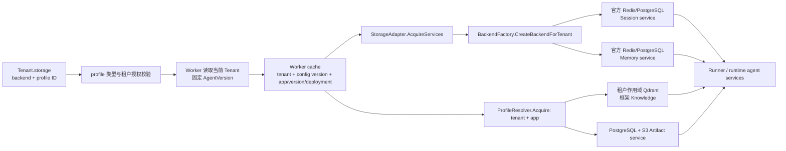

# 租户多后端适配与一致性

平台按数据域选择后端引擎，通过运维连接配置（profile）解析连接材料，再将带租户作用域的服务注入 Worker。Session 与 Memory 可以独立组合；Knowledge 使用 Qdrant，Artifact 使用 PostgreSQL 元数据与 S3-compatible 正文存储。平台协调数据保持统一权威，以支持跨节点执行、配置切换与故障恢复。

## 选择层次与支持矩阵

租户配置有两个选择层次：`backend` 决定该数据域采用的存储引擎与适配器，`profile` 决定引擎的实例、命名空间和连接策略。同一引擎可以注册多个 profile；更换 profile 可能意味着数据位置改变，需要迁移。

| 数据域 | 生产实现 | 租户选择 | 权威数据与访问契约 |
| --- | --- | --- | --- |
| Session / Event / State | 官方 Redis 或 PostgreSQL Session service | `sessionBackend` 选引擎；`sessionProfile` 选实例 | `session.Service`；官方 backend 管理 schema 与已提交会话数据 |
| Memory | 官方 Redis 或 PostgreSQL Memory service | `memoryBackend` 与 `memoryProfile` 独立于 Session | `memory.Service`；绑定 tenant/app 与认证 actor |
| Summary | PostgreSQL job/checkpoint 与 Session 读取 overlay | 平台统一管理 | `summary` store/sink；checkpoint 关联稳定事件前缀，经 `Session.Summaries` 提供给 Runner |
| Knowledge | Qdrant 与 OpenAI-compatible embedding 服务 | 固定 `knowledgeBackend: "qdrant"`；profile 选 endpoint、collection 与 embedding 定义 | 框架 Knowledge/vector-store 契约；tenant/app 物理 ID 和过滤器 |
| Artifact | PostgreSQL 版本元数据与 S3-compatible 对象 | 固定 `artifactBackend: "s3"`；profile 选 endpoint、bucket 与区域 | `artifact.Service`；作用域元数据、不可变对象版本、内容哈希和 tombstone |
| Audit / 配置 / Inbox / Outbox / 执行 guard | PostgreSQL | 平台统一管理 | 领域 repository、事务、唯一约束和 fenced 状态转换 |

Session/Memory 工厂接受 `inmemory`、`redis`、`postgres`。`inmemory` 用于本地构造器与测试；Admin 和 `NewProductionWorkerWithOptionsContext` 在分布式运行中拒绝该选项。即使租户将 Session/Memory 全部选为 PostgreSQL，仍需平台 PostgreSQL 与协调 Redis，分别承载队列/执行状态，以及租约、nonce 防重放和预算。

| 能力边界 | 当前契约 | 扩展入口 |
| --- | --- | --- |
| MySQL、其他 SQL 引擎、外部 Memory 服务 | 未接入平台工厂；控制面 repository 固定 PostgreSQL | 领域接口、租户准入、profile resolver 与 backend factory |
| 本地向量引擎 | 未接入 Knowledge 运行时 | scoped `vectorstore.VectorStore` 与数据面 resolver |
| Qdrant 单文档更新 | `Add` / `Update` 均为 upsert，支持读取、检索和过滤删除 | 保留文档完整内容及向量的调用契约 |
| Qdrant 批量字段更新 | 当前 SDK `UpdateByFilter` 返回 unsupported-operation 错误，平台保留此错误 | 安装满足作用域、捕获和重试契约的实现后开放 |
| Memory 在线迁移、跨会话硬容量配额 | 未实现 | 见同步约束和扩展路径 |

接入范围由 [backend factory](../pkg/storage/backend_factory.go)、[租户准入](../pkg/tenant/validation.go)、[数据面 profiles](../pkg/runtimeplane/profiles.go) 和 [控制面 repository](../pkg/tenant/repository.go) 共同定义。SDK 中其他适配器可作为扩展基础，需要完成平台路由与隔离契约后才能进入租户配置。

## 两个租户的配置

下面给出两个租户的完整 `storage` 配置。创建 Tenant 时，还需按管理 API 提供应用、模型、通道和策略等必需字段。`tenant-a` 使用 Redis Session + PostgreSQL Memory，`tenant-b` 使用 PostgreSQL Session + Redis Memory；两者可由同一组 Worker 副本执行。

```json
[
  {
    "id": "tenant-a",
    "storage": {
      "sessionBackend": "redis",
      "sessionProfile": "shared-redis",
      "memoryBackend": "postgres",
      "memoryProfile": "shared-postgres",
      "memoryConfig": {"memory_limit": "1000"},
      "knowledgeBackend": "qdrant",
      "knowledgeProfile": "shared-knowledge",
      "artifactBackend": "s3",
      "artifactProfile": "shared-artifacts"
    }
  },
  {
    "id": "tenant-b",
    "storage": {
      "sessionBackend": "postgres",
      "sessionProfile": "shared-postgres",
      "memoryBackend": "redis",
      "memoryProfile": "shared-redis",
      "memoryConfig": {"memory_limit": "500"},
      "knowledgeBackend": "qdrant",
      "knowledgeProfile": "shared-knowledge",
      "artifactBackend": "s3",
      "artifactProfile": "shared-artifacts"
    }
  }
]
```

运维向相关进程提供以下公开 `STORAGE_BACKEND_PROFILES` 清单：

```json
[
  {
    "id": "shared-redis",
    "backend": "redis",
    "connectionEnv": "TENANT_REDIS_URL",
    "tenantIds": ["tenant-a", "tenant-b"]
  },
  {
    "id": "shared-postgres",
    "backend": "postgres",
    "connectionEnv": "TENANT_POSTGRES_DSN",
    "tenantIds": ["tenant-a", "tenant-b"]
  }
]
```

对应的公开 `DATA_PLANE_PROFILES` 清单：

```json
[
  {
    "id": "shared-knowledge",
    "backend": "qdrant",
    "endpoint": "qdrant.example.internal:6334",
    "tls": true,
    "tenantIds": ["tenant-a", "tenant-b"],
    "collection": "agent_documents",
    "dimension": 1536,
    "apiKeyEnv": "QDRANT_API_KEY",
    "embeddingEndpoint": "https://api.openai.com/v1",
    "embeddingModel": "text-embedding-3-small",
    "embeddingAPIKeyEnv": "EMBEDDING_API_KEY"
  },
  {
    "id": "shared-artifacts",
    "backend": "s3",
    "endpoint": "objects.example.internal:443",
    "tls": true,
    "tenantIds": ["tenant-a", "tenant-b"],
    "bucket": "agent-artifacts",
    "region": "us-east-1",
    "accessKeyEnv": "ARTIFACT_ACCESS_KEY",
    "secretKeyEnv": "ARTIFACT_SECRET_KEY",
    "maxBytes": 16777216
  }
]
```

部署前需创建示例中的 endpoint、collection 和 bucket，并把具名秘密变量注入使用它们的进程。生产 Redis URL 使用 `rediss://`，PostgreSQL URL 使用 `sslmode=verify-full`。清单保存环境变量引用，连接密码由运维注入；示例省略 `allowInsecure`，采用默认 TLS 要求。

示例共享物理 profiles，服务调用仍校验各自的租户作用域。需要物理隔离时，可为专用数据库、Redis endpoint、Qdrant collection 或对象 bucket 注册单租户 profile，沿用同一 Worker 实现。`tenantIds` 缺省表示允许所有有效租户使用；专用资源必须配置明确的租户 allowlist。

## 运行时装配与租户级路由



1. `cmd/worker/bootstrap.go` 加载带秘密的 storage/data-plane catalogs，把对应 validator 传入 Tenant service。`TenantService` 默认每次从 repository 读取，入口依据当前租户配置授权请求。
2. Worker cache 绑定 tenant ID、配置版本和固定的 app/version/deployment。存储实例另以租户 storage 配置哈希区分；引用计数保证使用中的 Runner 排空后才关闭旧实例。
3. `AcquireServices` 调用 `CreateBackendForTenant`，分别分派 Session 与 Memory。四条生产分支将 profile URL/DSN 传入官方 `session/redis.NewService`、`session/postgres.NewService`、`memory/redis.NewService` 或 `memory/postgres.NewService`。
4. `pkg/worker/worker.go` 通过 `runner.WithSessionService`、`runner.WithMemoryService` 注入实际实例，并将取得的 Knowledge、Artifact 服务传入对应运行时。声明的能力缺少有效 profile/resolver 时，构造失败。
5. Session 叠加在线路由、严格 execution fencing 和 Summary checkpoint 读取层；Memory 叠加 execution fencing 与 actor 作用域。在线迁移中的装饰器每次操作都读取持久化路由，旧 Worker cache 中的实例也会跟随切换。

实现入口：[进程装配](../cmd/worker/bootstrap.go)、[Worker 构造](../pkg/worker/worker.go)、[存储适配](../pkg/storage/adapter_impl.go)、[官方构造器](../pkg/storage/backend_factory.go)、[数据面解析](../pkg/runtimeplane/resolver.go)、[Memory actor 作用域](../pkg/worker/memory_scope.go)。

## 隔离与配置准入

Session/Memory 的 app name 采用长度前缀：`tenant-a` 的逻辑应用 `support` 编码为 `tsa1:8:tenant-a:support`，避免 tenant/app 分隔符碰撞。严格装饰器校验 fence token、tenant、app、actor/session owner 与返回对象。群聊 Session 使用共享 owner，个人 Memory 解析到认证 actor。Knowledge 绑定 tenant/app 过滤器和物理 ID；Artifact 的元数据与对象身份包含 tenant/app/user/session/filename/version。

公开 validator 校验 profile 存在性、类型和租户授权。租户选项只允许 `session_ttl` 与 `memory_limit`，拒绝通过选项 map 传入 DSN、endpoint、任意 SDK 参数或秘密。实际连接材料由 Worker catalog 持有；Admin/Gateway/Consumer/Delivery 使用公开 profile 元数据，Summary Worker 获取其消费的 Session/Memory 材料，迁移进程获取其清单引用的源目标材料。数据 profile 授权与 model/channel/MCP SecretRef 的用途绑定分别执行。

普通 Tenant 更新在 PostgreSQL 事务中锁定当前行、解码 `StorageConfig`，校验已有 backend/profile 绑定后执行配置版本 CAS。修改或清空已有绑定均返回 `ErrStorageBindingChange`，该错误同时匹配 `ErrInvalidTenantConfig`，Admin 映射为 HTTP 400。空数据域的首次配置和普通非定位选项仍可更新。数据位置变更必须走完成验证的迁移专用事务，禁止用通用 Admin PUT 或先清空再配置绕过该约束。

Profile catalog 在单个进程内不可变，各副本应部署相同定义，新数据位置使用新 profile ID。普通路由依赖部署保证跨节点配置一致；在滚动发布中改变同名 profile 的 endpoint 会造成读写分叉。活跃及保留的迁移 route 进一步固定并校验实际存储 identity。部署还需配置 IAM、数据库角色、TLS、网络策略、备份和密钥轮换；逻辑租户过滤与独立数据库凭据是两层隔离措施。

## 四类后端的取舍

| 类型 | 一致性契约 | 延迟与成本 | 运维要点 |
| --- | --- | --- | --- |
| 关系型：PostgreSQL | 平台元数据使用事务/CAS；官方 Session/Memory 调用在所选数据库提交；同 Session 顺序由平台协调 | SQL 往返、索引和每服务连接池带来开销；持久化容量通常比纯内存每字节成本低 | schema/index、连接池、HA/PITR 与迁移协调；平台数据和租户数据可共用实例，数据所有者保持分离 |
| 键值：Redis | 经同一 endpoint 访问时，主节点确认后的数据跨节点可见；Session 用 lease/fence 串行化；故障转移耐久性取决于持久化与复制设置 | 单操作延迟较低，容量以内存成本为主；远端路由和同步镜像增加网络往返 | TLS/ACL、内存/淘汰策略、持久化和稳定 HA endpoint；当前运行时不做 Cluster/Sentinel 拓扑发现 |
| 向量：Qdrant | 作用域向量操作与同步确认的生产写入；embedding、索引/检索行为与副本设置各有一致性边界 | 检索成本随维度、索引和语料量变化；embedding 另计模型调用延迟与费用 | collection/index 调优、租户过滤、embedding 兼容性、备份和检索质量；迁移要求维度与 embedding 定义兼容 |
| 对象：S3-compatible + PostgreSQL | SQL 元数据与精确版本身份为强一致边界；对象上传/删除和 SQL 提交分属两个系统，通过哈希、tombstone 和清理恢复部分失败 | 适合较大正文存储，需计请求/流量费用与上传下载延迟；平台单个 Artifact 上限为 16 MiB | bucket IAM、版本/生命周期、孤立对象清理、元数据与正文备份对齐、provider 读取/删除语义 |

容量规划应在选定服务规格和业务负载下测量 p95/p99、连接池等待、故障转移数据损失窗口与成本，作为后端选型和迁移维护窗口的依据。

## 一致性保证与故障恢复

| 场景 | 执行机制 | 准入与运行约束 |
| --- | --- | --- |
| 多节点处理同一 Session | 持久化 Inbox FIFO、完整 Runner Redis lease、存储操作周围的 PostgreSQL execution generation/fence 校验 | 各节点共用协调数据库与数据 profiles；直接 SDK 和旧版写入者不参与协议 |
| Event / State / Summary 顺序 | Event/State 提交后发布 Summary job；稳定 cutoff、fenced checkpoint CAS；下一轮 Runner overlay | Summary 异步生成，Session backend、模型调用和 checkpoint 之间通过协议衔接，各自提交 |
| Memory 跨节点可见 | 官方共享 backend 与 tenant/app/actor 作用域 | 同 actor 的不同 Session 可并发写入，遵循 backend 更新语义；`memory_limit` 为 SDK/backend 限制，跨 Session 并发不保证硬上限 |
| Memory 硬容量配额 | 待扩展的用户作用域原子 reservation/enforcement | token 预算账本独立计量，不承担 Memory 条目计数 |
| Redis → PostgreSQL Session | 生产捕获、持久化 intent/journal、snapshot/catch-up、目标验证、CAS cutover 与回滚窗口 | 拒绝 shared App/User state、SDK native summary、TTL 和达到安全上限的 inventory/history |
| 向量迁移 | Qdrant profile → profile，要求 embedding 定义与维度兼容 | 本地向量转远端尚未接入，需要源适配器与 re-embedding/版本策略 |
| Artifact 迁移 | 精确版本投影、实际对象验证、持久化 tombstone 和路由切换 | SQL 元数据保持在平台数据库；对象 provider 部分失败通过 reconciliation 恢复 |
| Memory 离线迁移 | 受控导出/导入及恢复方案，在线实现未提供 | 停止写入，完成作用域/数量/内容核验、备份后，由专用受审计流程变更绑定；通用 Admin PUT 拒绝改绑 |
| IM 重试与去重 | tenant/channel/account 作用域 Inbox 身份、payload hash 与事务 Outbox | 缺少幂等发送 API 的外部 provider 可能留下投递结果未知，进入 reconciliation/DLQ 流程 |

PostgreSQL 连接级 advisory lock 要求直连或 session pooling，transaction/statement pooling 不受支持。活跃迁移串行化受影响 tenant/domain 的操作，同步镜像引入目标延迟和故障依赖。调用返回失败时源可能已经提交，持久化 intent 用于恢复；`pause` 只暂停协调推进，捕获继续。命令顺序和恢复条件见 [在线迁移运行指南](ONLINE_MIGRATION.md)。

## 扩展路径

扩展保持框架领域接口，平台负责租户路由、授权、生命周期与一致性约束。Session/Memory 新引擎依次接入：租户准入分支、operator manifest/type 校验、租户感知 factory、生命周期/健康处理，以及作用域、键长度、顺序、取消、重试和跨节点可见性测试。SDK 适配器复用业务存取能力，平台这些契约决定其能否生产接入。

在线迁移另需实现 resolver/identity/compatibility、原生 inventory、规范 read/apply、生产写捕获与恢复测试。新向量引擎位于 scoped Knowledge 边界后的 `vectorstore.VectorStore`，需增加 resolver 分支并固定查询/写入语义；本地向量转远端同时需要源目标适配器及 embedding 模型变化时的转换策略。外部 Memory provider 必须保留认证 actor 作用域、治理原生工具，并定义限流、保留期和一致性。对象 provider 需满足 `ObjectStore` 与精确版本投影契约；本地文件系统路径尚未开放为租户选项。

## 验证入口

| 验证对象 | 源码与测试入口 | 部署验收条件 |
| --- | --- | --- |
| 租户选择与 Worker 路由 | `pkg/storage/backend_profile_test.go`、`pkg/storage/tenant_isolation_test.go`、`pkg/worker/worker.go`、`cmd/worker/bootstrap.go` | 使用上述两组配置执行独立的双租户 HTTP 纵向验收，记录实际后端读写与隔离结果 |
| 双租户交叉后端组合 | `test/integration/cross_backend_storage_test.go` | 真实 Redis/PostgreSQL 上验证两个独立生产适配器的双向可见性、作用域隔离、物理后端选择及资源释放；执行上下文由测试预置 |
| 四类后端服务 | Redis/PostgreSQL 构造器、`pkg/runtimeplane/resolver.go`、`test/integration/runtimeplane_test.go` | 准备 PostgreSQL、Redis、Qdrant、S3-compatible 服务及 embedding 协议服务 |
| 多节点同步与恢复 | `pkg/reliable`、`pkg/controlplane/session_fence.go`、`pkg/storage/lease.go`、`test/integration/postgres_reliable_test.go` | 副本共用依赖，覆盖同 Session 竞争、租约接管和陈旧提交 |
| 数据归属与关联 | [DATA_MODEL.md](DATA_MODEL.md) | 核对平台 SQL 键、SDK 逻辑实体、摘要事件前缀及对象元数据/正文 |
| 在线迁移 | `test/integration/online_session_migration_test.go`、`test/integration/online_dataplane_migration_test.go` | 验证实际捕获、目标读回、旧缓存路由、失败恢复及回滚；不支持的操作按准入契约拒绝 |
| IM 与治理观测 | `pkg/channel`、`pkg/telemetry`、Gateway/Delivery 装配、[风险登记册](RISK_REGISTER.md) | 企业微信/Telegram 真实收发、全链 trace、实际告警接收端、HA/RTO 与容量 |
| 配置改绑保护 | `pkg/tenant/storage_binding_test.go` | 四域改绑/清空拒绝、首次配置、普通更新与已完成迁移位置保护 |

执行环境、提交版本与结果统一记录在 [验收证据](ACCEPTANCE_EVIDENCE.md)。框架接口与官方构造器的复用边界、平台 profile catalog、fencing、可靠队列、Summary 协调及迁移装饰器的职责见 [总体方案](COMPETITION_SUBMISSION.md)。
